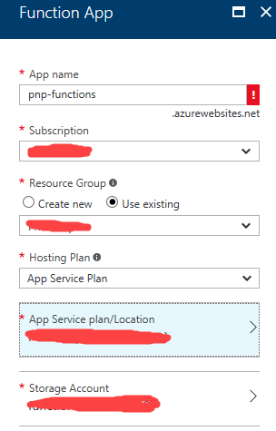
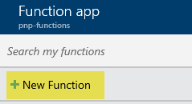
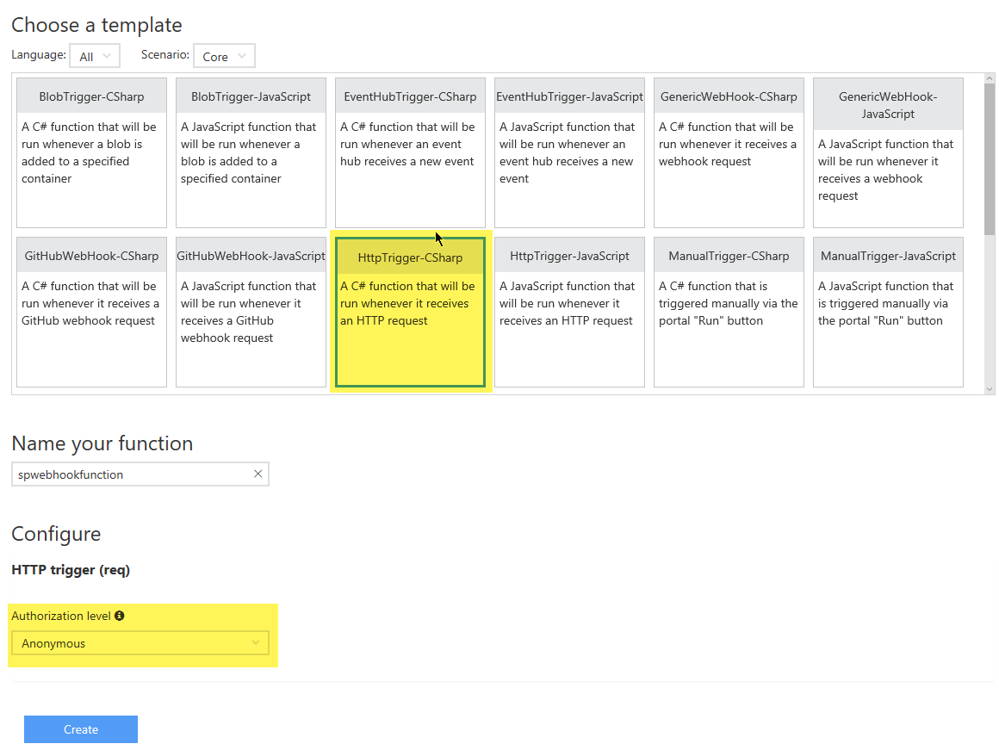
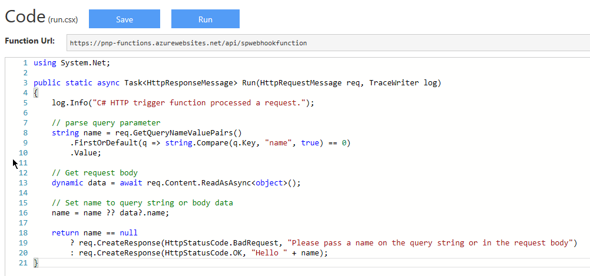
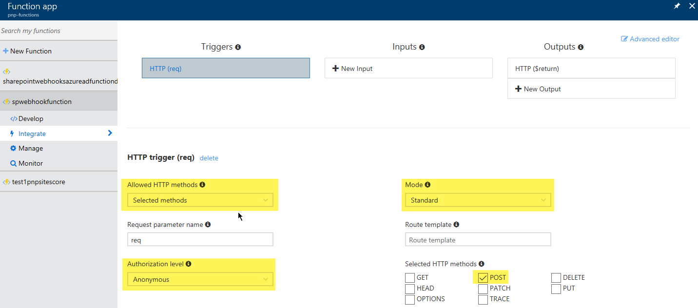
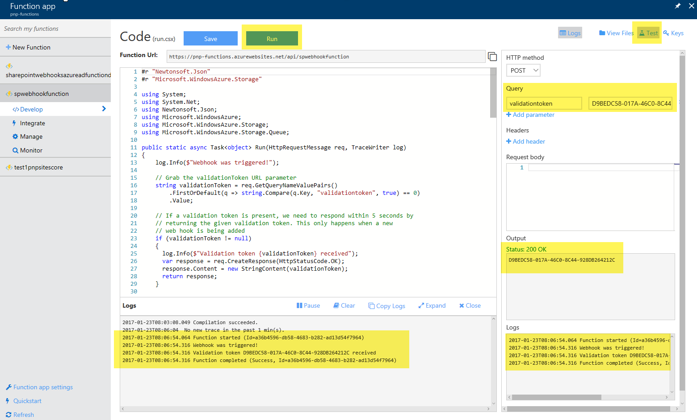

# Using Azure Functions with SharePoint webhooks #
[Azure functions](https://docs.microsoft.com/en-us/azure/azure-functions/functions-overview) offer an easy way to host your SharePoint webhooks: you can simply add your webhook C# or Javascript code via the browser and Azure will take care of the hosting and scaling of your function! This guide shows how to setup and use Azure Functions for your webhooks.

## Create a an Azure Function App
The first step you'll need to do is creating an Azure Function App, which is a special kind of Azure Web App focused on hosting Azure Functions. Navigate to [https://portal.azure.com](https://portal.azure.com), click on the "New" and search for "Function app":


Select "Function App" and complete the information needed to create the Function App:



## Create an Azure Function
Now that the app to host the functions is ready you can continue with creating your first Azure Function by clicking on the "New Function" link:



This will offer you to start your function from a template, in the case of SharePoint webhooks we will need a HTTP triggered function and since we'll be writing C# code in our sample this means we're using the **HttpTrigger-CSharp** function template. Given that SharePoint webhook services need to be anonymously callable it's important to switch the **Authorization level** to **Anonymous**.



>**Note:**
>Using the **GenericWebHook** template currently does not yet work for SharePoint webhooks but the SharePoint product team is aware of this problem and will address it.

The result will be a "default" Azure Function written in C#


In our case we want this Azure Function to behave as a SharePoint webhook service, so we'll need to implement the following in C#:
- Return the validationtoken if specified as URL parameter to the call. This is needed as described [here](./lists/create-subscription)
- Process the JSON webhook notification. In below sample we've opted to store the JSON in a storage queue so that an Azure Web Job can pick it up and process it asynchronously. Depending on your needs you could also process the notification directly in your webhook service

You can achieve above by replacing the default code by below code (please enter your storage account connection string and update the queue name if you're using a different one):

```C#
#r "Newtonsoft.Json"
#r "Microsoft.WindowsAzure.Storage"

using System;
using System.Net;
using Newtonsoft.Json;
using Microsoft.WindowsAzure;
using Microsoft.WindowsAzure.Storage;
using Microsoft.WindowsAzure.Storage.Queue;

public static async Task<object> Run(HttpRequestMessage req, TraceWriter log)
{
    log.Info($"Webhook was triggered!");

    // Grab the validationToken URL parameter
    string validationToken = req.GetQueryNameValuePairs()
        .FirstOrDefault(q => string.Compare(q.Key, "validationtoken", true) == 0)
        .Value;
    
    // If a validation token is present, we need to respond within 5 seconds by  
    // returning the given validation token. This only happens when a new 
    // web hook is being added
    if (validationToken != null)
    {
      log.Info($"Validation token {validationToken} received");
      var response = req.CreateResponse(HttpStatusCode.OK);
      response.Content = new StringContent(validationToken);
      return response;
    }

    log.Info($"SharePoint triggered our webhook...great :-)");
    var content = await req.Content.ReadAsStringAsync();
    log.Info($"Received following payload: {content}");

    var notifications = JsonConvert.DeserializeObject<ResponseModel<NotificationModel>>(content).Value;
    log.Info($"Found {notifications.Count} notifications");

    if (notifications.Count > 0)
    {
        log.Info($"Processing notifications...");
        foreach(var notification in notifications)
        {
            CloudStorageAccount storageAccount = CloudStorageAccount.Parse("<YOUR STORAGE ACCOUNT>");
            // Get queue... create if does not exist.
            CloudQueueClient queueClient = storageAccount.CreateCloudQueueClient();
            CloudQueue queue = queueClient.GetQueueReference("sharepointlistwebhookeventazuread");
            queue.CreateIfNotExists();

            // add message to the queue
            string message = JsonConvert.SerializeObject(notification);
            log.Info($"Before adding a message to the queue. Message content: {message}");
            queue.AddMessage(new CloudQueueMessage(message));
            log.Info($"Message added :-)");
        }
    }

    // if we get here we assume the request was well received
    return new HttpResponseMessage(HttpStatusCode.OK);
}


// supporting classes
public class ResponseModel<T>
{
    [JsonProperty(PropertyName = "value")]
    public List<T> Value { get; set; }
}

public class NotificationModel
{
    [JsonProperty(PropertyName = "subscriptionId")]
    public string SubscriptionId { get; set; }

    [JsonProperty(PropertyName = "clientState")]
    public string ClientState { get; set; }

    [JsonProperty(PropertyName = "expirationDateTime")]
    public DateTime ExpirationDateTime { get; set; }

    [JsonProperty(PropertyName = "resource")]
    public string Resource { get; set; }

    [JsonProperty(PropertyName = "tenantId")]
    public string TenantId { get; set; }

    [JsonProperty(PropertyName = "siteUrl")]
    public string SiteUrl { get; set; }

    [JsonProperty(PropertyName = "webId")]
    public string WebId { get; set; }
}

public class SubscriptionModel
{
    [JsonProperty(NullValueHandling = NullValueHandling.Ignore)]
    public string Id { get; set; }

    [JsonProperty(PropertyName = "clientState", NullValueHandling = NullValueHandling.Ignore)]
    public string ClientState { get; set; }

    [JsonProperty(PropertyName = "expirationDateTime")]
    public DateTime ExpirationDateTime { get; set; }

    [JsonProperty(PropertyName = "notificationUrl")]
    public string NotificationUrl {get;set;}

    [JsonProperty(PropertyName = "resource", NullValueHandling = NullValueHandling.Ignore)]
    public string Resource { get; set; }
}
```

## Configure your Azure Function
Since we've chosen the correct template to start from our configuration is almost complete, the only thing you need to still do is to switch the **Allowed HTTP methods** to **Selected methods** and then only allow the **PUT** HTTP method. Also cross check that **Mode** is equal to **Standard** and **Authorization level** is set to **Anonymous**.



## Test your Azure Function
You're now all set for your first Azure Function test: navigate to the **Develop** screen. Click on the **Test** icon to pop-up the test pane at the right side, add a URL parameter "validationtoken" with a random string as value. Using this setup we're mimicking the behavior of SharePoint calling your web hook service when validating a new webhook addition. Click on **Run** to test...if everything goes well you'll see in the logs section that your service was called and that it returned the passed value with a HTTP 200 response:



## Grab the webhook URL to use in your implementation
We'll need to let SharePoint now what webhook URL we're using. To so let's start by copying the Azure Function URL:


To avoid unathorized usage of your Azure Function the caller will need to specify a code when calling your function. This code can be retreived via the **Manage** screen:


So in our case the webhook URL to use is the following: `https://pnp-functions.azurewebsites.net/api/spwebhookfunction?code=wyx9iAxp3o7fdGFZTbnp9Kfc5o2UhlzwgSOT/XGGM6QZcdYYa/o9aw==`


