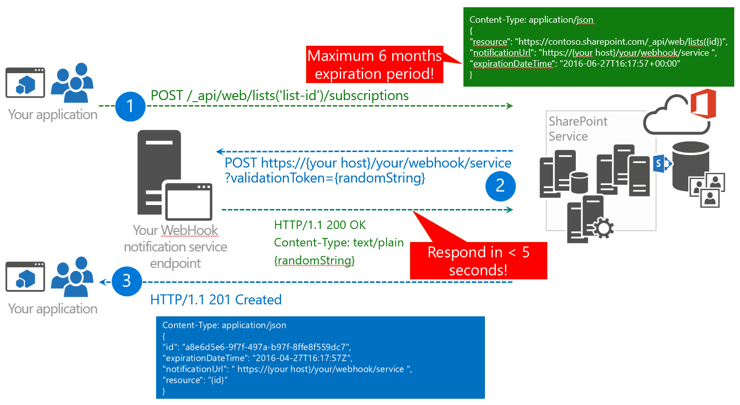
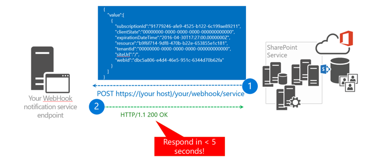

# SharePoint webhooks sample reference implementation

>**Note:** SharePoint webhooks is currently in preview and is subject to change. SharePoint webhooks are not currently supported for use in production environments.

The SharePoint Patterns and Practices (PnP) reference implementation shows how you can use SharePoint webhooks in your application. The webhooks are implemented in an enterprise ready manner using various Microsoft Azure components such as Azure Web Jobs, Azure SQL Server, and Azure Storage Queues for asynchronous web job notification handling.

The reference implementation only works with [SharePoint list webhooks](./lists/overview-sharepoint-list-webhooks). 

You can also follow these steps by watching the video on the [SharePoint PnP YouTube Channel](https://www.youtube.com/watch?v=j3hWCAI9R20).

<a href="https://www.youtube.com/watch?v=j3hWCAI9R20">

</a>

## Applies to

-  Office 365 Multi Tenant (MT) with [First Release enabled](https://support.office.com/en-us/article/Set-up-the-Standard-or-First-Release-options-in-Office-365-3b3adfa4-1777-4ff0-b606-fb8732101f47).

## Prerequisites

Microsoft Azure is used to host the various components needed to implement Azure webhooks.

## Source code for this reference implementation

Source code and other materials for the reference implementation are available in the [SharePoint developer samples GitHub repository](https://github.com/SharePoint/sp-dev-samples/tree/master/Samples/WebHooks).

## Deploying the reference implementation

The application will show you how to manage webhooks, specifically for a SharePoint list. It also contains a reference implementation of a webhook service endpoint which you can reuse in your webhook projects. 


The [SharePoint web hooks reference implementation - Deployment guide](https://github.com/SharePoint/sp-dev-samples/blob/master/Samples/WebHooks/Deployment%20guide.md) lists the deployment steps used to deploy the reference implementation. 

## Introduction to webhooks

Webhooks notify your application about changes in SharePoint that the application needs to monitor. There's no need for your application to regularly poll for changes anymore. With webhooks your application is notified (**push** model) whenever there's a change. Webhooks are not specific to Microsoft. They are a universal web standard that's also being adopted by other vendors (e.g., WordPress, GitHub, MailChimp, and others).

### Adding a webhook to your SharePoint list

The reference implementation works with a SharePoint list. To add a webhook to a SharePoint list, your application first creates a webhook subscription by sending a [`POST /_api/web/lists('list-id')/subscriptions`](./create-subscription) request. The request includes the following items:
* A payload that identifies the list which you're adding the webhook for.
* The location of your webhook service URL to send the notifications.
* The expiration date of the webhook. 

After you've requested SharePoint to add your webhook, SharePoint will validate that your webhook service endpoint exists. It sends a validation string to your service endpoint. SharePoint expects that your service endpoint returns the validation string within 5 seconds. If this process fails then the webhook creation is canceled. If you've deployed your service then this will work and SharePoint returns an HTTP 201 message on the POST request the application initially sent. The payload in the response contains the ID of the new webhook subscription.



Take a look at the reference implementation, and you'll see that all webhook CRUD operations are consolidated in the [WebHookManager](https://github.com/SharePoint/sp-dev-samples/blob/master/Samples/WebHooks/SharePoint.WebHooks.Common/WebHookManager.cs) class of the **SharePoint.WebHooks.Common** project. Adding a webhook is done using the **AddListWebHookAsync** method:

```cs
/// <summary>
/// This method adds a webhook to a SharePoint list. Note that you need your webhook endpoint being passed into this method to be up and running and reachable from the internet
/// </summary>
/// <param name="siteUrl">Url of the site holding the list</param>
/// <param name="listId">Id of the list</param>
/// <param name="webHookEndPoint">Url of the webhook service endpoint (the one that will be called during an event)</param>
/// <param name="accessToken">Access token to authenticate against SharePoint</param>
/// <param name="validityInMonths">Optional webhook validity in months, defaults to 3 months, max is 6 months</param>
/// <returns>subscription ID of the new webhook</returns>
public async Task<SubscriptionModel> AddListWebHookAsync(string siteUrl, string listId, string webHookEndPoint, string accessToken, int validityInMonths = 3)
{
    // webhook add code...
}
```

When making a call to SharePoint, you need to provide authentication information and in this case you're using a **Bearer** authentication header with an **access token**. To obtain the access token, intercept the token via an **ExecutingWebRequest** event handler:

```cs
ClientContext cc = null;

// Create SharePoint ClientContext object...

// Add ExecutingWebRequest event handler
cc.ExecutingWebRequest += Cc_ExecutingWebRequest;

// Capture the OAuth access token since we want to reuse that one in our REST requests
private void Cc_ExecutingWebRequest(object sender, WebRequestEventArgs e)
{
    this.accessToken = e.WebRequestExecutor.RequestHeaders.Get("Authorization").Replace("Bearer ", "");
}
```

### SharePoint calls out to your webhook service

When SharePoint detects a change in a list for which you've created a webhook subscription, your service endpoint will be called by SharePoint. When you look at the payload from SharePoint, notice that the following properties are important:

Property|Description
--------|-----------
**subscriptionId**|The ID of the webhook subscription. If you want to update the webhook subscription, for example you prolong the webhook expiration, then you need this ID.
**resource**|The ID of the list for which the change happened.
**siteUrl**|The server relative url of the site holding the resource for which the change happened.

> **Note:** SharePoint only sends a notification that a change happened, but the notification does not include what actually changed. Because you get information about the web and list that were changed, this means that you can use the same service endpoint to handle webhook events from multiple sites and lists.

When your service is called, it's important that your service replies with an HTTP 200 message in under 5 seconds. Later in this article you'll learn more about the response time, but essentially this requires that you **asynchronously** handle the notifications. In this reference implementation you'll do this by using Azure Web Jobs and Azure Storage Queues.



### Grab the changes your service needs to act upon

In the previous step your service endpoint was called but SharePoint only provided information about where the change happened, not what was actually changed. To understand what was changed, you'll need to use the SharePoint `GetChanges()` API, as shown in the following image.


You can learn more about the `GetChanges()` implementation in the **ProcessNotification** method in the [ChangeManager](https://github.com/SharePoint/sp-dev-samples/blob/master/Samples/WebHooks/SharePoint.WebHooks.Common/ChangeManager.cs) class of the **SharePoint.WebHooks.Common** project. 

To avoid getting the same change repeatedly, it's important that you inform SharePoint from which point you want the changes. This is done by passing a **changeToken**, which also implies that your service endpoint needs to persist the last used **changeToken** so that it can be used the next time the service endpoint is called.

The following are some key things to note about changes:

- SharePoint does not call your service in real-time: when a change happens on a list that has a webhook, SharePoint will queue a webhook call out. Once each minute this queue will be read and the appropriate service endpoints are called. This batching of requests is important. For example, if a bulk upload of 1000 records occurred at once, batching prevents SharePoint from calling your endpoint 1000 times. So your endpoint is only called once but when you call the `GetChanges()` method you'll get 1000 change events that you need to process.
- To guarantee an immediate response, regardless of the number of changes there, it's important that the workload of your service endpoint runs asynchronously. In the reference implementation we leveraged the power of Azure: the service will serialize the incoming payload and store it in an Azure Storage queue while there's an Azure web job that runs continuously and checks for messages in the queue. When there are messages in the queue the web job will process them and also execute your logic asynchronously.

### Complete end-to-end flow

The following diagram describes the complete end-to-end webhook flow:


1. Your application creates a webhook subscription. When it does it gets the current **changeToken** from the list it created the webhook for.
2. Your application persists the **changeToken** in a persistent storage, such as SQL Azure in this case.
3. A change in SharePoint occurs and SharePoint calls your service endpoint.
4. Your service endpoint serializes the notification request and stores it in a storage queue.
5. Your web job sees the message in the queue and starts your message processing logic.
6. Your message processing logic retrieves the last used change token from the persistent storage.
7. Your message processing logic uses the `GetChanges()`API to determine what changed.
8. The returned changes are processed and now your application performs what it needs to do based on the changes.
9. Finally the application persists the last retrieved **changeToken** so that next time it does not receive changes that were already processed.

## How to work with webhook renewal

Webhook subscriptions are set to expire 6 months by default or at the specified date when they are created. Often you need the webhook to be available for a longer time. The patterns described below are good for increasing the lifetime of a webhook subscription. The first pattern is lightweight and the second one is slightly more complex and requires an additional web job to be hosted.

### Basic model

When your service receives a notification it also gets information about the subscription lifetime. If the subscription is about to expire,  inside your notification processing logic you simply extend the lifetime of the subscription. This model is implemented in this reference implementation and works fine for most cases. However, in a case where there's no change for 6 months on the list you've created a webhook subscription for, the webhook subscription is never prolonged and will be deleted.

### Reliable but more complex model

Create a web job that on a weekly basis reads all the subscription IDs from the persistent storage. One-by-one extend the found subscriptions each time. 

> **Note:** This web job is not part of this reference implementation.

The actual renewal of a SharePoint list webhook can be done using a [`PATCH /_api/web/lists('list-id')/subscriptions(‘subscriptionID’)`](./update-subscription) REST call. In the reference implementation, updating of webhooks is implemented in the [WebHookManager](https://github.com/SharePoint/sp-dev-samples/blob/master/Samples/WebHooks/SharePoint.WebHooks.Common/WebHookManager.cs) class of the **SharePoint.WebHooks.Common** project. Updating a webhook is done using the **AddListWebHookAsync** method:

```csharp
/// <summary>
/// Updates the expiration datetime (and notification URL) of an existing SharePoint list webhook
/// </summary>
/// <param name="siteUrl">Url of the site holding the list</param>
/// <param name="listId">Id of the list</param>
/// <param name="subscriptionId">Id of the webhook subscription that we need to update</param>
/// <param name="webHookEndPoint">Url of the webhook service endpoint (the one that will be called during an event)</param>
/// <param name="expirationDateTime">New webhook expiration date</param>
/// <param name="accessToken">Access token to authenticate against SharePoint</param>
/// <returns>true if successful, exception in case something went wrong</returns>
public async Task<bool> UpdateListWebHookAsync(string siteUrl, string listId, string subscriptionId, string webHookEndPoint, DateTime expirationDateTime, string accessToken)
{
    // webhook update code...
}
```

## Debugging webhooks

Because SharePoint is calling out to your webhook service endpoint, your endpoint needs to be reachable by SharePoint. This makes development and debugging slightly more complex. The following are some strategies that you can use to make your life easier:

* During initial development, you provide your own serialized payload to your service processing logic. This will make it possible to completely test your processing logic without deploying the service endpoint (and even without configuring a webhook).
* If you have access to Azure resources, you can deploy your endpoint to Azure using a debug build and configure the Azure App Service for debugging. This will then allow you to set a remote breakpoint and do remote debugging using Visual Studio.
- If you do not want to deploy your service during development time, you'll need to use a secure tunnel for your service. The idea is that you tell SharePoint that the notification service is located on a shared public endpoint. In the client, you install a component that connects to that shared public service and whenever a call is made to the public endpoint, the client component is notified and it pushes the payload to your service running on localhost. [ngrok](https://ngrok.com/) is an implementation of such a secure tunnel tool that you can use to debug your webhook service locally.
