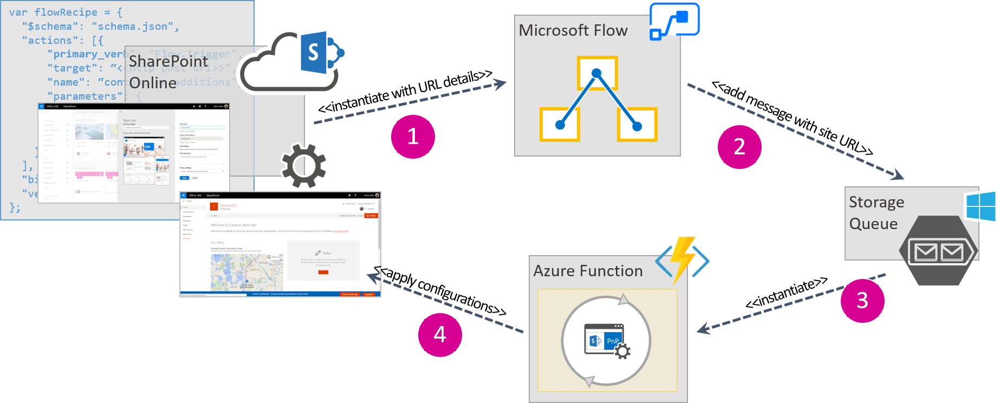

---
# Mandatory fields. See more on aka.ms/skyeye/meta.
title: Site designs and site scripts
description: Use site scripts and site designs to automate provisioning new SharePoint sites with custom configurations.
ms.date: 11/19/2017
---

# Overview of site design
When people in your organization create new SharePoint sites, you often need to ensure proper branding and theming is applied to each new site. People and teams may need a set of standard configurations that they can use repeatedly for each new site. You may also have complicated site provisioning scripts that need to be repeated each time a new site is created. You can use site designs and site scripts to automate provioning new SharePoint sites using your own custom configurations.

```
TBD need overview image
```

## Anatomy of a site script

Site scripts are JSON files that specify an ordered list of actions to run when creating the new site. Here's an example of a script with only one action that simply applies the blue yonder theme.

```javascript
var site_script = {
    "$schema": "schema.json",
        "actions": [
            {
                verb: "applyTheme",
                themeName: "Blue Yonder"
            }
        ],
            "bindata": { },
    "version": 1
}
```

Site scripts can apply themes, create lists, create pages, add navigation links, and set the logo. They can also trigger a Microsoft Flow in which you can specify any additional custom action you want.

You can create site scripts by using PowerShell, CSOM, or the REST API. The following example shows how to create a new site script.

```
TBD: example powershell creating site script
```

Site scripts can be run again on the same site after provisioning. This can only be done programmatically. Site scripts are non-destructive, so when they run again, they ensure that the site matches the configuration in the script. For example, if the site already has a list with the same name that the site script is creating, the site script will only add missing fields to the existing list.

## How site designs work

Site designs incorporate site scripts into the SharePoint user interface for creating new sites. They appear in a dropdown list when creating either a team site, or communication site. A site design has a title, and description, and specify one or more scripts to run.


You can create a site design by using PowerShell, CSOM, or the REST API. The following example shows how to create a new site design for the team site template.

```
TBD powershell example creating a new site design
```

When someone creates a new site, and selects a site design, SharePoint creates the new site, and then runs any scripts registered with the site design. Each action is recorded in a local list. When the scripts are done, SharePoint displays the results from the list in a progress pane.

```
TBD image of progress pane
```

## PnP Provisioning and customization using Microsoft Flow

If you use the PnP provisioning engine to automate site creation you can integrate with site designs to maintain your current provisioning scripts. Site designs provide an action to trigger a Microsoft flow. This allows you to run any custom action you want, including running the PnP provisioning engine.



The process works as follows:
1. The script instantiates your Microsoft flow using a URL with additional details.
1. The flow sends a message to an Azure storage queue that you have configured.
1. The message triggers a call to an Azure function that you have configured.
1. The Azure function runs your custom script, such as the PnP provisioning engine, to apply your custom configurations.

For a step-by-step tutorial on how to configure this, see [Build a complete site design using the PnP provisioning engine](site-design-pnp-provisioning)

## Scoping

You can configure site designs to only appear for specific groups or people in your organization. This is useful to ensure that people only see the site designs intended for them. For example, the accounting department can see only site designs that apply to them. 

Scopes are applied when you register a site design. You can specify the scope by user, Office 365 group, or a mail-enabled security group. The following example shows how to register a site design for just the accounting Office 365 group.

```
TBD powershell example scope
```

For more information, see
*  TBD(links to PowerShell cmdlet, CSOM, and REST refs)
