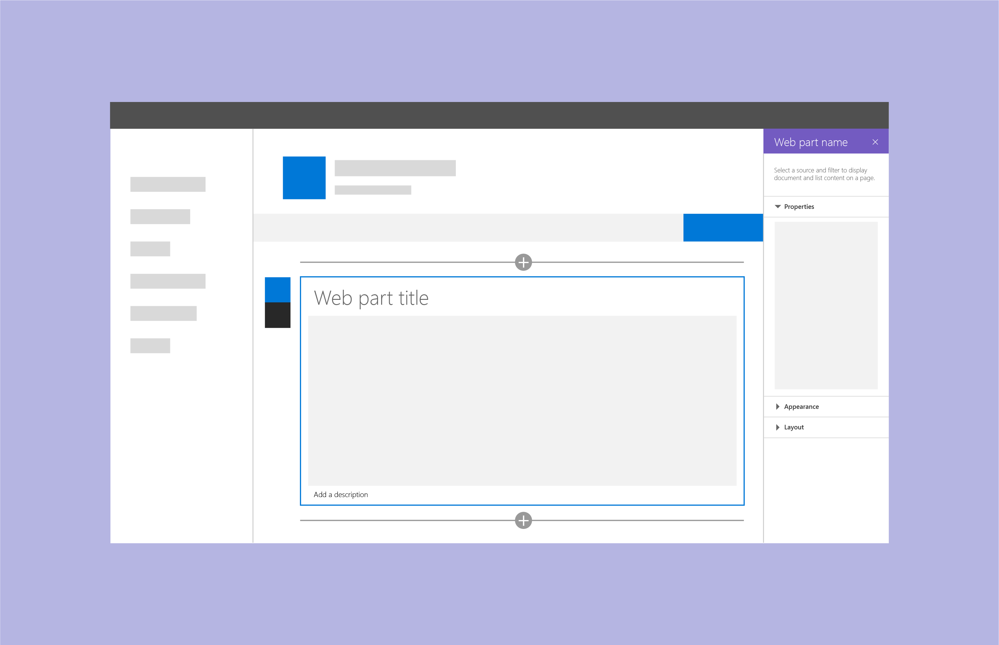
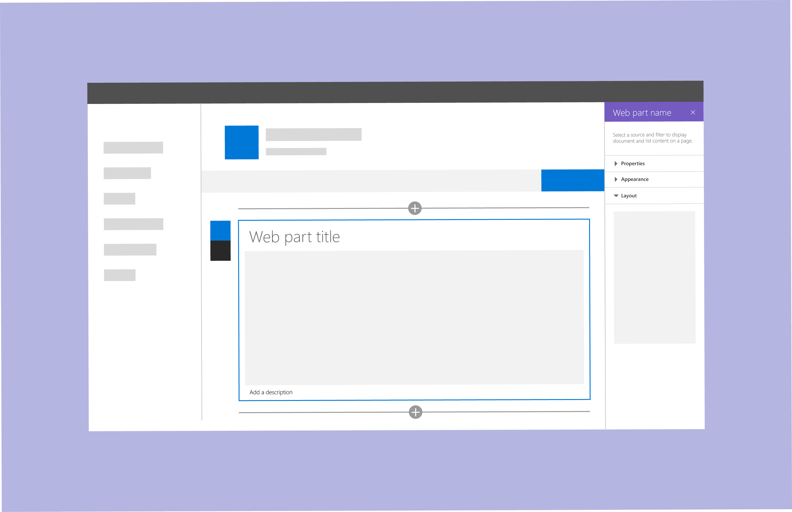
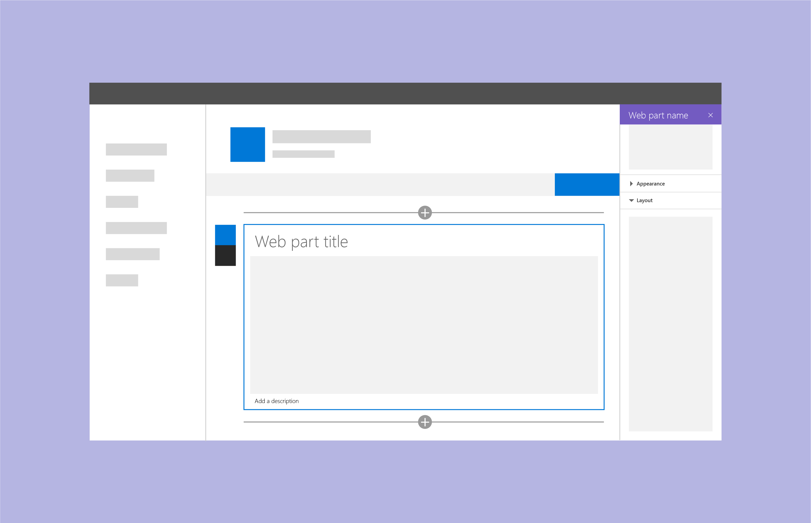
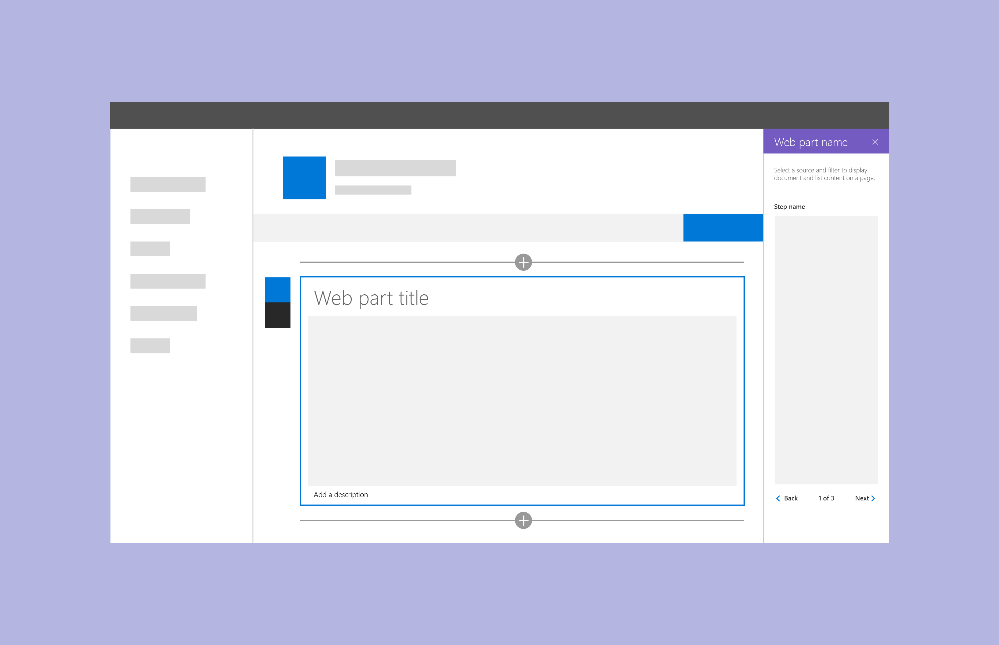
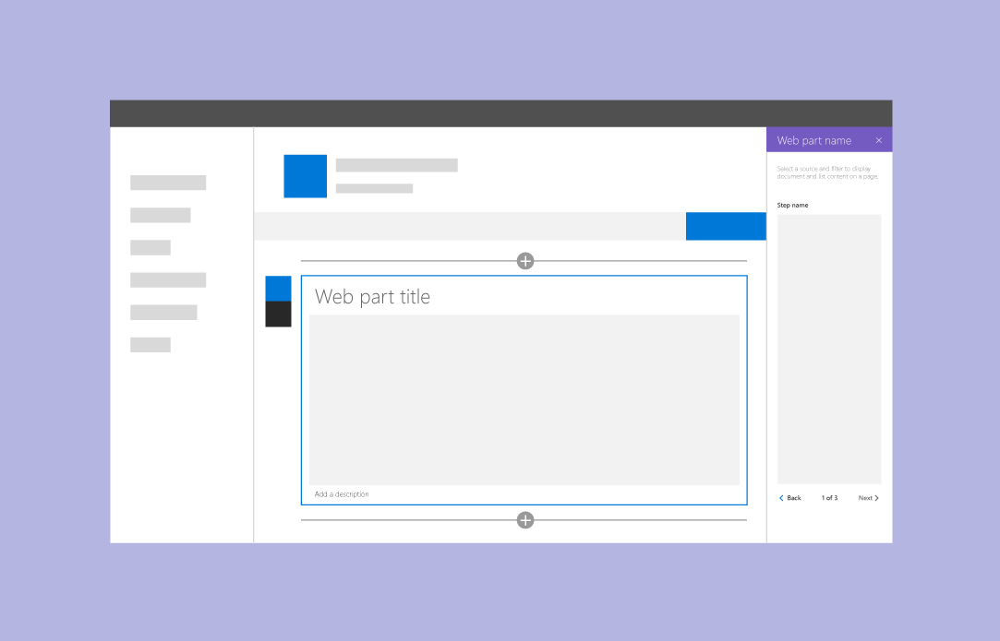

# Designing a SharePoint web part

Before you design a SharePoint web part, you should understand how to [author pages in a SharePoint site](authoring-pages.md). If you haven't already, take some time to create a page and add multiple types of web parts. It is important know how to leverage Office Fabric components and styles to make it easier and quicker to get your new web part up and running.

When you design web parts, it's important to be familiar with the following concepts:

- [Property pane types and when to use each type](#property-pane-types)
- [Reactive and nonreactive web parts](reactive-and-nonreactive-web-parts.md)
- [Titles and descriptions](web-part-titles-and-descriptions.md)
- [Fallbacks and placeholders](placeholders-and-fallbacks.md)

## Property pane types

You can use three types of property panes to design and develop web parts that fit your business or customer needs.

To open a pane to configure settings for a web part, select **Edit**. Use the pane to enable and disable features, select a source, choose a layout, and set options. Edit web part content within the web part rather than in the property pane.

The property pane is 320px and when opened, the page will responsively reflow.

### Single pane
Use a single pane for simple web parts that have only a small number of properties to configure.

### Accordion pane
Use an accordion pane to contain a group or groups of properties with many options, and where the groups result in a long scrolling list of options. For example, you might have three groups named Properties, Appearance, and Layout, each with ten components.

Use accordion panes when you need to apply categorization for a complex web part.

**Accordian groups example with last pane open**

**Accordion groups example with two groups open**

### Steps pane

Use a steps pane to group properties in multiple steps or pages when you need the web part to be configured in a linear order, or when choices in the first step affect the options that display in the second or third step. 

**Step 1 of the steps pane**

In step 1, the back button is disabled and the next button is enabled.

**Step 2 of the steps pane** 

In step 2, the back and next buttons are enabled.

**Step 3 of the steps pane** 

In step 3, the next button is disabled and the back button is enabled.

## See also

- [Designing great SharePoint experiences](design-guidance-overview.md)

