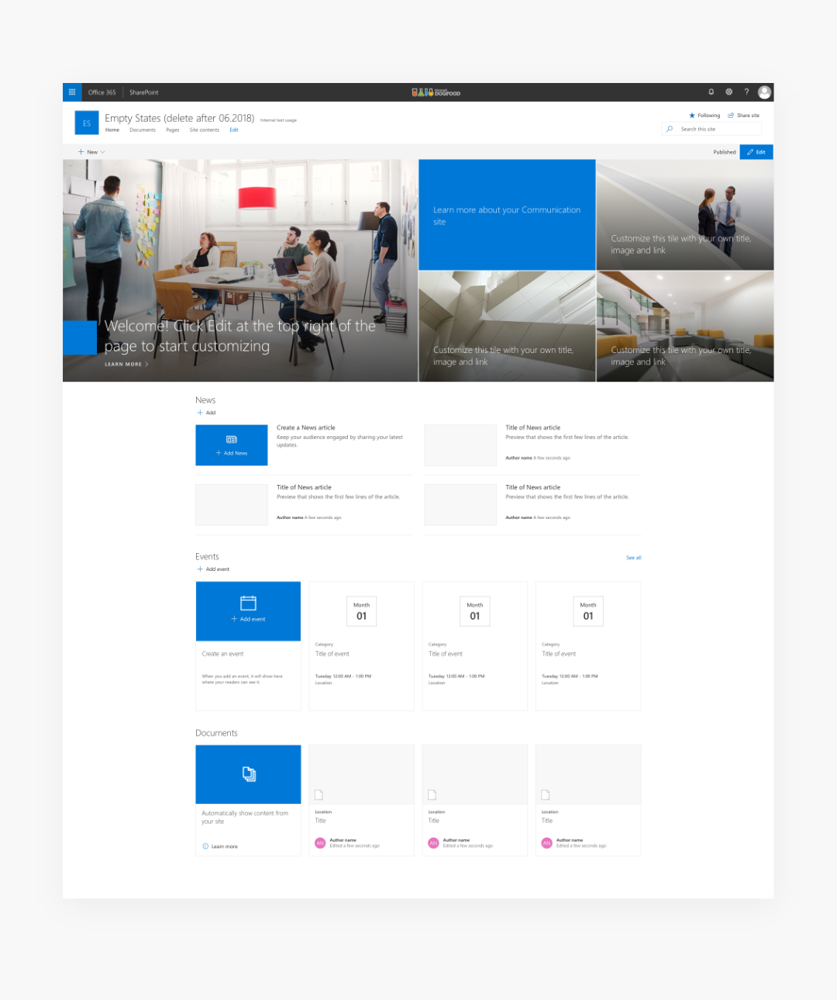
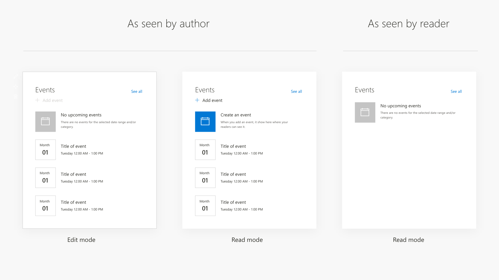
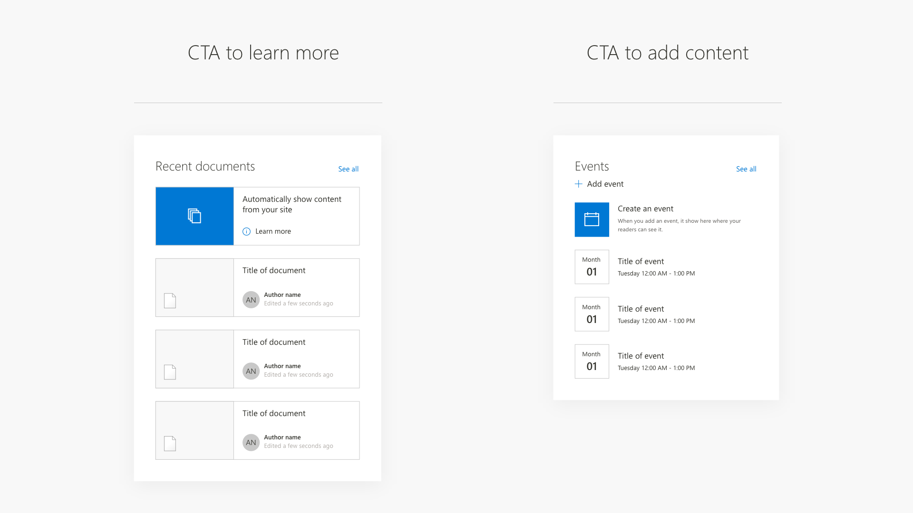
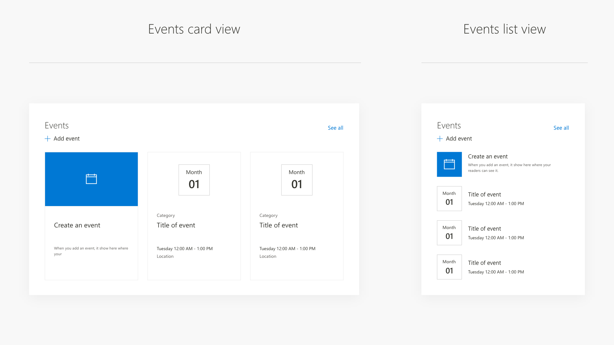
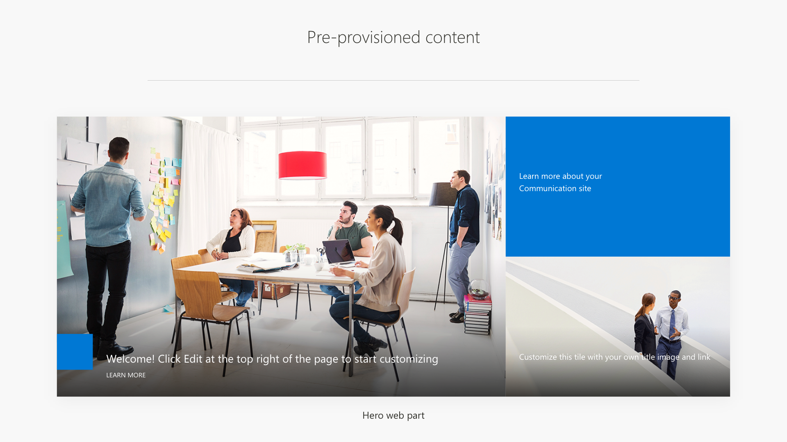

# Empty state of a web part

The empty state is a visual representation of a web part, pre-configured to a content source like a list or with placeholder content, such as images and text. 

The following web parts have a content source set by default but no content to show for a newly created Communication site (that is, they feature an empty state):

- Highlighted content
- News
- Site activity
- Events
- Hero
- Image gallery

Empty states are designed to convey the purpose, stucture, and layout options of web parts before the web part is configured or content is added. The empty state is also a perfect way to illustrate the vertical rhythm and layout of a page that starts from a template. Empty states behave similarly to fully configured web parts, and reflow to accommodate available space. They should support author-configured web part layouts. 

Empty states are different from placeholders in that the latter are meant to be displayed as a fallback when no content is added, or to help the author configure the web part. To learn more about placeholders, see [Placeholders and fallbacks in SharePoint web parts](placeholders-and-fallbacks.md).

## Empty state and editing rights

Web parts with empty states can change interaction options and display text depending on the permission level and mode of the page. 

In the following example (left to right), a person with editing rights sees an empty state of the Events web part in Edit and Read modes. The last image shows a simplified empty state view for page readers that have no editing rights, with a message appropriate to their permission level. 

The following are layout options for the Events web part in an empty state.

## Interactions with an empty state

Empty states are designed primarily for people with editing rights and change interaction options based on the current page mode. Authors can manually add content to web parts in the Read mode, such as adding a new event or new news post. 

The following example shows an empty state with multiple items stacked vertically, where the first item acts as a call to action (CTA) to learn more or create an event.

## Empty state with pre-provisioned content

The Hero web part is an example of an empty state with pre-provisioned content and text. The empty state is designed to help authors understand the options and the layout capabilites of the web part. The empty state in this case is a visual template for the web part.

