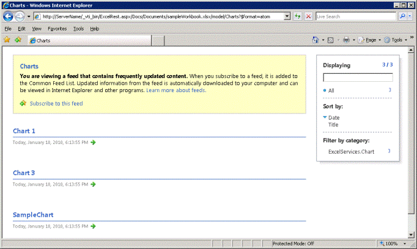
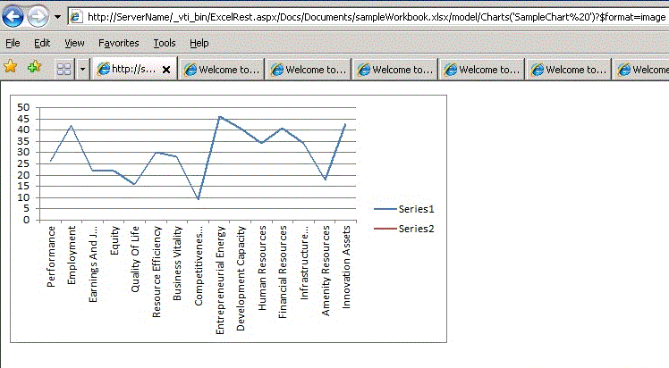

# Discovery in Excel Services REST API

This topic discusses the discovery mechanisms built into the Excel Services REST API.
  
    
    


> [!NOTE]
> The Excel Services REST API applies to SharePoint 2013 and SharePoint 2016 on-premises. For Office 365 Education, Business, and Enterprise accounts, use the Excel REST APIs that are part of the  [Microsoft Graph](http://graph.microsoft.io/en-us/docs/api-reference/v1.0/resources/excel
) endpoint.
  
    
    


## Discovery Base URL and Discovery Example

Discovery enables developers and users to discover information about and the content of a workbook manually or programmatically. The discovery mechanism supplies the  [Atom](http://tools.ietf.org/html/rfc4287) feed that contains information about the resources in a workbook. By using discovery, you can explore and view the resources in the workbook. Resources that you can explore and access are ranges, charts, tables, and PivotTables.
  
    
    
Following is the construct of the REST URL to a specific element in a workbook:
  
    
    


```

http://<ServerName>/_vti_bin/ExcelRest.aspx/<DocumentLibrary>/<FileName>/<ResourceLocation>
```

As described in the  [Basic URI Structure and Path](basic-uri-structure-and-path.md) topic, following is the REST URL to access a workbook named **sampleWorkbook.xlsx** and further view the chart called **SampleChart**: 
  
    
    


```
http://<ServerName>/_vti_bin/ExcelRest.aspx/Docs/Documents/sampleWorkbook.xlsx/model/Charts('SampleChart')
```

To start and explore the resources in the workbook and view the resources by using discovery, go to the model page by using a URI that follows this example:
  
    
    


```
http://<ServerName>/_vti_bin/ExcelRest.aspx/<DocumentLibrary>/<FileName>/model
```

Using the "sampleWorkbook.xlsx" example, following is the URI:
  
    
    


```
http://<ServerName>/_vti_bin/ExcelRest.aspx/Docs/Documents/sampleWorkbook.xlsx/model
```

Following is a screen shot of the model page.
  
    
    

**Excel Services REST model URL**

  
    
    

  
    
    

  
    
    
The URL to the model page is where you start the discovery. The model page displays four resource collections that the Excel Services REST API currently supports. The resource collections are ranges, charts, tables, or PivotTables. You can explore those resources in a particular workbook by clicking **Ranges**, **Charts**, **Tables**, or **PivotTables** on the model page.
  
    
    
For example, to access the chart in the workbook by using discovery, do the following: 
  
    
    

  
    
    

1. On the model page, click **Charts**. Clicking the **Charts** link brings another Atom feed—this resulting feed lists all the charts that are available in the sampleWorkbook.xlsx workbook. The sampleWorkbook.xlsx workbook contains three charts named **Chart 1**, **Chart 3**, and **SampleChart**. Therefore, three chart names are listed, as seen in the following screen shot.
    
   **Excel Services REST discovery chart list**

  

     
  

  

  
2. On the model page, click **SampleChart**. This displays the chart named **SampleChart** that resides in **sampleWorkbook.xlsx**, as shown in the following screen shot. 
    
   **Viewing chart using REST**

  

     
  

  

  
3. Similarly, clicking **Chart 1** or **Chart 3** displays the chart with the corresponding name. Clicking **SampleChart** navigates to the actual chart URL. Following is the URL to the **SampleChart** image (as can be seen in the screen shot):
    

  http://<ServerName>/_vti_bin/ExcelRest.aspx/Docs/Documents/sampleWorkbook.xlsx/model/Charts('SampleChart%20')?$format=image


## Atom Feed

Using the  [Atom](http://tools.ietf.org/html/rfc4287) feed provided by the REST API gives you an easier way of getting to the data that you are interested in. If you view the source of the Web page, you get the XML. An example from the charts in **sampleWorkbook.xlsx** is shown below.
  
    
    
As can be seen in the XML, the feed contains traversable elements that enable code to discover what elements exist in the workbook. Each Atom entry corresponds to a chart that can be accessed. This same mechanism applies to discovering ranges, tables, and PivotTables.
  
    
    


```XML
<?xml version="1.0" encoding="utf-8" standalone="yes"?>
<feed xmlns="http://www.w3.org/2005/Atom" xmlns:x="http://schemas.microsoft.com/office/2008/07/excelservices/rest" xmlns:d="http://schemas.microsoft.com/ado/2007/08/dataservice" xmlns:m="http://schemas.microsoft.com/ado/2007/08/dataservices/metadata">
  <title type="text">Charts</title>
  <id>http://ServerName/_vti_bin/ExcelRest.aspx/Docs/Documents/sampleWorkbook.xlsx/model/Charts</id>
  <updated>2010-01-19T19:32:53Z</updated>
  <author>
    <name />
  </author>
  <link rel="self" href="http://ServerName/_vti_bin/ExcelRest.aspx/Docs/Documents/sampleWorkbook.xlsx/model/Charts?$format=atom" title="Charts" />
  <entry>
    <category term="ExcelServices.Chart" scheme="http://schemas.microsoft.com/ado/2007/08/dataservices/scheme" />
    <title>Chart 1</title>
    <id>http://ServerName/_vti_bin/ExcelRest.aspx/Docs/Documents/sampleWorkbook.xlsx/model/Charts('Chart%201')</id>
    <updated>2010-01-19T19:32:53Z</updated>
    <author>
      <name />
    </author>
    <link rel="alternate" title="Chart 1" href="http://ServerName/_vti_bin/ExcelRest.aspx/Docs/Documents/sampleWorkbook.xlsx/model/Charts('Chart%201')?$format=image" />
    <content type="image/png" src="http://ServerName/_vti_bin/ExcelRest.aspx/Docs/Documents/sampleWorkbook.xlsx/model/Charts('Chart%201')?$format=image" />
  </entry>
  <entry>
    <category term="ExcelServices.Chart" scheme="http://schemas.microsoft.com/ado/2007/08/dataservices/scheme" />
    <title>Chart 3</title>
    <id>http://ServerName/_vti_bin/ExcelRest.aspx/Docs/Documents/sampleWorkbook.xlsx/model/Charts('Chart%203')</id>
    <updated>2010-01-19T19:32:53Z</updated>
    <author>
      <name />
    </author>
    <link rel="alternate" title="Chart 3" href="http://ServerName/_vti_bin/ExcelRest.aspx/Docs/Documents/sampleWorkbook.xlsx/model/Charts('Chart%203')?$format=image" />
    <content type="image/png" src="http://ServerName/_vti_bin/ExcelRest.aspx/Docs/Documents/sampleWorkbook.xlsx/model/Charts('Chart%203')?$format=image" />
  </entry>
  <entry>
    <category term="ExcelServices.Chart" scheme="http://schemas.microsoft.com/ado/2007/08/dataservices/scheme" />
    <title>SampleChart </title>
    <id>http://ServerName/_vti_bin/ExcelRest.aspx/Docs/Documents/sampleWorkbook.xlsx/model/Charts('SampleChart%20')</id>
    <updated>2010-01-19T19:32:53Z</updated>
    <author>
      <name />
    </author>
    <link rel="alternate" title="SampleChart" href="http://ServerName/_vti_bin/ExcelRest.aspx/Docs/Documents/sampleWorkbook.xlsx/model/Charts('SampleChart%20')?$format=image" />
    <content type="image/png" src="http://ServerName/_vti_bin/ExcelRest.aspx/Docs/Documents/sampleWorkbook.xlsx/model/Charts('SampleChart%20')?$format=image" />
  </entry>
</feed>
```


## See also


#### Concepts


  
    
    
 [Resources URI for Excel Services REST API](resources-uri-for-excel-services-rest-api.md)
