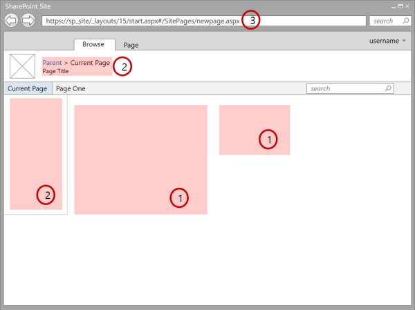
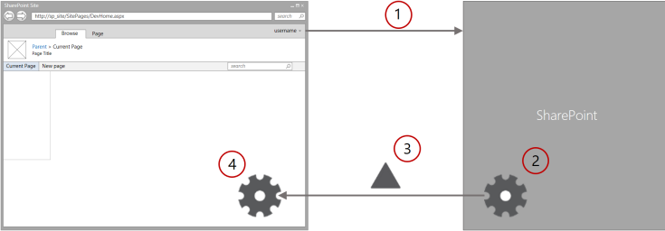

# Minimal Download Strategy overview
Learn about Minimal Download Strategy (MDS), a new feature in SharePoint that reduces page load time by sending only the differences when users navigate to a new page.
Minimal Download Strategy (MDS) is a new technology in SharePoint that reduces the amount of data that the browser has to download when users navigate from one page to another in a SharePoint site. When users browse an MDS-enabled site, the client processes only the differences (or delta) between the current page and the requested page. Figure 1 shows the sections that change from page to page and therefore require an update. The delta usually includes the data in the (1) content areas, as well as other components such as (2) navigation controls.
  
    
    


**Figure 1. Page processed with MDS**

  
    
    

  
    
    

  
    
    
You can identify a site that has MDS enabled by looking at the URL. An MDS-enabled site has the (3) **_layouts/15/start.aspx** page in the URL followed by a hash mark ( **#** ) and the relative URL of the requested resource, as shown in Figure 1. For example, the following is the MDS-formatted URL for the page **newpage.aspx**: **https://sp_site/_layouts/15/start.aspx#/SitePages/newpage.aspx**It is equivalent to the following non-MDS-formatted URL: **https://sp_site/SitePages/newpage.aspx**As a developer, you might have created SharePoint components that need some updates before they can work seamlessly with MDS. 
## Enable MDS
<a name="SP15MDSOverview_Enable"> </a>

You can enable MDS in your site by using either the site administration pages or the SharePoint client object models.
  
    
    
To enable MDS by activating the feature in the administration pages, choose **Site settings** > **Manage site features**, and activate the **Minimal Download Strategy** feature.
  
    
    
Because the feature is activated by modifying the  [EnableMinimalDownload](https://msdn.microsoft.com/library/Microsoft.SharePoint.Client.Web.EnableMinimalDownload.aspx) property, you can also use the client APIs. The following code shows how to enable MDS using the JavaScript object model (JSOM).
  
    
    


```

var clientContext;

clientContext = new SP.ClientContext.get_current();
this.oWebsite = clientContext.get_web();

this.oWebsite.set_enableMinimalDownload(true);
this.oWebsite.update();

clientContext.load(this.oWebsite);

clientContext.executeQueryAsync(
    Function.createDelegate(this, successHandler),
    Function.createDelegate(this, errorHandler)
);

function successHandler() {
    alert("MDS is enabled in this site.");
}

function errorHandler() {
    alert("Request failed: " + arguments[1].get_message());
}
```


## Benefits of using MDS
<a name="SP15MDSOverview_Benefits"> </a>

Using MDS provides several benefits, including:
  
    
    

- **Speed:** This is the main objective of MDS. When you are using MDS, the browser doesn't have to reprocess the chrome user interface (UI). MDS also reduces the payload compared to a full page load.
    
  
- **Smooth transitions:** By updating only the areas that change, you draw the user's eye toward these areas, as opposed to a full page load where the whole page "flashes." When the whole page is updated, the user must parse it in its entirety to detect what is new. Users have an easier time navigating a site that only updates the areas that changed from the previous page.
    
  
- **Browser navigation controls:** Other AJAX-based systems confuse the **previous** and **next** buttons in browsers. Because MDS updates the URL in the browser window, the previous and next buttons work just as they are supposed to.
    
  
- **Backward compatibility:** The MDS engine either provides MDS navigation immediately or detects when it isn't possible. In the case where MDS navigation isn't possible, a full page load occurs instead. This process is called **failover**, and it ensures that all pages render properly regardless of whether they contain MDS-compliant components. MDS also works nicely with search engines because the **href** attribute of anchor tags uses the regular, non MDS-formatted URLs. Instead, the MDS engine in the client captures the **onclick** event and uses it to communicate with the server.
    
  

## MDS architecture
<a name="SP15MDSOverview_Architecture"> </a>

The basic mechanics of MDS are pretty simple. The main components of MDS are two engines, one in the server and another in the client, that work together to calculate the changes and render the pages in the browser when the user navigates from page to page in the site. Figure 2 shows the MDS flow when a user navigates through an MDS-enabled site.
  
    
    

**Figure 2. MDS flow when a user navigates the site**

  
    
    

  
    
    

  
    
    

  
    
    

1. The browser requests the changes between the current page and a new one in the SharePoint site.
    
  
2. The MDS engine in the server calculates the delta between the current and the new pages.
    
  
3. The MDS engine in the server sends the delta to the MDS engine in the client.
    
  
4. The MDS engine in the client replaces the changed areas on the current page with the new page content.
    
  
The resulting page is exactly as it would have been if the page had been downloaded without MDS.
  
    
    
The MDS engine in the client includes a download manager. All requests in the page are routed through the download manager. All controls in the page must subscribe to the download manager to learn when a URL has changed. The download manager makes one request for all the new control data. To be able to work with search engines, the MDS engine doesn't directly use the **href** attribute of anchor tags to store MDS-formatted URLs. Instead, the **SPUpdatePage** function handles the **onclick** event and uses it to communicate with the server. The **SPUpdatePage** function is declared in the **_layouts/15/start.js** file.
  
    
    
The MDS engine in the server sends the information back to the client. This information can contain HTML with embedded scripts and styles, XML, or JavaScript Object Notation (JSON).
  
    
    
The URL plays an important role in MDS. An MDS URL looks like the following: **https://sp_site/_layouts/15/start.aspx#/SitePages/newpage.aspx**. **Start.aspx** contains minimal shared UI and instructions for loading page changes. MDS considers the part following the hash mark (#) as the target page. The target page starts with a slash (/) followed by a URL relative to the SharePoint website. When the browser receives the URL, it sees that the part to the left of the hash mark hasn't changed, so it fires a local navigation event. The MDS engine in the client captures the local navigation event and uses it to perform an MDS update.
  
    
    
As mentioned previously in this article, in some situations it's not possible to determine whether the page can be updated properly. In these situations, the MDS engine issues a **failover**, which consists of an extra round trip to redirect the browser to the full version of the new page. These are the most common reasons why failover occurs:
  
    
    

- The new page has a different master page.
    
  
- The current master page has changed.
    
  
- The MDS engine detects non-compliant HTML, for example:
    
  - Pages using ASP.NET 2.0
    
  
  - CSS or scripts not registered in the MDS engine
    
  
  - Illegal HTML
    
  
- There are non-compliant controls on the page, for example:
    
  - The control is not in the MDS engine whitelist.
    
  
  - The control assembly is not marked as compliant.
    
  
  - The control class doesn't have the MDS attribute.
    
  
The MDS engine tries to recover from a failover after the user navigates to yet another new page.
  
    
    

## Developer controls
<a name="SP15MDSOverview_DevControls"> </a>

Thanks to the failover mechanism, your controls work seamlessly whether or not MDS is enabled in your users' websites. However, it is a good idea to update your SharePoint controls and components to take full advantage of MDS. Users get a better experience when your pages and controls are MDS compliant. The following components are good candidates to get optimized for MDS:
  
    
    

- Master pages
    
  
- ASP.NET pages
    
  
- Controls and Web Parts
    
  

## Additional resources
<a name="bk_addresources"> </a>


-  [EnableMinimalDownload](https://msdn.microsoft.com/library/Microsoft.SharePoint.Client.Web.EnableMinimalDownload.aspx)
    
  
-  [Modify SharePoint components for MDS](modify-sharepoint-components-for-mds.md)
    
  
-  [Build sites for SharePoint](build-sites-for-sharepoint.md)
    
  

