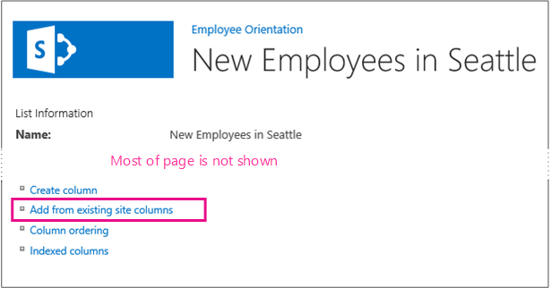

# Add custom columns to a SharePoint-hosted SharePoint Add-in

This is the third in a series of articles about the basics of developing SharePoint-hosted SharePoint Add-ins. You should first be familiar with [SharePoint Add-ins](sharepoint-add-ins.md) and the previous articles in this series:

-  [Get started creating SharePoint-hosted SharePoint Add-ins](get-started-creating-sharepoint-hosted-sharepoint-add-ins.md)  
-  [Deploy and install a SharePoint-hosted SharePoint Add-in](deploy-and-install-a-sharepoint-hosted-sharepoint-add-in.md)
    
> [!NOTE]
> If you have been working through this series about SharePoint-hosted add-ins, you have a Visual Studio solution that you can use to continue with this topic. You can also download the repository at [SharePoint_SP-hosted_Add-Ins_Tutorials](https://github.com/OfficeDev/SharePoint_SP-hosted_Add-Ins_Tutorials) and open the BeforeColumns.sln file.

In this article, we get back to coding by adding some site columns to the Employee Orientation SharePoint Add-in.
 
## Create custom column types

1. In **Solution Explorer**, right-click the project and select **Add** > **New Folder**. Name the folder **Site Columns**.    
 
2. Right-click the new folder, and select **Add** > **New Item**. The **Add New Item** dialog opens to the **Office/SharePoint** node.
     
3. Select **Site Column**, give it the name **Division**, and then select **Add**.
    
4. In the elements.xml file for the new site column, edit the **Field** element so that it has the attributes and values shown in the following example, except that *you should **not** change the GUID* for the **ID** attribute from the value that Visual Studio generated for it, *so be careful if you are using copy-and-paste*.
    
    ```
      <Field ID="{generated GUID}" 
           Name="Division" 
           Title="Division" 
           DisplayName="Division" 
           Description="The division of the company where the employee works." 
           Group="Employee Orientation" 
           Type="Text" 
           Required ="FALSE">
    </Field>
    ```
    
    <br/>

5. Add another **Site Column** named **OrientationStage** to the same folder .
    
6. In the elements.xml file for the new site column, edit the **Field** element so that it has the attributes and values shown in the following example, except that you should not change the GUID for the **ID** attribute from the value that Visual Studio generated for it.
    
    ```
      <Field ID="{generated GUID}" 
           Name="OrientationStage" 
           Title="OrientationStage"
           DisplayName="Orientation Stage" 
           Group="Employee Orientation" 
           Description="The current orientation stage of the employee." 
           Type="Choice"
           Required ="TRUE">
    </Field>
    ```
    
    <br/>

7. Because this is a Choice field, you must specify the possible choices and the order in which they should appear in the drop-down list when a user is making a choice. Because it is a required field, you must specify a default value. Add the following child markup to the **Field** element, and then save all the files.
    
    ```
      <CHOICES>
          <CHOICE>Not Started</CHOICE>
          <CHOICE>Tour of building</CHOICE>
          <CHOICE>HR paperwork</CHOICE>
          <CHOICE>Corporate network access</CHOICE>
          <CHOICE>Completed</CHOICE>
    </CHOICES>
    <MAPPINGS>
          <MAPPING Value="1">Not Started</MAPPING>
          <MAPPING Value="2">Tour of building</MAPPING>
          <MAPPING Value="3">HR paperwork</MAPPING>
          <MAPPING Value="4">Corp network access</MAPPING>
          <MAPPING Value="5">Completed</MAPPING>
    </MAPPINGS>
    <Default>Not Started</Default>
    ```

    </br>
    
## Run the add-in and test the columns

1. Use the F5 key to deploy and run your add-in. Visual Studio makes a temporary installation of the add-in on your test SharePoint site and immediately runs the add-in.  
 
2. When the add-in's default page opens, select the **New Employees in Seattle** link to open the custom list instance.
 
3. Open the list's **Settings** page and add the two columns to it with these steps:
    
    1. Select the callout button, **· · ·** just above the list, and then select **Create View**.
    2. The **View Type** page opens, with the breadcrumb structure **Settings > View Type** near the top. Select the **Settings** breadcrumb.
    
        *Figure 1. Steps to open the list settings page*

        
 
    3. On the **Settings** page, open the **Add from existing site columns** link on the left about halfway down the page.
    
        *Figure 2. List settings page*

        

    4. On the **Add Columns from Site Columns** page, select **Employee Orientation** on the **Select site columns from** drop-down list.
    
        *Figure 3. Add Columns from Site Columns page*

        

    5. Add the **Division** and **OrientationStage** columns to the **Columns to add** box.

    6. Select **OK** to return to the **Settings** page, and then select the **New Employees in Seattle** breadcrumb near the top of the page.
    
4. The new columns are now on the list. Add a new item to the list. On the edit form, the **Orientation Stage** field will already have the default value **Not Started**. (The existing items will be blank in this field because they were created before the field was on the list.)
    
    *Figure 4. The list with new columns*

    
 
5. To end the debugging session, close the browser window or stop debugging in Visual Studio. Each time that you select F5, Visual Studio will retract the previous version of the add-in and install the latest one.
    
6. You will work with this add-in and Visual Studio solution in other articles, and it's a good practice to retract the add-in one last time when you are done working with it for a while. Right-click the project in **Solution Explorer**, and then select **Retract**.
    

## Next steps
<a name="Nextsteps"> </a>

You don't really want your users to have to manually add the custom columns to the list, so in the next article in this series, you'll create a custom content type that includes the custom columns and is automatically associated with the New Employees list template: [Add a custom content type to a SharePoint-hosted SharePoint Add-in](add-a-custom-content-type-to-a-sharepoint-hosted-sharepoint-add-in.md). 
 

 

