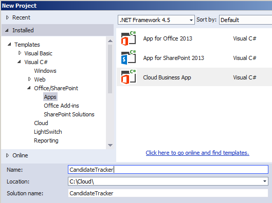
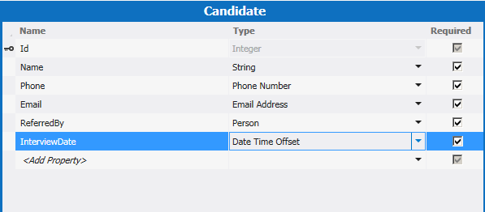
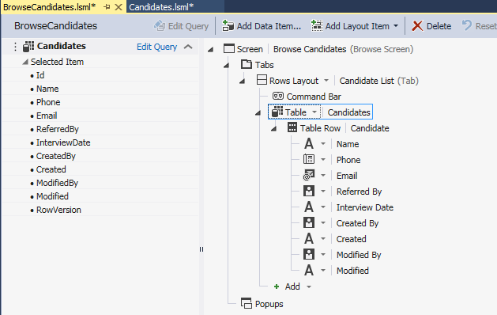
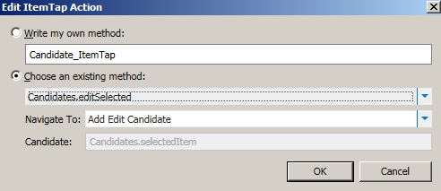

# Create a cloud business add-in with a social newsfeed

By using the Cloud Business Add-in template in Visual Studio, you can create SharePoint Add-ins in which users can view, add, and update SharePoint data. The **Cloud Business Add-in** project type uses Visual Studio LightSwitch technologies, which greatly simplify the process of creating business add-ins hosted on SharePoint. In this walkthrough, you'll create an add-in to track job candidates, taking advantage of the SharePoint for Office 365 social integration feature to provide a newsfeed for the add-in.
 
You can [download the complete sample application from the MSDN Code Gallery](https://code.msdn.microsoft.com/Creating-a-Cloud-Business-8540c0c9).

## Prerequisites

This walkthrough requires Visual Studio 2013.

To host the add-in, you'll also need a SharePoint site or a SharePoint Developer site on Office 365, which you can get from the [Sign up for an Office 365 Developer Site](set-up-a-development-environment-for-sharepoint-add-ins-on-office-365.md#sign-up-for-an-office-365-developer-site).

<a name="bk_create"> </a>
## Create a cloud business add-in project

To create a cloud business add-in, you start with the Cloud Business Add-in project template in Visual Studio.

### To create the project

1. On the menu bar, select **File** > **New** > **Project**.

2. In the **New Project** dialog box, in the list of templates, expand the **Visual Basic** or **Visual C#** node, expand the **Office/SharePoint** node, select the **Add-ins** node, and then select **Cloud Business Add-in**, as shown in Figure 1 (note that "app" is now "add-in").
    
   *Figure 1. Add the project*

   

3. In the **Name** box, enter **CandidateTracker**, and then select **OK**.

4. In the New Cloud Business Add-in Wizard, enter the URL for your Office 365 Developer site, and then select **Finish**.
    
    The URL should take the form `https://MySite.sharepoint.com/sites/Developer/`.
    
    A **CandidateTracker** solution is added to Solution Explorer with four projects: 
    
    - A top-level **CandidateTracker** project
    - A **CandidateTracker.HTMLClient** project
    - A **CandidateTracker.Server** project
    - A **CandidateTracker.SharePoint** project

<a name="bk_add"> </a>
## Add data and screens

The candidate tracker add-in needs a database table, which you'll create in the **Server** project, and screens to view, add, and update data, which you'll create in the **HTMLClient** project.

### To add the database table

1. In **Solution Explorer**, open the shortcut menu for the **CandidateTracker.Server** node, and select **Add Table**.

2. In the entity designer, in the Properties window, in the **Name** property box, enter **Candidate**.

3. Select the `<Add Property>` link and enter **Name**.
    
4. Select **Enter**, accepting the default data type **String**, and leaving the **Required** check box selected.
    
5. Select the `<Add Property>` link, enter **Phone**, and then select the **Tab** key.

6. In the **Type** column, select **Phone Number**, and then select the **Tab** key twice.
    
   **Phone Number** is a custom business type that automatically formats and provides validation for telephone numbers.

7. In the next row, in the **Name** column, enter **Email**, and in the **Type** column, select the **Email Address** data type.
    
   **Email Address** is another custom business type that provides validation for email addresses.
    
8. In the next row, enter **ReferredBy**, and select **Person** as the data type.
    
   The **Person** business type provides a connection to the SharePoint User Profile Service, which pulls user information from Active Directory.

9. In the next row, enter **InterviewDate**, and select **Date Time Offset** as the data type.
    
   The **Date Time Offset** business type stores the date and time in UTC format, allowing users in different time zones to see the correct time.   

   *Figure 2. The completed Candidate entity*

   

### To create the browse screen


1. In the entity designer, on the **Perspective** bar, select the **HTML Client** tab, and then on the toolbar, select **Screen**.

2. In the **Add New Screen** dialog box, in the **Select a screen template** list, select **Browse Data Screen**.

3. In the **Screen Data** list, select **Candidates**, and then select **OK**.
    
   The screen designer opens, with a representation of the data entity in the left pane, and a representation of the screen layout in the right pane.

4. In the right pane of the screen designer, select the **List | Candidates** node, expand the **List** list, and then select **Table**, as shown in Figure 3.
    
   *Figure 3. The Table control*

   
 
   This displays the **Candidate** information in a tabular format instead of in the default list format.
    
   Notice that in addition to the fields that you defined for the table, there are four more fields: Created By, Created, Modified By, and Modified. These fields create an audit trail to show when an item was added or last updated and by whom. 

### To create the add screen

1. In the screen designer, open the shortcut menu for the **Command Bar** node, and select **Add Button**.

2. In the **Add Button** dialog box, expand the **showTab** list, select **addAndEditNew** as shown in Figure 4, and then select **OK**.
    
   *Figure 4. The Add Button dialog box*

   

3. In the **Add New Screen** dialog box, accept the default values, and then select **OK**. A new screen designer window opens.

### To create the edit screen

1. Select the **BrowseCandidates.lsml** designer tab, and in the screen designer, select the **Table | Candidates** node.

2. In the Properties window, select the **Item Tap** link, as shown in Figure 5.
    
   *Figure 5. The Item Tap link*

   

3. In the **Edit Item Tap Action** dialog box, expand the **showTab** list, select **editSelected** as shown in Figure 6, and then select **OK**.
    
   *Figure 6. The Edit Item Tap Action dialog box*

   

### To test the add-in

1. On the menu bar, select **Debug** > **Start Debugging**.
    
   The first time that you run a SharePoint add-in on your computer, you're prompted to install a Localhost certificate because cloud business add-ins always use SSL (Secure Sockets Layer). If you accept this certificate, a security warning won't appear each time that you launch the add-in. Because the certificate applies only to Localhost, your system faces no threat.

2. In the **Security Alert** dialog box, select **Yes**.

3. If a **Security Warning** dialog box appears, select **Yes**.

4. On the sign-in page of your web browser, select **Sign In**.

5. Enter your password, and then select **Sign In**.

6. If prompted, select **Trust It**.

7. On the **Browse Candidates** screen, select **Add Candidate**.

8. On the **Add Candidate** screen, enter a name, phone number, and email address.

9. Select the **Referred By** field and enter the first three characters of your own name.
    
   Your full name should appear in the list. If your site is connected to Active Directory, you should see a list of all users whose name begins with the same three characters.

10. Optionally change the **Interview Date** date and time, and then select **Save** to return to the **Browse Candidates** screen.
    
   The candidate that you just added is displayed; if you select the row, the **Add Edit Candidates** screen opens. Notice that some of the fields inherit special behaviors from their custom business types. Select the **Phone** field to dial the number, select the **Email** field to send an email, or hover over the **Created By** field to see your contact information.

11. Close the browser window to stop the add-in from running.

<a name="bk_feed"> </a>
## Add a newsfeed

One of the features of SharePoint for Office 365 is the ability to add newsfeeds, allowing users to track activity on a list and add their comments. Cloud business add-ins make it easy to create a newsfeed for your add-in.

### To enable social integration

1. Select the **Candidates.lsml** designer tab, and then on the **Perspective** bar, select the **Server** tab.

2. In the Properties window, select the **Post when Created** and **Post when Updated** check boxes, as shown in Figure 7.
    
   *Figure 7. Social properties*

   

3. Select the **Choose post triggers** link.

4. In the **Choose post triggers** dialog box, clear the **All Fields** check box, select the **Interview Date** check box, and then select **OK**.

### To test the add-in

1. On the menu bar, select **Debug** > **Start Debugging**.

2. On the **Browse Candidates** screen, select the candidate that you created earlier.

3. On the **Add Edit Candidate** screen, change the **Interview Date**, and then select **Save**.

4. Select **Add Candidate**, and add another candidate.

5. On the **Browse Candidates** screen, on the SharePoint chrome bar, select the **Newsfeed** link.
    
   The **Candidate Tracker Newsfeed** opens in a new browser window with two entries for the added and updated candidates. You can select the **Like** link for a post, or you can select the **Reply** link to add a comment.

6. Close both browser windows to stop the add-in from running.

<a name="bk_validate"> </a>
## Add validation

In many business add-ins, you'll want to restrict access to certain functionality, for example, only allowing a manager to change the interview date. Cloud business add-ins let you do this by writing validation logic; in this case, you will write code to determine if the current user is a member of a specific Active Directory Security Group.

### To add validation

1. Select the **Candidates.lsml** designer tab, and then on the **Perspective** bar, select the **Server** tab.

2. On the toolbar, expand the **Write Code** list, and select the **Candidates_Validate** method.

3. In the Code Editor, add the following code to the **Candidates_Validate** method:
    
    ```VB.net
      If Not Application.User.Department = "Hiring Managers" Then
                    results.AddEntityError("Permission denied")
                End If
    ``` 

    ```C#
       if (!(Application.User.Department == "Hiring Managers")) {
     results.AddEntityError("Permission denied");
     }
    ```

The **Validate** method is run when a user tries to save a record. If the user is a member of the Hiring Managers security group, the record is saved; otherwise, a "Permission denied" error message is displayed and the record is discarded.

At this point, if you run the add-in and add a new candidate, you will likely see the error message unless you are a member of an actual security group named Hiring Managers. Replace "Hiring Managers" with the name of a security group to which you belong and try again. You should now have permission to add a candidate.

<a name="bk_validate"> </a>
## Next steps

Congratulations! You created your first cloud business add-in. If this was an add-in that you want to share with users, your next step would be to publish the add-in: 
- [Publish a cloud business add-in to Office 365](incident-manager-a-cloud-business-add-in-tutorial.md#publish-to-sharepoint)
- [Publish cloud business add-ins](publish-cloud-business-add-ins.md)
- [Publish SharePoint Add-ins](publish-sharepoint-add-ins.md).

Of course, this is just a simple example; there's much more that you can do to create full-featured add-ins. Because the Cloud Business Add-in template is based on LightSwitch technologies, you may want to explore the LightSwitch documentation to get some ideas: [LightSwitch SharePoint Add-ins](http://msdn.microsoft.com/en-us/library/vstudio/jj969620.aspx).

## Additional resources
<a name="bk_addresources"> </a>

-  [Create cloud business add-ins](create-cloud-business-add-ins.md)
    
 

