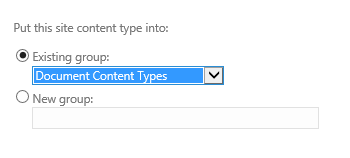

# Provide a template for a document library in a cloud business add-in
In addition to the Office templates that are available when you add a document to a SharePoint document library, you can provide your own templates. For example, you might have your own sales quote template that you want to use when new orders are added.
 

 **Note**  The name "apps for SharePoint" is changing to "SharePoint Add-ins". During the transition, the documentation and the UI of some SharePoint products and Visual Studio tools might still use the term "apps for SharePoint". For details, see  [New name for apps for Office and SharePoint](new-name-for-apps-for-sharepoint.md#bk_newname).
 

## 

If you haven't already done so, associate a document library with your cloud business add-in. See  [Associate a document library with an entity](associate-a-document-library-with-an-entity.md).
 

 

### To add a template

1. Go to your SharePoint developer site and on the  **Developer** page, choose **Site Contents**.
    
 
2. On the  **Site Contents** page, choose **Settings**, as shown in Figure 1.
    
    **Figure 1. The Settings link**

 

  
 

 

 
3. On the  **Site Settings** page, in the **Web Designer Galleries** list, choose **Site content types**, as shown in Figure 2.
    
    **Figure 2. The Site content types link**

 

  
 

 

 
4. On the  **Site Content Types** page, choose **Create**, as shown in Figure 3.
    
    **Figure 3. The Create link**

 

  
 

 

 
5. On the  **New Site Content Type** page, enter a name and description for your template. For the **Parent Content Type**, choose  **Document Content Types** and **Document**, as shown in Figure 4.
    
    **Figure 4. Parent content type selections**

 

  
 

 

 
6. In the  **Group** section, in the **Existing group** list, choose **Document Content Types** as shown in Figure 5, and then choose **OK**.
    
    **Figure 5. Group setting**

 

  
 

 

 
7. On the  **Site Content Type** page, choose **Advanced settings**.
    
 
8. On the  **Advanced Settings** page, either enter the URL of an existing document template or upload a new document template as shown in Figure 6, and then choose **OK**.
    
    **Figure 6. Specify the document template**

 

  
 

 

 
9. Go to the  **Site Contents** page and choose your document library, and then go to the **Settings** page.
    
 
10. On the  **Settings** page, choose **Add from existing site content types**.
    
 
11. On the  **Add Content Types** page, add your template as shown in Figure 7, and then choose **OK**.
    
    **Figure 7. Adding the template**

 

  
 

 

 
12. Run your add-in and add a document. You should see your template in the  **Create a new file** dialog box, as shown in Figure 8.
    
    **Figure 8. The Create a new file dialog box with the new template**

 

  
 

 

 

## Additional resources

-  [Develop cloud business add-ins](develop-cloud-business-add-ins.md)
    
 
-  [Associate a document library with an entity](associate-a-document-library-with-an-entity.md)
    
 

