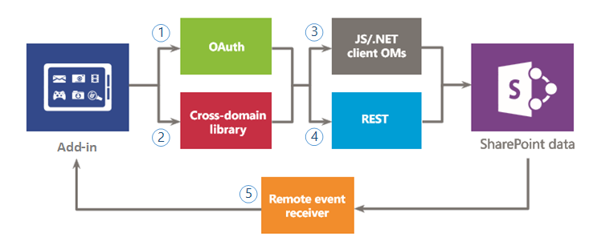
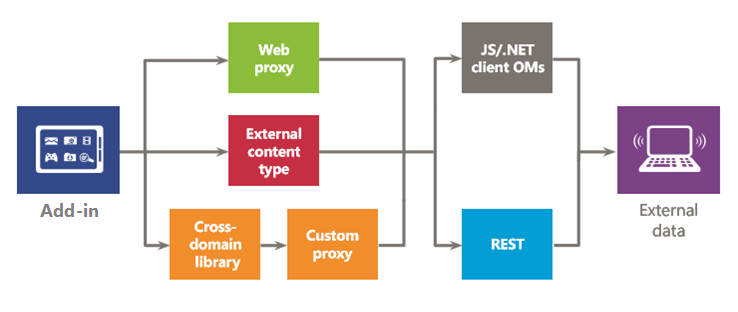

# Secure data access and client object models for SharePoint Add-ins

In evaluating your data access options for SharePoint Add-ins, you have to assess your add-in environment and consider several factors, such as communication between the client and server, and the permission level that is required for your add-in to perform the required tasks. You also have to evaluate the APIs that are available in the model for SharePoint Add-ins.

## High-level overview of data in SharePoint Add-ins

It is difficult to imagine a SharePoint Add-in (or any add-in for that matter) that does not need to query, store, or manipulate data. In your add-in, you will frequently have to retrieve and manipulate SharePoint data, such as items in document libraries and lists, metadata, or user profiles. Similarly, you might have scenarios where you need to access external data in your add-in. The model for SharePoint Add-ins provides multiple connectivity options and a rich set of APIs for accessing the data and services that reside on SharePoint and on external systems.

As you design your add-in and plan for data access, you have to make two key decisions:

1. Which connectivity option should I use?
2. What APIs should I use for accessing the data I need?

The following figures summarize the different options that are provided by the model for SharePoint Add-ins. In the sections that follow, you will examine each option in detail and learn when to use them.

Figure 1 illustrates the options you have for accessing SharePoint data in your add-in. When you are dealing with these scenarios, you have to decide whether you want to authenticate and communicate to SharePoint by using (1) OAuth or (2) the cross-domain library. For the data access API, you must decide between (3) the client object model (JavaScript/.NET client object models) or (4) Representational State Transfer (REST).

Keep in mind that you can also access certain data using (5) remote event receivers; however, the main scenario for remote event receivers is remote code execution.

*Figure 1. Options for using SharePoint data in your add-in*

 
Figure 2 shows the options that you have for accessing external data on your add-in. When you are working with these scenarios, you have to decide whether you want to use (1) the web proxy, (2) external content types, or (3) the cross-domain library with a custom proxy page to authenticate and communicate with external services or systems. You can also use (4) the client object model (JavaScript/.NET client object models) or (5) Representational State Transfer (REST).

*Figure 2. Options for using external data in your add-in*

## Data connectivity options for SharePoint Add-ins

You have to consider several aspects when you work with data in your add-in. For example, what route is the data using? Is it coming from or going through the server? Is it going through the client? Is it okay to authenticate as the signed-in user? Does the add-in need elevated privileges? The following sections can help you with these and other questions you may have.

### SharePoint data connectivity

The following connectivity options are available when accessing SharePoint data (see Figure 1):

- **OAuth:** An open protocol that enables secure authorization in a simple and standard way. OAuth enables users to approve an application to act on their behalf without sharing their user name and password. You can use OAuth with server-side code. It is a good option if you need to run a non-interactive process, or if you need to elevate privileges to other than those of the signed-in user. For information about OAuth, see [Authorization and authentication of SharePoint Add-ins](authorization-and-authentication-of-sharepoint-add-ins.md).  
 
- **Cross-domain library:** A client-side alternative in the form of a JavaScript file (**SP.RequestExecutor.js**) hosted in the SharePoint website that you can reference in your remote add-in. The cross-domain library allows you to interact with more than one domain in your remote add-in page through a proxy. This is a good option if you prefer your add-in code to run in the client rather than in the server, or if there are connectivity barriers, such as firewalls, between SharePoint and your remote infrastructure. For more information, see [Access SharePoint data from add-ins using the cross-domain library](access-sharepoint-data-from-add-ins-using-the-cross-domain-library.md).
     
- **Remote event receivers:** You can use remote event receivers to handle events that occur to an item in the add-in, such as a list, a list item, or a web. These events resemble those in a traditional SharePoint solution, except that they can work with the remote components of the SharePoint Add-in. Note that some properties of the item are available to the remote event receiver. For more information, see [Create a remote event receiver in SharePoint Add-ins](create-a-remote-event-receiver-in-sharepoint-add-ins.md). In a similar way, you can use add-in event receivers to customize how your add-in is installed, updated, and uninstalled. For more information, see [Create an add-in event receiver in SharePoint Add-ins](create-an-add-in-event-receiver-in-sharepoint-add-ins.md).

### SharePoint data connectivity options: Which one should I use?

The following table lists the common requirements and scenarios you might encounter when you are building add-ins. An **x** in the column indicates which option you can use in each case.

**Table 1. SharePoint data connectivity options**

|**Requirement/Scenario**|**OAuth**|**Cross-domain library**|
|:-----|:-----:|:-----:|
|I use client-side technologies (HTML + JavaScript).||x|
|I want to use REST interfaces.|x|x|
|There is a firewall between SharePoint and my remote add-in, and I need to issue the calls through the browser.||x|
|My add-in needs to access resources as the signed-in user.|x|x|
|My add-in needs to elevate privileges to other than those of the current signed-in user.|x||
|My add-in needs to act on behalf of a user other than the one who is signed in.|x||
|My add-in needs to perform operations only while the user is signed in.|x|x|
|My add-in needs to perform operations even when the user is not signed in.|x||
|My add-in needs to execute remote code as a response to an event in SharePoint.|||

Because Remote Event Receivers are built on top of OAuth, a comparison in this table is not the best way to decide whether you should use them or not. Use Remote Event Receivers when you need to execute remote code in addition to data exchange.

### External data connectivity

The following connectivity options are available when accessing external data (see Figure 2):

-  **Web proxy:** As a developer, you can use the web proxy exposed in client APIs such as the JSOM. When you use the web proxy, you issue the initial request to SharePoint. In turn, SharePoint requests the data to the specified endpoint and forwards the response back to your page. Use the web proxy when you want the communication to occur at the server level. The web proxy is designed to access unstructured data that doesn't require authentication. For more information, see [Query a remote service using the web proxy in SharePoint](query-a-remote-service-using-the-web-proxy-in-sharepoint.md).

-  **External content types:** You can create add-ins that access external data from SAP, Netflix, and proprietary and other types of data without involving the tenant administrator. Access to external applications is maintained through Business Connectivity Services (BCS), which provides a consistent and uniform interface that can be used by other SharePoint applications. App-scoped ECTs are a good option when you are using a BCS model and access to the data requires authentication. For more information, see [Add-in-scoped external content types in SharePoint](http://msdn.microsoft.com/library/a34cbbba-dc38-4d3d-b796-d54b5848bdfb%28Office.15%29.aspx).

-  **Custom proxy page for the cross-domain library:** You can use the cross-domain library to access data in your remote add-in if you provide a custom proxy page that is hosted in the remote add-in infrastructure. As the developer, you are responsible for the custom proxy page implementation and must provide custom logic, such as the authentication mechanism to the remote add-in. Use the cross-domain library with a custom proxy page if you want the communication to occur at the client level. For more information, see [Create a custom proxy page for the cross-domain library in SharePoint](create-a-custom-proxy-page-for-the-cross-domain-library-in-sharepoint.md).

### External data connectivity options: Which one should I use?

The following table lists the common requirements and scenarios you might encounter when you are building add-ins. An **x** in the column indicates which option you can use in each case.

**Table 2. External data connectivity options**

|**Requirement/Scenario**|**Web proxy**|**External content types**|**Cross-domain library with custom proxy page**|
|:-----|:-----:|:-----:|:-----:|
|I use client-side technologies (HTML + JavaScript).|x|x|x|
|I cannot add pages or components to the remote add-in or service.|x|x||
|I want to use REST interfaces.|x|x|x|
|I want to use the JavaScript CSOM.|x|x|x|
|I want to use the .NET CSOM.|x|x||
|There is no direct connectivity between the SharePoint infrastructure and my add-in. I need to issue calls through the browser.||x|x|
|My add-in needs to access resources as the signed-in user.|x|x|x|

## Available data access APIs for SharePoint Add-ins

The following API choices are available when you want to access SharePoint data from your add-in:

- **Representational State Transfer (REST):** For scenarios in which you need to access SharePoint entities from client technologies that do not use JavaScript and are not built on the .NET Framework platform, SharePoint provides an implementation of a REST web service that uses the [Open Data (OData) protocol](http://www.odata.org/) to perform CRUDQ (Create, Read, Update, Delete, and Query) operations on SharePoint data. In addition, nearly every API in the client object models has a corresponding REST endpoint. This enables your code to interact directly with SharePoint by using any technology that supports standard REST capabilities. To use the REST capabilities that are built into SharePoint, your code constructs a RESTful HTTP request to an endpoint that corresponds to the desired SharePoint object. The REST service handles the HTTP request and serves a response in either Atom or JavaScript Object Notation (JSON) format. To learn more about REST in SharePoint, see [Use OData query operations in SharePoint REST requests](use-odata-query-operations-in-sharepoint-rest-requests.md).
    
- **.NET Framework client object model (.NET client OM):** Almost every class in the core site and list server-side object model has a corresponding class in the .NET Framework client object model. In addition, the .NET Framework client object model also exposes a full set of APIs for extending other features, including some SharePoint-level features such as ECM, taxonomy, user profiles, advanced search, analytics, BCS, and others. To learn more about client-side object models, see [Choose the right API set in SharePoint](http://msdn.microsoft.com/library/f36645da-77c5-47f1-a2ca-13d4b62b320d%28Office.15%29.aspx). 
 
- **JavaScript client object model (JSOM):** SharePoint provides a JavaScript object model for use in either inline script or separate .js files. It includes all the same functionality as the .NET Framework client object model. The JSOM is a useful way of including custom SharePoint code in an add-in, especially in a SharePoint-hosted add-in, where custom server-side code is not allowed. It also enables web developers to use their existing JavaScript skills to create SharePoint Add-ins with a minimal learning curve. To learn more about client-side object models, see [Choose the right API set in SharePoint](http://msdn.microsoft.com/library/f36645da-77c5-47f1-a2ca-13d4b62b320d%28Office.15%29.aspx).
    
There might be additional APIs that you can use in your SharePoint Add-in when accessing external data. It depends on what interfaces the external services and systems have to offer. You should also consider these interfaces in your design.

## Additional resources

-  [Authorization and authentication of SharePoint Add-ins](authorization-and-authentication-of-sharepoint-add-ins.md)
-  [Access SharePoint data from add-ins using the cross-domain library](access-sharepoint-data-from-add-ins-using-the-cross-domain-library.md)
-  [Create a custom proxy page for the cross-domain library in SharePoint](create-a-custom-proxy-page-for-the-cross-domain-library-in-sharepoint.md)
-  [Query a remote service using the web proxy in SharePoint](query-a-remote-service-using-the-web-proxy-in-sharepoint.md)
-  [Create a remote event receiver in SharePoint Add-ins](create-a-remote-event-receiver-in-sharepoint-add-ins.md)
-  [Choose the right API set in SharePoint](http://msdn.microsoft.com/library/f36645da-77c5-47f1-a2ca-13d4b62b320d%28Office.15%29.aspx)
-  [Use OData query operations in SharePoint REST requests](use-odata-query-operations-in-sharepoint-rest-requests.md)
    
 

