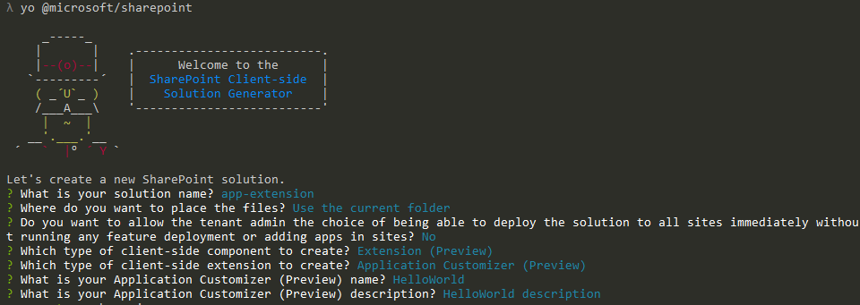
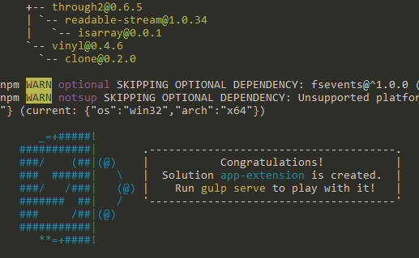
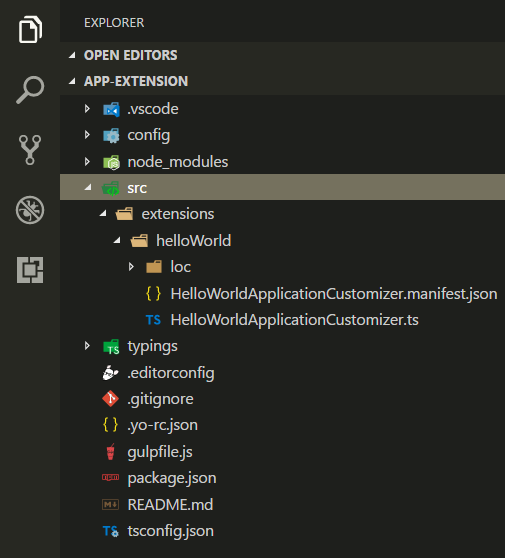
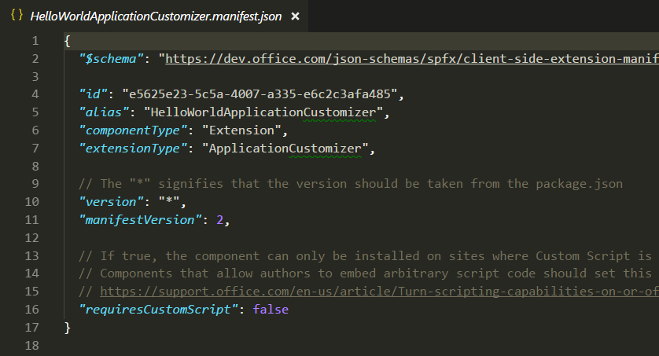
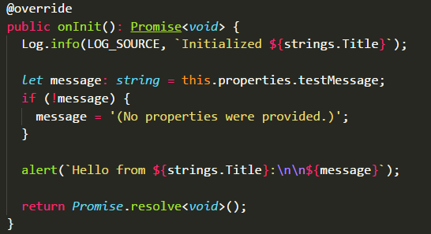
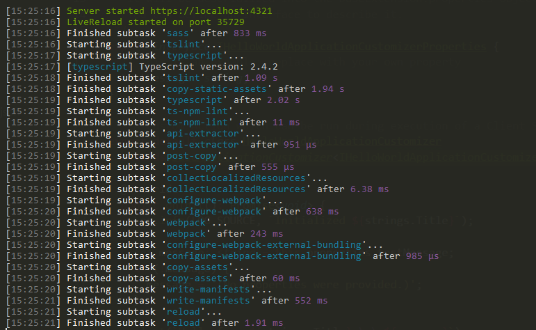
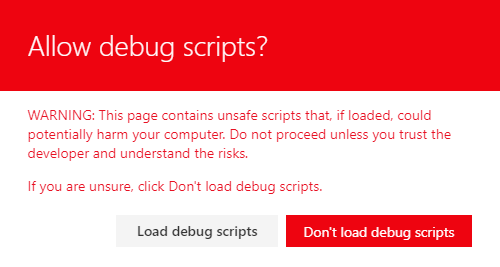
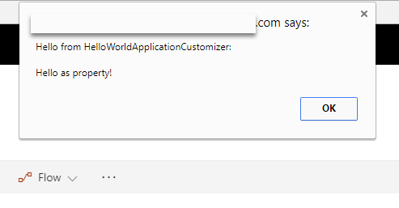

# Build your first SharePoint Framework Extension (Hello World part 1)

>**Note:** The SharePoint Framework Extensions are currently in preview and is subject to change. SharePoint Framework Extensions are not currently supported for use in production environments.

Extensions are client-side components that run inside the context of a SharePoint page. Extensions can be deployed to SharePoint Online, and you can also use modern JavaScript tools and libraries to build them.

>**Note:** Before following the steps in this article, be sure to [Set up your development environment](../../set-up-your-development-environment). Notice that extensions are currently **ONLY** available from Office 365 developer tenants.

## Create a extension project
Create a new project directory in your favorite location.

```
md app-extension
```

Go to the project directory.

```
cd app-extension
```

Create a new HelloWorld extension by running the Yeoman SharePoint Generator.

```
yo @microsoft/sharepoint
```

When prompted:

* Accept the default **app-extension** as your solution name and choose **Enter**.
* Choose **Extension (Preview)** as client-side component type to be created. 
* Choose **Application Customizer (Preview)** as they extension type to be created.

The next set of prompts will ask for specific information about your extension:

* Accept the default **HelloWorld** as your extension name and choose **Enter**.
* Accept the default **HelloWorld description** as your extension description and choose **Enter**.



At this point, Yeoman will install the required dependencies and scaffold the solution files along with the **HelloWorld** extension. This might take a few minutes. 

When the scaffold is complete, you should see the following message indicating a successful scaffold:



For information about troubleshooting any errors, see [Known issues](../basics/known-issues).

Once solution scaffolding is completed, type the following into console to start Visual Studio Code.

```
code .
```

> Notice that because the SharePoint client-side solution is HTML/TypeScript based, you can use any code editor that supports client-side development to build your extension.

Notice how the default solution structure is like the solution structure of client-side web parts.  This is the basic SharePoint Framework solution structure, with similar configuration options across all solution types.



Open **HelloWorldApplicationCustomizer.manifest.json** at the src\extensions\helloWorld folder.

This file defines your extension type and a unique identifier **“id”** for your extension.  You’ll need this unique identifier later when debugging and deploying your extension to SharePoint.



## Coding your Application Customizer 
Open the **HelloWorldApplicationCustomizer.ts** file in the **src\extensions\helloWorld** folder.

Notice that base class for the Application Customizer is imported from the **sp-application-base** package, which contains SharePoint framework code required by the Application Customizer.


The logic for your Application Customizer is contained in the two methods onInit and onRender.  
- **onInit()** is where you should perform any setup needed for your extension.  This event occurs after this.context and this.properties are assigned, but before the page DOM is ready. Like with web parts, onInit() returns a promise that you can use to perform asynchronous operations; onRender() will not be called until your promise has resolved.  If you don’t need that, simply return super.onInit().
- **onRender()** is where your extension can interact with the UI.  This event occurs after the application’s initial page DOM structure has been created (although some parts of the UI may not have finished rendering yet).

> Notice. The class constructor is called at an early stage, when "this.context" and "this.properties" are undefined.  We do not support including custom initiation logic here.

Below are the contents of **onInit()** and **onRender()** in the default solution.  This default solution simply writes a log to the Dev Dashboard, and then displays a simple JavaScript alert when the page renders.



>  If your application customizer uses the ClientSideComponentProperties JSON input, it will be deserialized into the BaseExtension.properties object. You can define an interface to describe it. Default template is looking for property called testMessage and is outputting that in alert message, if it's provided.

## Debugging your Application Customizer using gulp serve and query string parameters
SharePoint Framework extensions cannot be currently tested just by using local workbench, so you'll need to test and develop them directly against live SharePoint Online site. You do not however need to deploy your customization to app catalog, to be able to do this, which will keep the debugging experience simple and efficient. 

First, compile your code and host the compiled files from the local machine by running this command:

```
gulp serve --nobrowser
```
Notice that we used the `--nobrowser` option, since there's no value for starting local workbench, since you cannot debug extensions locally currently.

Once it compiles the code without errors, it will serve the resulting manifest from http://localhost:4321.



To test your extension, navigate to a modern list view page in your SharePoint environment and append the following query string parameters to the URL:

```
?loadSPFX=true&debugManifestsFile=https://localhost:4321/temp/manifests.js&customActions={"d03ae0c2-bbbf-4cf5-9ff7-0986904553da":{"location":"ClientSideExtension.ApplicationCustomizer","properties":{"testMessage":"Hello as property!"}}}
```
More detail about the URL query parameters:
* **loadSPFX=true:**  ensures that the SharePoint Framework is loaded on the page. For performance reasons, the framework normally is not loaded unless at least one extension is registered.  Since no components are registered yet, we must explicitly load the framework.
* **debugManifestsFile:**  specifies that we want to load SPFx components that are being locally served.  Normally the loader only looks for components in the App Catalog (for your deployed solution) and the SharePoint manifest server (for the system libraries).
* **customActions:**  this URL query parameter simulates a custom action.  When we actually deploy and register this component in a site later in this lab, we’ll create this CustomAction object for real and describe all the different properties you can set on it. 
    * **Key:** use the Guid of the extension as the key to associate with the custom action
    * **Location:** the type of custom action, use "ClientSideExtension.ApplicationCustomizer" for the Application Customizer extension
    * **Properties:** an optional JSON object containing properties that will be available via the this.properties member. In this HelloWorld example, it defined a ‘testMessage’ property.


Navigate to a out of the box modern list in SharePoint Online. This can be a list or a library for the initial testing. Application customizers are also supported in modern pages and in Site Contents page. 

Extend the URL with the additional query parameters defined above. Notice that you'll need to update the GUID to match ID of your custom Application Customizer available from  **HelloWorldApplicationCustomizer.manifest.json** at the src\extensions\helloWorld folder. 

Full URL should be looking somewhat follows depending on your tenant URL.

```
contoso.sharepoint.com/Lists/Contoso/AllItems.aspx?loadSPFX=true&debugManifestsFile=https://localhost:4321/temp/manifests.js&customActions={"5fc73e12-8085-4a4b-8743-f6d02ffe1240":{"location":"ClientSideExtension.ApplicationCustomizer","properties":{"testMessage":"Hello as property!"}}}
```



Click "**Load debug scripts**" button to continue loading scripts from your local host.

You should now see the alert message in your page. 



This alert is thrown by your SharePoint Framework Extension. Notice also that since we provided testMessage property as part of the debug query parameters, it's included in the alert message. You can configure your extension instances based on the client component properties, which are passed for the instance also in runtime mode. 

> If you are having challenges for making the debugging to work, double check the URL query parameters used for the query. Some browsers tend to encode the parameters in some scenarios, which will impact the behavior. 

## Next steps
Congratulations on getting your first SharePoint Framework Extension running! Now that your extension is running, you can continue building out your extension in the next topic, [Using page placeholders from Application Customizer (Hello World part 2)](./using-page-placeholder-with-extensions.md). You will use the same project and take advantage of specific content place holders, for modifying the UI of SharePoint. Notice that the `gulp serve` command is still running in your console window (or in Visual Studio Code if you using the editor). You can continue to let it run while you go to the next article.