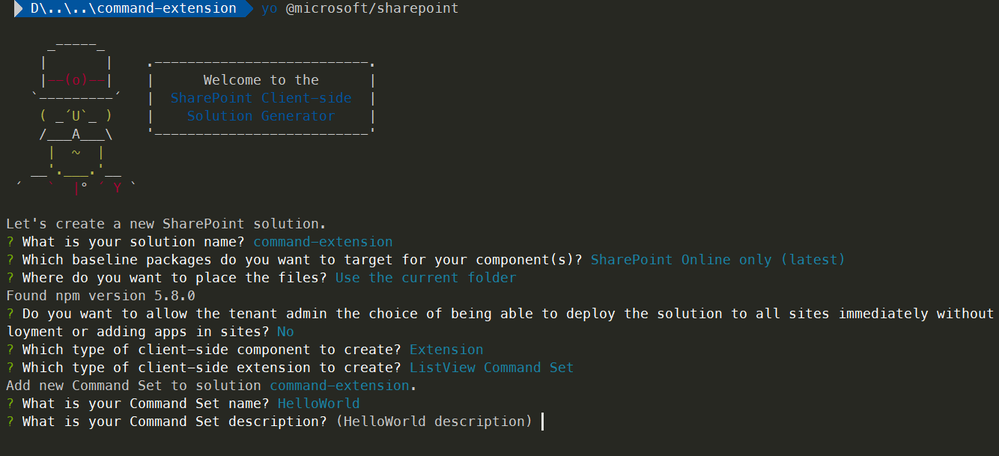
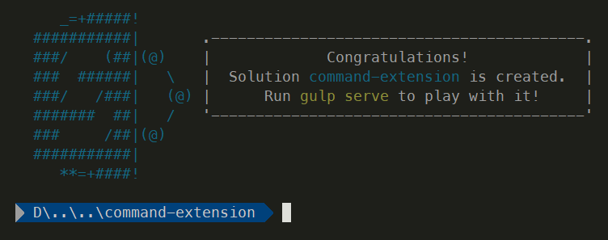
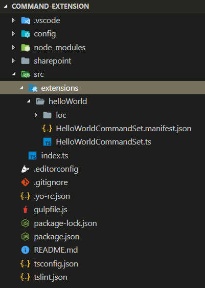
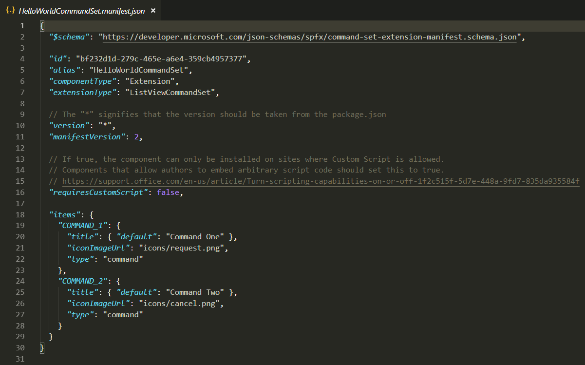
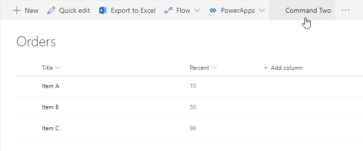
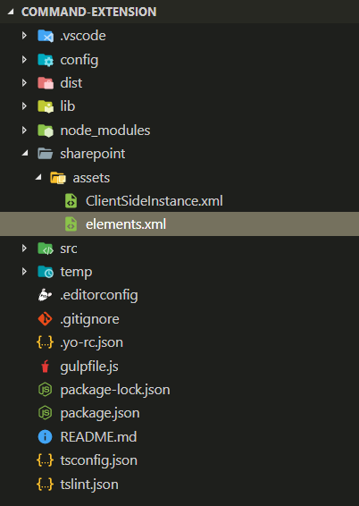
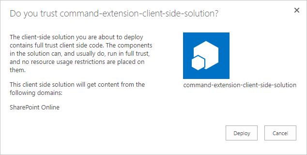
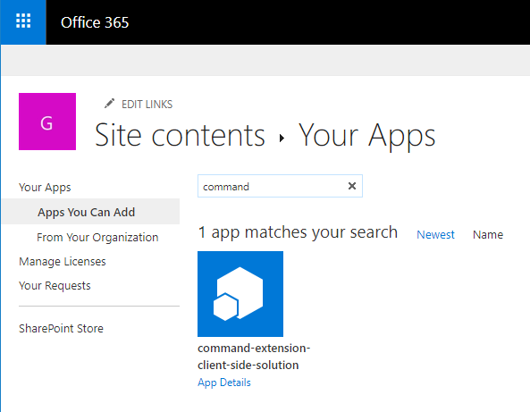
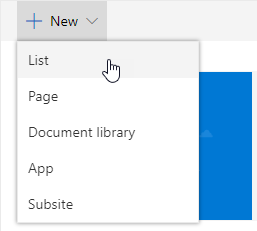
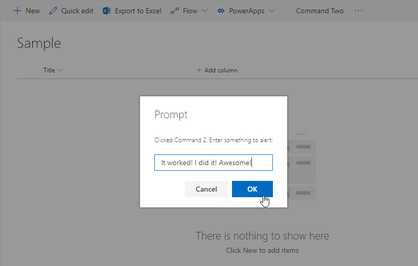

---
title: Build your first ListView Command Set extension
ms.date: 09/25/2017
ms.prod: sharepoint
---


# Build your first ListView Command Set extension

>**Note:** The SharePoint Framework Extensions are currently in preview and are subject to change. SharePoint Framework Extensions are not currently supported for use in production environments.

Extensions are client-side components that run inside the context of a SharePoint page. Extensions can be deployed to SharePoint Online and you can use modern JavaScript tools and libraries to build them.

You can also follow these steps by watching the video on the [SharePoint PnP YouTube Channel](https://www.youtube.com/watch?v=iW0LQQqAY0Y&list=PLR9nK3mnD-OXtWO5AIIr7nCR3sWutACpV). 

<a href="https://www.youtube.com/watch?v=iW0LQQqAY0Y&list=PLR9nK3mnD-OXtWO5AIIr7nCR3sWutACpV">

</a>

## Create an extension project
Create a new project directory in your favorite location.

```
md command-extension
```

Go to the project directory.

```
cd command-extension
```

Create a new HelloWorld extension by running the Yeoman SharePoint Generator.

```
yo @microsoft/sharepoint
```

When prompted:

* Accept the default value of **command-extension** as your solution name and press **Enter**.
* Choose **Use the current folder** and press **Enter**.
* Choose **N** to require extension to be installed on each site explicitly when it's being used. 
* Choose **Extension (Preview)** as the client-side component type to be created. 
* Choose **ListView Command Set (Preview)** as the extension type to be created.

The next set of prompts will ask for specific information about your extension:

* Accept the default value of **HelloWorld** as your extension name and press **Enter**.
* Accept the default value of **HelloWorld description** as your extension description and press **Enter**.



At this point, Yeoman will install the required dependencies and scaffold the solution files along with the **HelloWorld** extension. This might take a few minutes. 

When the scaffold is complete, you should see the following message indicating a successful scaffold:



For information about troubleshooting any errors, see [Known issues](../../known-issues-and-common-questions.md).

Once the solution scaffolding is completed, type the following into the console to start Visual Studio Code.

```
code .
```

> Notice that because the SharePoint client-side solution is HTML/TypeScript based, you can use any code editor that supports client-side development to build your extension.

Notice how the default solution structure is like the solution structure of client-side web parts. This is the basic SharePoint Framework solution structure, with similar configuration options across all solution types.



Open **HelloWorldCommandSet.manifest.json** in the **src\extensions\helloWorld** folder.

This file defines your extension type and a unique identifier **“id”** for your extension. You’ll need this unique identifier later when debugging and deploying your extension to SharePoint.

Notice also the actual command definitions in the manifest file. These are the actual buttons which will be exposed based on the registration target. In the default template, you'll find two different buttons: *"Command One"* and *"Command Two"*



> Currently, images are not properly referenced unless you are referring to them from absolute locations in a CDN within your manifest. This will be improved in future releases.

## Coding your ListView Command Set 
Open the **HelloWorldCommandSet.ts** file in the **src\extensions\helloWorld** folder.

Notice that the base class for the ListView Command Set is imported from the **sp-listview-extensibility** package, which contains SharePoint framework code required by the ListView Command Set.

```ts
import { override } from '@microsoft/decorators';
import { Log } from '@microsoft/sp-core-library';
import {
  BaseListViewCommandSet,
  Command,
  IListViewCommandSetListViewUpdatedParameters,
  IListViewCommandSetExecuteEventParameters
} from '@microsoft/sp-listview-extensibility';
```

The behavior for your custom buttons is contained in the **onListViewUpdated()** and **OnExecute()** methods.

The **onListViewUpdated()** event occurs separately for each command (e.g. menu item), whenever a change happens in the ListView and the UI needs to be re-rendered. The `“event”` function parameter represents information about the command being rendered. The handler can use this information to customize the title or adjust the visibility. For example, if a command should only be shown when a certain number of items are selected in the list view. Here's the default implementation:

When using the method `“tryGetCommand”` you’ll get a Command object, which is a representation of the command that shows in the UI. You can modify its values, like `“title”`, or `“visible”` in order to modify the UI element. SPFx will use this information when re-rendering the commands. These objects keep the state from the last render, so if a command is set to `“visible = false”` it will remain invisible until is set back to `“visible = true”`.

```ts
  @override
  public onListViewUpdated(event: IListViewCommandSetListViewUpdatedParameters): void {
    if (this.properties.disabledCommandIds) {
      for (const commandId of this.properties.disabledCommandIds) {
        const command: Command | undefined = this.tryGetCommand(commandId);
        if (command && command.visible) {
          Log.info(LOG_SOURCE, `Hiding command ${commandId}`);
          command.visible = false;
        }
      }
    }
  }
```
The **OnExecute()** method defines what happens when a command is executed (e.g. the menu item is clicked). In the default implementation, different messages are shown based on which button was clicked: 

```ts
  @override
  public onExecute(event: IListViewCommandSetExecuteEventParameters): void {
    switch (event.commandId) {
      case 'COMMAND_1':
        alert(`Clicked ${strings.Command1}`);
        break;
      case 'COMMAND_2':
        alert(`Clicked ${strings.Command2}`);
        break;
      default:
        throw new Error('Unknown command');
    }
  }
```


## Debugging your ListView Command Set using gulp serve and query string parameters
SharePoint Framework extensions cannot be currently tested using the local workbench, so you'll need to test and develop them directly against a live SharePoint Online site. You do not, however, need to deploy your customization to the app catalog to do this, which keeps the debugging experience simple and efficient. 

First, compile your code and host the compiled files from the local machine by running this command:
```
gulp serve --nobrowser
```

Notice that we used the `--nobrowser` option, since there's no value in launching the local workbench since you currently cannot debug extensions locally.

Once it compiles the code without errors, it will serve the resulting manifest from *http://localhost:4321*.

Navigate to any SharePoint list in your SharePoint Online site using the modern experience.

Since our ListView Command Set is hosted from localhost and is running, we can use specific debug query parameters to execute the code in the list view.

Append the following query string parameters to the URL. Notice that you will need to update the GUID to match the ID of your list view command set extension available in the **HelloWorldCommandSet.manifest.json** file:

```
?loadSpfx=true&debugManifestsFile=https://localhost:4321/temp/manifests.js&customActions={"6a6ac29e-258e-4a2c-8de3-6bdd358cdb54":{"location":"ClientSideExtension.ListViewCommandSet.CommandBar"}}
```

* **loadSPFX=true:**  ensures that the SharePoint Framework is loaded on the page. For performance reasons, the framework is not normally loaded unless at least one extension is registered. Since no components are registered yet, we must explicitly load the framework.
* **debugManifestsFile:**  specifies that we want to load SPFx components that are being locally served. Normally the loader only looks for components in the App Catalog (for your deployed solution) and the SharePoint manifest server (for the system libraries).
* **customActions:**  this URL query parameter simulates a custom action. There are many properties you can set on this *CustomAction* object that affect the look, feel, and location of your button; we’ll cover them all later.
    * **Key:** guid of the extension
    * **Location:** where the commands are displayed. The possible values are:
        * **ClientSideExtension.ListViewCommandSet.ContextMenu:**  The context menu of the item(s)
        * **ClientSideExtension.ListViewCommandSet.CommandBar:** The top command set menu in a list or library
        * **ClientSideExtension.ListViewCommandSet:** Both the context menu and the command bar (Corresponds to SPUserCustomAction.Location="CommandUI.Ribbon")
* **Properties:** an optional JSON object containing properties that will be available via the `this.properties` member.

The full URL should look similar to the following, depending on your tenant URL and the location of the list.

```
contoso.sharepoint.com/Lists/Orders/AllItems.aspx?loadSpfx=true&debugManifestsFile=https://localhost:4321/temp/manifests.js&customActions={"6a6ac29e-258e-4a2c-8de3-6bdd358cdb54":{"location":"ClientSideExtension.ListViewCommandSet.CommandBar"}}
```

Accept the loading of Debug Manifests, by clicking **Load debug scripts** when prompted.


Notice two new buttons available in the toolbar with titles of *Command One* and *Command Two*.



## Enhancing the ListView Command Set rendering
We'll take advantage of a new Dialog API, which can be used to show modal dialogs easily from your code. 

Return to the console and execute the following command to include the dialog API in our solution.

``` 
npm install @microsoft/sp-dialog --save
```

Return to Visual Studio Code (or your preferred editor).

Open **HelloWorldCommandSet.ts** from the **src\extensions\helloWorld** folder.

Add the following import statement for the `Dialog` class from `@microsoft/sp-dialog` after the existing import statements. 

```ts
import { Dialog } from '@microsoft/sp-dialog';
``` 

Update the **onExecute** method as follows

```ts
  @override
  public onExecute(event: IListViewCommandSetExecuteEventParameters): void {
    switch (event.commandId) {
      case 'COMMAND_1':
        Dialog.alert(`Clicked ${strings.Command1}`);
        break;
      case 'COMMAND_2':
        Dialog.prompt(`Clicked ${strings.Command2}. Enter something to alert:`).then((value: string) => {
          Dialog.alert(value);
        });
        break;
      default:
        throw new Error('Unknown command');
    }
  }
``` 
Switch back to your console window and ensure that you do not have any exceptions. If you do not already have the solution running in localhost, execute the following command:

```
gulp serve --nobrowser
```

Return to the list view and use the same query parameters used previously with the Id matching your extension identifier available in the **HelloWorldCommandSet.manifest.json** file.

Accept the loading of Debug Manifests, by clicking **Load debug scripts** when prompted.


We still have the same buttons in the toolbar, but you'll notice they behave differently if you click them one-by-one. Now we are using the new dialog API, which can be easily used with your solutions even for complex scenarios. 


## Adding a ListView Command Set to a solution package for deployment

Return to your solution in Visual Studio Code (or to your preferred editor).

We'll first need to create an **assets** folder where we will place all feature framework assets used to provision SharePoint structures when the package is installed.

* Create a folder named **sharepoint** in the root of the solution
* Create a folder named **assets** as a sub folder within the just created **sharepoint** folder

Your solution structure should look similar to the following picture:



### Add an elements.xml file for SharePoint definitions

Create a new file inside the **sharepoint\assets** folder named **elements.xml**

Copy the following xml structure into **elements.xml**. Be sure to update the **ClientSideComponentId** property to the unique Id of your ListView Command Set available in the **HelloWorldCommandSet.manifest.json** file in the **src\extensions\helloWorld** folder.

Notice that we use a specific location value of `ClientSideExtension.ListViewCommandSet.CommandBar` to define that this is a ListView Command Set and it should be displayed in the command bar. We also define the `RegistrationId` as **100** and the `RegistrationType` as **List** to associate this custom action automatically with generic lists.

```xml
<?xml version="1.0" encoding="utf-8"?>
<Elements xmlns="http://schemas.microsoft.com/sharepoint/">

    <CustomAction 
        Title="SPFxListViewCommandSet"
        RegistrationId="100"
        RegistrationType="List"
        Location="ClientSideExtension.ListViewCommandSet.CommandBar"
        ClientSideComponentId="5fc73e12-8085-4a4b-8743-f6d02ffe1240">

    </CustomAction>

</Elements>
```

Possible location values which can be used with a ListView Command Set:

* `ClientSideExtension.ListViewCommandSet.CommandBar` - Toolbar of the list or library
* `ClientSideExtension.ListViewCommandSet.ContextMenu` - Context menu for list or library items
* `ClientSideExtension.ListViewCommandSet` - Register commands to both the toolbar and to the context menu

### Ensure that definitions are taken into account within the build pipeline

Open **package-solution.json** from the **config** folder. The **package-solution.json** file defines the package metadata as shown in the following code:

```json
{
  "solution": {
    "name": "command-extension-client-side-solution",
    "id": "dfffbe21-e422-4c0f-a302-d7d62a30c1bf",
    "version": "1.0.0.0",
    "skipFeatureDeployment": false,
  },
  "paths": {
    "zippedPackage": "solution/command-extension.sppkg"
  }
}
```

To ensure that our newly added **elements.xml** file is taken into account while the solution is being packaged, we'll need to include a Feature Framework feature definition for the solution package. Let's include a JSON definition for the needed feature inside of the solution structure as demonstrated below.

```json
{
  "solution": {
    "name": "command-extension-client-side-solution",
    "id": "dfffbe21-e422-4c0f-a302-d7d62a30c1bf",
    "version": "1.0.0.0",
    "skipFeatureDeployment": false,    
    "features": [{
      "title": "ListView Command Set - Deployment of custom action.",
      "description": "Deploys a custom action with ClientSideComponentId association",
      "id": "456da147-ced2-3036-b564-8dad5c1c2e35",
      "version": "1.0.0.0",
      "assets": {        
        "elementManifests": [
          "elements.xml"
        ]
      }
    }]
  },
  "paths": {
    "zippedPackage": "solution/command-extension.sppkg"
  }
}
```

## Deploy the Extension to SharePoint Online and host JavaScript from local host

Now you are ready to deploy the solution to a SharePoint site and to have the *CustomAction* automatically associated on the site level.

In the console window, enter the following command to package your client-side solution that contains the extension, so that we get the basic structure ready for packaging:

```
gulp bundle
```

Next, execute the following command so that the solution package is created:

```
gulp package-solution
```

The command will create the package in the **sharepoint/solution** folder:

```
command-extension.sppkg
```

Next you need to deploy the package that was generated to the App Catalog.

Go to your tenant's **App Catalog** and open the **Apps for SharePoint** library.

Upload or drag and drop the `command-extension.sppkg` located in the **sharepoint/solution** folder to the App Catalog. SharePoint will display a dialog and ask you to trust the client-side solution.

Notice that we did not update the URLs for hosting the solution for this deployment, so the URL is still pointing to `https://localhost:4321`. Click the **Deploy** button.



Move back to your console and ensure that the solution is running. If it's not running, execute the following command in the solution folder:

```
gulp serve --nobrowser
```

Go to the site where you want to test SharePoint asset provisioning. This could be any site collection in the tenant where you deployed this solution package.

Chose the gear icon on the top navigation bar on the right and choose **Add an app** to go to your Apps page.

In the **Search** box, enter '**extension**' and press *Enter* to filter your apps.



Choose the **command-extension-client-side-solution** app to install the solution on the site. When the installation is completed, refresh the page by pressing **F5**.

When the application has been successfully installed, Click **New** from the toolbar on the **Site Contents** page and choose **List**



Provide the name as **Sample** and click **Create**.

Notice how **Command One** and **Command Two** are being rendered in the toolbar based on your ListView Command Set customizations. 


