# Build your first ListView Command Set extension

>**Note:** The SharePoint Framework Extensions are currently in preview and is subject to change. SharePoint Framework Extensions are not currently supported for use in production environments.

Extensions are client-side components that run inside the context of a SharePoint page. Extensions can be deployed to SharePoint Online, and you can also use modern JavaScript tools and libraries to build them.

>**Note:** Before following the steps in this article, be sure to [Set up your development environment](../../set-up-your-development-environment). Notice that extensions are currently **ONLY** available from Office 365 developer tenants.

## Create a extension project
Create a new project directory in your favorite location.

```
md command-extension
```

Go to the project directory.

```
cd command-extension
```

Create a new HelloWorld extension by running the Yeoman SharePoint Generator.

```
yo @microsoft/sharepoint
```

When prompted:

* Accept the default **command-extension** as your solution name and choose **Enter**.
* Choose **Extension (Preview)** as client-side component type to be created. 
* Choose **ListView Command Set (Preview)** as they extension type to be created.

The next set of prompts will ask for specific information about your extension:

* Accept the default **HelloWorld** as your extension name and choose **Enter**.
* Accept the default **HelloWorld description** as your extension description and choose **Enter**.

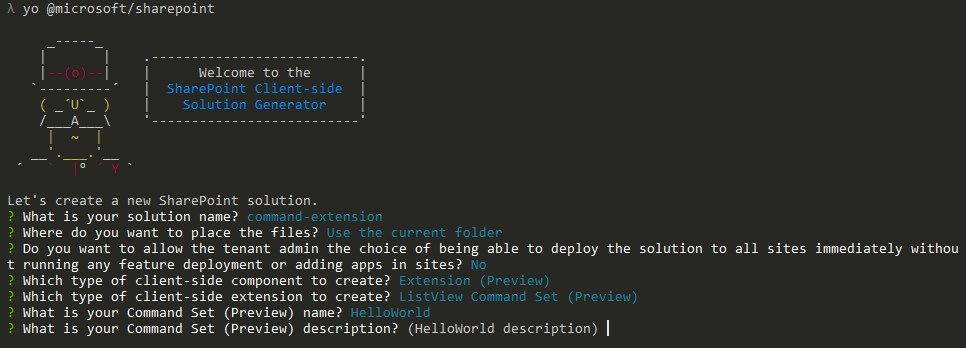

At this point, Yeoman will install the required dependencies and scaffold the solution files along with the **HelloWorld** extension. This might take a few minutes. 

When the scaffold is complete, you should see the following message indicating a successful scaffold:

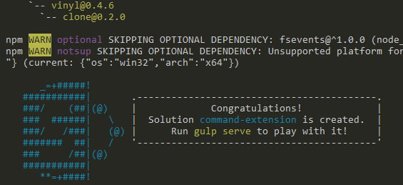

For information about troubleshooting any errors, see [Known issues](../basics/known-issues).

Once solution scaffolding is completed, type the following into console to start Visual Studio Code.

```
code .
```

> Notice that because the SharePoint client-side solution is HTML/TypeScript based, you can use any code editor that supports client-side development to build your extension.

Notice how the default solution structure is like the solution structure of client-side web parts.  This is the basic SharePoint Framework solution structure, with similar configuration options across all solution types.

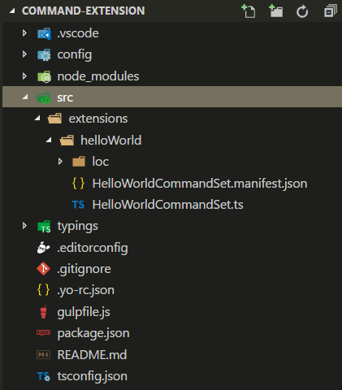

Open **HelloWorldCommandSet.manifest.json** at the src\extensions\helloWorld folder.

This file defines your extension type and a unique identifier **“id”** for your extension.  You’ll need this unique identifier later when debugging and deploying your extension to SharePoint.

Notice also the actual command definitions in the manifest file. These are the actual buttons which will be then exposed based on the registration target. In default template, you'll have two different button: *"Command One"* and *"Command Two"*

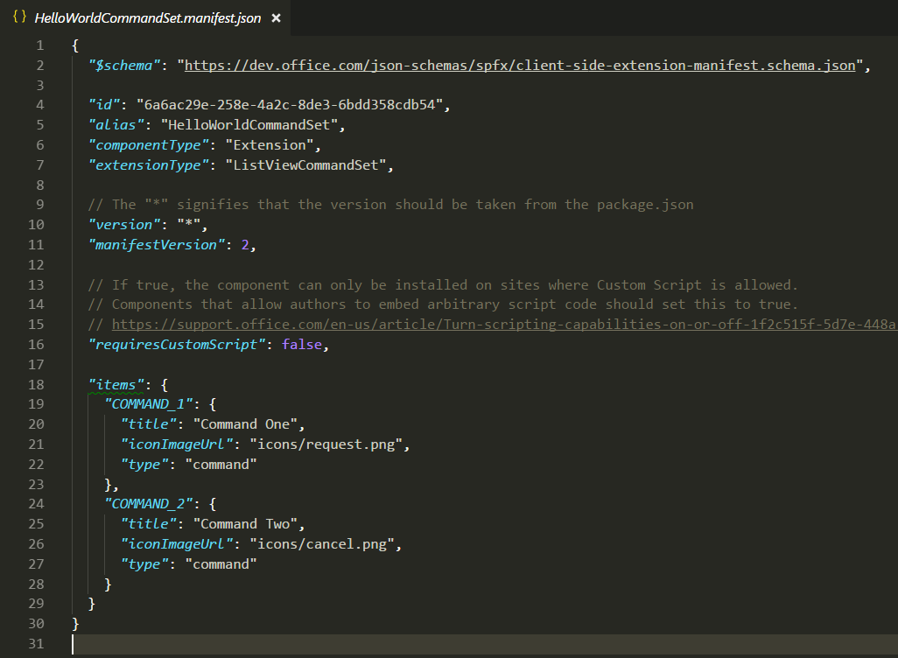

> Images are currently not properly exposed for the images unless you are referring them from absolutely locations in CDN in your manifest. This will be improved in the future releases.

## Coding your ListView Command Set 
Open the **HelloWorldCommandSet.ts** file in the **src\extensions\helloWorld** folder.

Notice that base class for the Application Customizer is imported from the **sp-application-base** package, which contains SharePoint framework code required by the Application Customizer.

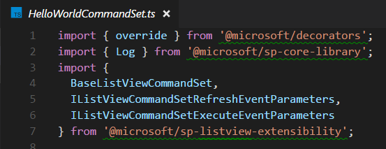

The behavior of your custom buttons is contained in the **onRefreshCommand()** and **OnExecute()** methods.

The **onRefreshCommand()** event occurs separately for each command (i.e. menu item), whenever the application attempts to display it in the UI. The `“event”` function parameter represents information about the command being rendered.  The handler can use it to  customize the title, or adjust the visibility, e.g. if a command should only be shown when a certain number of items is selected in the list view.  Here is the example implementation:

```ts
  @override
  public onRefreshCommand(event: IListViewCommandSetRefreshEventParameters): void {
    event.visible = true; // assume true by default

    if (this.properties.disabledCommandIds) {
      if (this.properties.disabledCommandIds.indexOf(event.commandId) >= 0) {
        Log.info(LOG_SOURCE, 'Hiding command ' + event.commandId);
        event.visible = false;
      }
    }
  }
```
The **OnExecute()** method defines what happens when a command is executed (e.g. the menu item is clicked).  In this example, we just show different messages based on which button was clicked. 

```ts
  @override
  public onExecute(event: IListViewCommandSetExecuteEventParameters): void {
    switch (event.commandId) {
      case 'COMMAND_1':
        alert(`Clicked ${strings.Command1}`);
        break;
      case 'COMMAND_2':
        alert(`Clicked ${strings.Command2}`);
        break;
      default:
        throw new Error('Unknown command');
    }
  }
```


## Debugging your ListView Command Set using gulp serve and query string parameters
SharePoint Framework extensions cannot be currently tested just by using local workbench, so you'll need to test and develop them directly against live SharePoint Online site. You do not however need to deploy your customization to app catalog, to be able to do this, which will keep the debugging experience simple and efficient. 

First, compile your code and host the compiled files from the local machine by running this command:

```
gulp serve --nobrowser
```
Notice that we used the `--nobrowser` option, since there's no value for starting local workbench, since you cannot debug extensions locally currently.

Once it compiles the code without errors, it will serve the resulting manifest from *http://localhost:4321*.

Move any SharePoint list in your SharePoint Online sites with a modern experience.

Since our ListView Command Set is hosted still in localhost and is running, we can use specific debug query parameters to execute the code in the newly created.

Append the following query string parameters to the URL. Notice that you will need to update id to match your own extension identifier available from **HelloWorldCommandSet.manifest.json** file:

```
?loadSpfx=true&debugManifestsFile=https://localhost:4321/temp/manifests.js&customActions={"81b6a3d7-e408-43a4-8ef1-180d0f2582cc":{"location":"ClientSideExtension.ListViewCommandSet.CommandBar"}}
```

* **loadSPFX=true:**  ensures that the SharePoint Framework is loaded on the page. For performance reasons, the framework normally is not loaded unless at least one extension is registered.  Since no components are registered yet, we must explicitly load the framework.
* **debugManifestsFile:**  specifies that we want to load SPFx components that are being locally served.  Normally the loader only looks for components in the App Catalog (for your deployed solution) and the SharePoint manifest server (for the system libraries).
* **customActions:**  this URL query parameter simulates a custom action. There are many properties you can set on this *CustomAction* object that affect the look, feel, and location of your button; we’ll cover them all later.
    * **Key:** guid of the extension
    * **Location:** where the commands are displayed. The possible values are:
        * **ClientSideExtension.ListViewCommandSet.ContextMenu:**  The context menu of the items
        * **ClientSideExtension.ListViewCommandSet.CommandBar:** The top command set menu in a list or library
        * **ClientSideExtension.ListViewCommandSet:** Both context menu and also command bar
(Corresponds to SPUserCustomAction.Location="CommandUI.Ribbon")
* **Properties:** an optional JSON object containing properties that will be available via the `this.properties` member. In this HelloWorld example, it defined a *‘testMessage’* property.

Full URL should be something like following, depending on your tenant URL and the location of the newly created list.

```
contoso.sharepoint.com/Lists/Orders/AllItems.aspx?loadSpfx=true&debugManifestsFile=https://localhost:4321/temp/manifests.js&customActions={"81b6a3d7-e408-43a4-8ef1-180d0f2582cc":{"location":"ClientSideExtension.ListViewCommandSet.CommandBar"}}
```

Accept loading of Debug Manifests, but clicking **Load debug scripts** when warning is showed.


Notice two new buttons available in the toolbar with titles of *Command One* and *Command Two*.

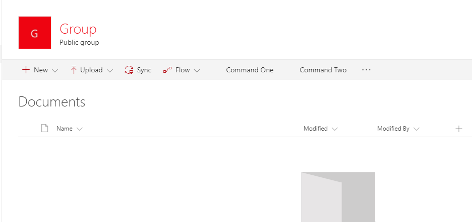

## Enhancing the ListView Command Set rendering
We'll take advantage of new Dialog API, which can be used to show modal dialogs easily from your code. 

Move to console side and execute following command to include dialog API to our solution.

``` 
npm install @microsoft/sp-dialog --save
```

Move to back Visual Studio Code (or your preferred editor).

Open **HelloWorldCommandSet.ts** from the **src\extensions\helloWorld** folder.

Add following import for the `Dialog` class from `@microsoft/sp-dialog/lib/index`. Under the other import statements. 

```ts
import { Dialog } from '@microsoft/sp-dialog/lib/index';
``` 

Update onExecute method as follows

```ts
  @override
  public onExecute(event: IListViewCommandSetExecuteEventParameters): void {
    switch (event.commandId) {
      case 'COMMAND_1':
        Dialog.alert(`Clicked ${strings.Command1}`);
        break;
      case 'COMMAND_2':
        Dialog.prompt(`Clicked ${strings.Command2}. Enter something to alert:`).then((value: string) => {
          Dialog.alert(value);
        });
        break;
      default:
        throw new Error('Unknown command');
    }
  }
``` 
Switch back to your console window and ensure that you do not have any exceptions. If you do not have the solution running in localhost, execute following command:

```
gulp serve --nobrowser
```

Move back to your previously used list and use the same query parameter as previously with the Id being updated to your extension identifier available from the **HelloWorldCommandSet.manifest.json** file.

Accept loading of Debug Manifests, but clicking **Load debug scripts** when warning is showed.


We have still same buttons in the toolbar, but you'll notice a different if you click them one-by-one. Now we are using the new dialog API, which can be easily used with your solutions also for complex scenarios. 

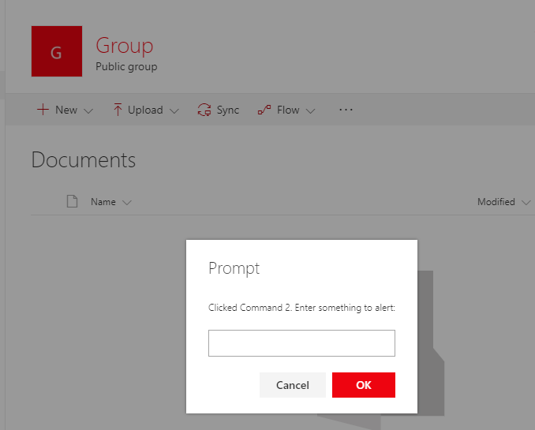

## Adding ListView Command Set to solution package for deployment

Move back to your solution package in the Visual Studio Code (or to your preferred editor)

We'll first need to create an **assets** folder where we will place all feature framework assets used to provision SharePoint structures when package is installed.

* Create folder called **sharepoint** to the root of the solution
* Create folder called **assets** as a sub folder for the just created **sharepoint** folder

Your solution structure should be looking like in the following picture

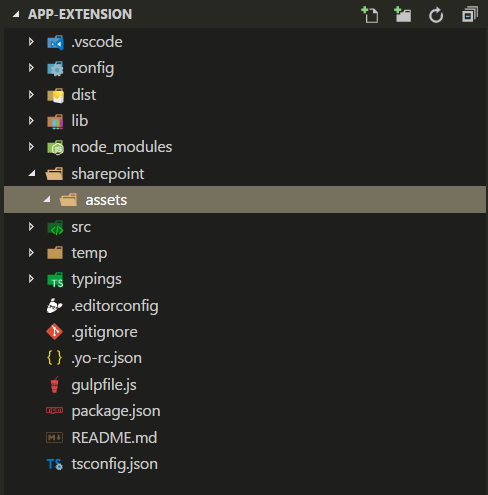

### Add element.xml file for SharePoint definitions

Create a new file inside the **sharepoint\assets** folder named as **elements.xml**

Copy the following xml structure into **elements.xml**. Updated the **ClientSideComponentId** property to have the unique Id of your Application Customizer available from the **HelloWorldCommandSet.manifest.json** file at **src\extensions\helloWorld** folder.

Notice also that we use specific location called `ClientSideExtension.ListViewCommandSet.CommandBar` to define that this is ListView Command Set. We also define `RegistrationId` as **100** and `RegistrationType` as **List** to associate this custom action automatically to generic lists.

```xml
<?xml version="1.0" encoding="utf-8"?>
<Elements xmlns="http://schemas.microsoft.com/sharepoint/">

    <CustomAction 
        Title="SPFxListViewCommandSet"
        RegistrationId="100"
        RegistrationType="List"
        Location="ClientSideExtension.ListViewCommandSet.CommandBar"
        ClientSideComponentId="5fc73e12-8085-4a4b-8743-f6d02ffe1240">

    </CustomAction>

</Elements>
```

Possible location values which can be used with ListView Command Set.
* `ClientSideExtension.ListViewCommandSet.CommandBar` - Toolbar of the list or library
* `ClientSideExtension.ListViewCommandSet.ContextMenu` - Context menu for list or library items
* `ClientSideExtension.ListViewCommandSet` - Register commands to both toolbar and to context menu

### Ensure that definitions are taken into use in build pipeline

Open **package-solution.json** from the **config** folder. The **package-solution.json** file defines the package metadata as shown in the following code:

```json
{
  "solution": {
    "name": "command-extension-client-side-solution",
    "id": "dfffbe21-e422-4c0f-a302-d7d62a30c1bf",
    "version": "1.0.0.0"
  },
  "paths": {
    "zippedPackage": "solution/command-extension.sppkg"
  }
}
```

To ensure that our newly added **element.xml** file is taken into account while solution is being packaged, we'll need to include a Feature Framework feature definition for the solution package. Let's include a JSON definition for needed feature inside of the solution structure as demonstrated in below code.

```json
{
  "solution": {
    "name": "command-extension-client-side-solution",
    "id": "dfffbe21-e422-4c0f-a302-d7d62a30c1bf",
    "version": "1.0.0.0",
    "features": [{
      "title": "ListView Command Set - Deployment of custom action.",
      "description": "Deploys a custom action with ClientSideComponentId association",
      "id": "456da147-ced2-3036-b564-8dad5c1c2e34",
      "version": "1.0.0.0",
      "assets": {        
        "elementManifests": [
          "elements.xml"
        ]
      }
    }]
  },
  "paths": {
    "zippedPackage": "solution/command-extension.sppkg"
  }
}
```

## Deploy field to SharePoint Online and host JavaScript from local host

Now you are ready to deploy the solution to SharePoint site and to get the *CustomAction* automatically associated on the site level.

In the console window, enter the following command to package your client-side solution that contains the extension, so that we get the basic structure ready for packaging:

```
gulp bundle
```

Next execute following command, so that the solution package is created:

```
gulp package-solution
```

The command will create the package in the **sharepoint/solution** folder:

```
command-extension.sppkg
```

Next you need to deploy the package that was generated to the App Catalog.

Go to your tenant's **App Catalog**.

Upload or drag and drop the `command-extension.sppkg` located in the **sharepoint/solution** folder to the App Catalog. SharePoint will display a dialog and ask you to trust the client-side solution to deploy.

Notice that we did not update the URLs for hosting the solution for this deployment, so URL is still pointing to `https://localhost:4321`.

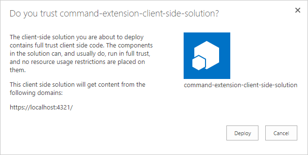

Move back to your console and ensure that the solution is running. If it's not running, executed following command in the solution folder.

```
gulp serve --nobrowser
```

Go to the site where you want to test SharePoint asset provisioning. This could be any site collection in the tenant where you deployed this solution package.

Chose the gears icon on the top navigation bar on the right and choose **Add an app** to go to your Apps page.

In the **Search** box, enter '**command**' and choose *Enter* to filter your apps.

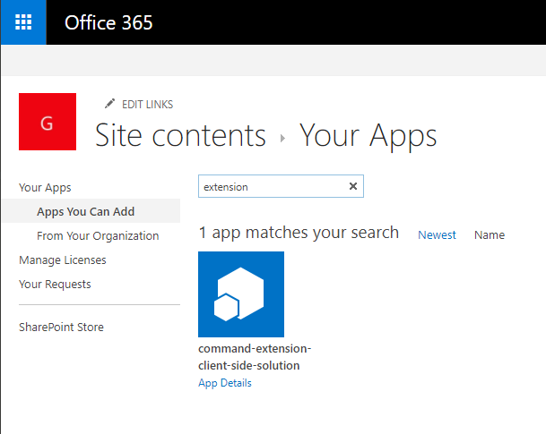

Choose the **command-extension-client-side-solution** app to install the solution on the site. When installation is completed, refresh the page by pressing **F5**.

When the solution has been installed, Click **New** from the toolbar in **Site Contents** page and choose **List**

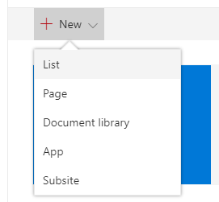

Provide name as **Sample** and click **Create**.

Notice how the **Command One** and **Command Two** are being rendered in the toolbar based on your ListView Command Set based customizations. 

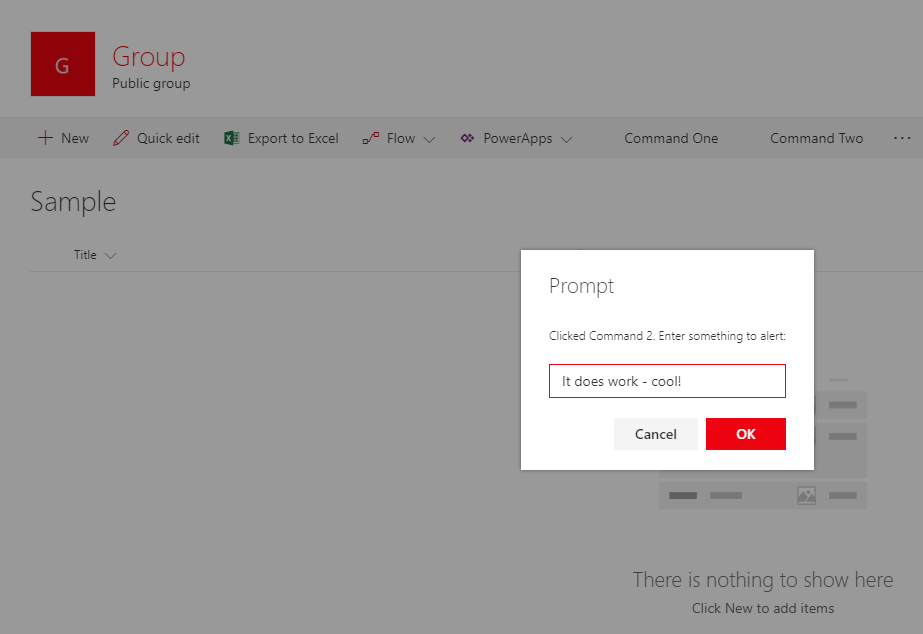
