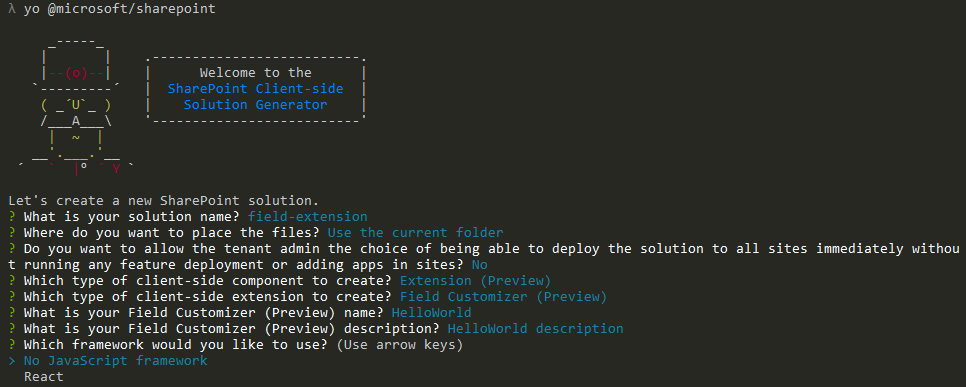
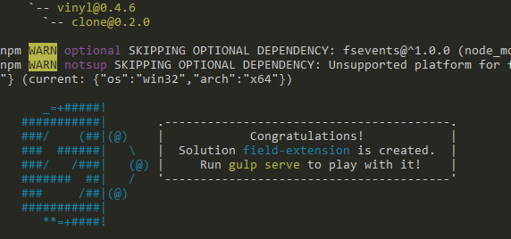
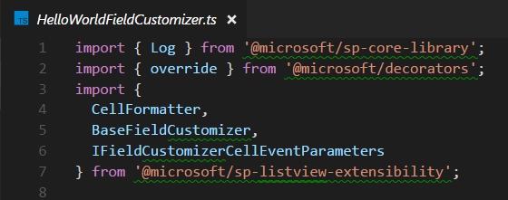
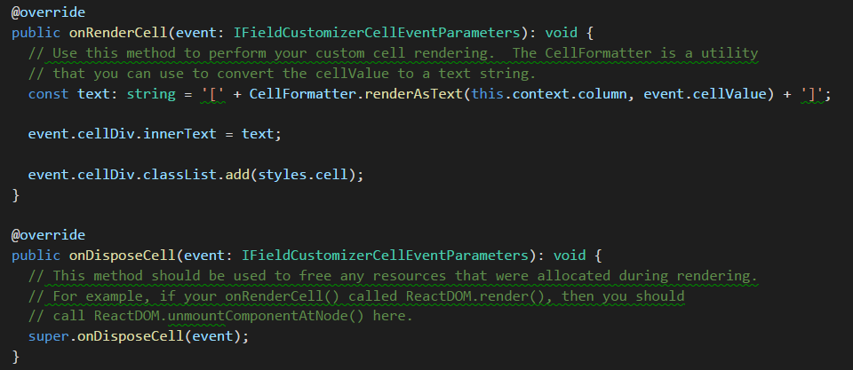
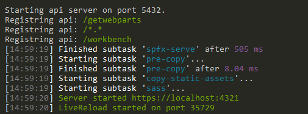
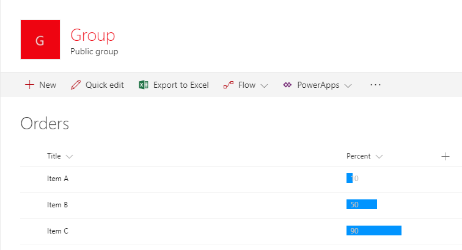
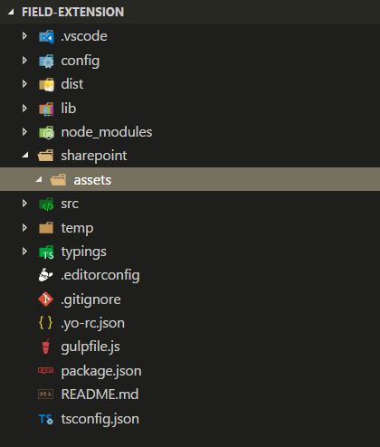
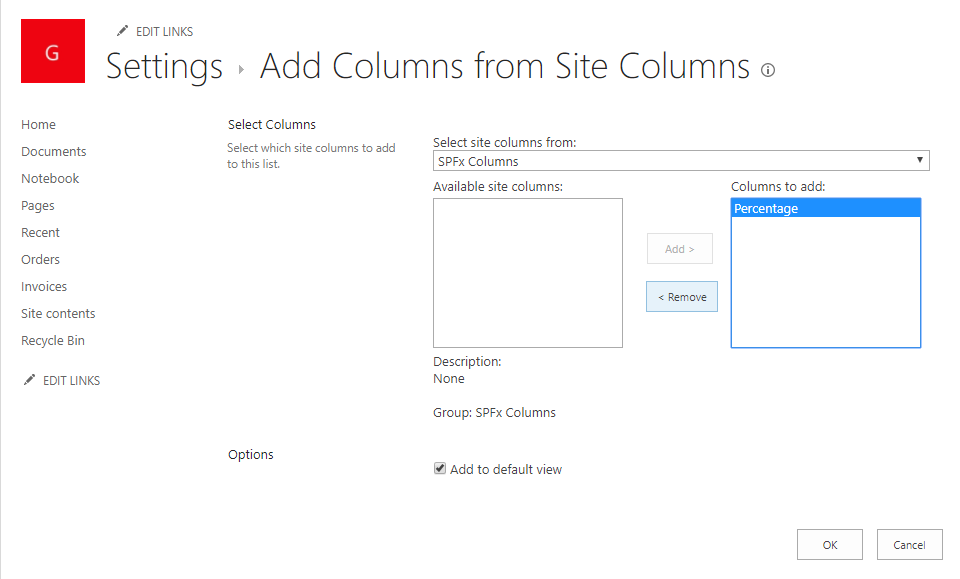
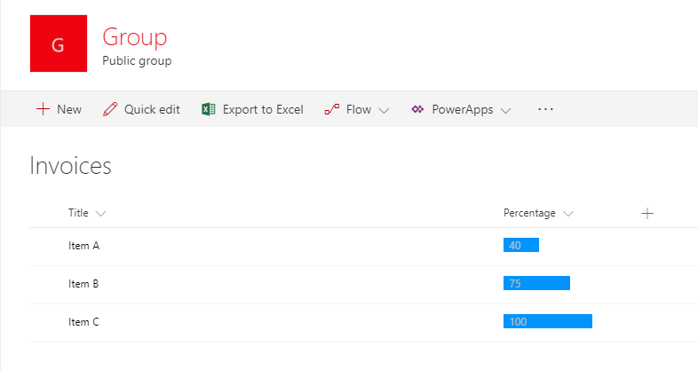

# Build your first Field Customizer extension

>**Note:** The SharePoint Framework Extensions are currently in preview and is subject to change. SharePoint Framework Extensions are not currently supported for use in production environments.

Extensions are client-side components that run inside the context of a SharePoint page. Extensions can be deployed to SharePoint Online, and you can also use modern JavaScript tools and libraries to build them.

>**Note:** Before following the steps in this article, be sure to [Set up your development environment](../../set-up-your-development-environment). Notice that extensions are currently **ONLY** available from Office 365 developer tenants.

## Create a extension project
Create a new project directory in your favorite location.

```
md field-extension
```

Go to the project directory.

```
cd field-extension
```

Create a new HelloWorld extension by running the Yeoman SharePoint Generator.

```
yo @microsoft/sharepoint
```

When prompted:

* Accept the default **field-extension** as your solution name and choose **Enter**.
* Choose **Extension (Preview)** as client-side component type to be created. 
* Choose **Field Customizer (Preview)** as they extension type to be created.

The next set of prompts will ask for specific information about your extension:

* Accept the default **HelloWorld** as your extension name and choose **Enter**.
* Accept the default **HelloWorld description** as your extension description and choose **Enter**.
* Accept the default **No JavaScript Framework** as the framework selection and choose **Enter** 



At this point, Yeoman will install the required dependencies and scaffold the solution files along with the **HelloWorld** extension. This might take a few minutes. 

When the scaffold is complete, you should see the following message indicating a successful scaffold:



For information about troubleshooting any errors, see [Known issues](../basics/known-issues).

Once solution scaffolding is completed, type the following into console to start Visual Studio Code.

```
code .
```

> Notice that because the SharePoint client-side solution is HTML/TypeScript based, you can use any code editor that supports client-side development to build your extension.

Notice how the default solution structure is like the solution structure of client-side web parts.  This is the basic SharePoint Framework solution structure, with similar configuration options across all solution types.


Open **HelloWorldFieldCustomizer.manifest.json** at the src\extensions\helloWorld folder.

This file defines your extension type and a unique identifier **“id”** for your extension.  You’ll need this unique identifier later when debugging and deploying your extension to SharePoint.


## Coding your Field Customizer 
Open the **HelloWorldFieldCustomizer.ts** file in the **src\extensions\helloWorld** folder.

Notice that base class for the Application Customizer is imported from the **sp-application-base** package, which contains SharePoint framework code required by the Application Customizer.



The logic for your Field Customizer is contained in the **OnInit()**, **onRenderCell()**, and **onDisposeCell()** methods.

* **onInit():**  this is where you should perform any setup needed for your extension.  This event occurs after `this.context` and `this.properties` are assigned, but before the page DOM is ready. Like with web parts, **onInit()** returns a promise that you can use to perform asynchronous operations; **onRenderCell()** will not be called until your promise has resolved.  If you don’t need that, simply return super.onInit().
* **onRenderCell():**  This event occurs before each cell is rendered.  It provides an `event.cellDiv` HTML element where your code can write its content.
* **onDisposeCell():** This event occurs immediately before the `event.cellDiv` is deleted.  It can be used to free any resources that were allocated during field rendering.  For example, if **onRenderCell()** mounted a React element, **onDisposeCell()** must be used to free it, otherwise a resource leak would occur. 

Below are the contents of **onRenderCell()** and **onDisposeCell()** in the default solution:



## Debugging your Field Customizer using gulp serve and query string parameters
SharePoint Framework extensions cannot be currently tested just by using local workbench, so you'll need to test and develop them directly against live SharePoint Online site. You do not however need to deploy your customization to app catalog, to be able to do this, which will keep the debugging experience simple and efficient. 

First, compile your code and host the compiled files from the local machine by running this command:

```
gulp serve --nobrowser
```
Notice that we used the `--nobrowser` option, since there's no value for starting local workbench, since you cannot debug extensions locally currently.

Once it compiles the code without errors, it will serve the resulting manifest from http://localhost:4321.



To test your extension, navigate to a site in your SharePoint Online tenant.

Move to **Site Contents** page

Click **New** from the toolbar and choose **List**


Create a new list called *Orders* and click **Create**


Click **plus** sign and choose **Number** to create a new field for the list


Set name of the field as **Percent** and click **Save**


Add few items with different numbers for percent field. We'll modify the rendering later in this tutorial, so the different numbers will be presented differently based on your custom implementation.


Since our Field Customizer is hosted still in localhost and is running, we can use specific debug query parameters to execute the code in the newly created.

Append the following query string parameters to the URL. Notice that you will need to update id to match your own extension identifier available from **HelloWorldFieldCustomizer.manifest.json** file:

```
?loadSPFX=true&debugManifestsFile=https://localhost:4321/temp/manifests.js&fieldCustomizers={"Percent":{"id":"0e3d8b71-56aa-4405-9225-f08a80fc1d71","properties":{"sampleText":"Hello!"}}}
```
More detail about the URL query parameters:

* **loadSPFX=true:**  ensures that the SharePoint Framework is loaded on the page. For performance reasons, the framework normally is not loaded unless at least one extension is registered.  Since no components are registered yet, we must explicitly load the framework.
* **debugManifestsFile:**  specifies that we want to load SPFx components that are being locally served.  Normally the loader only looks for components in the App Catalog (for your deployed solution) and the SharePoint manifest server (for the system libraries).
* **fieldCustomizers**:  Indicates which fields in your list should have their rendering controlled by the Field Customizer.  The ID parameter specifies the GUID of the extension that should be used to control the rendering of the field.  The properties parameter is an optional text string containing a JSON object that will be deserialized into `this.properties` for your extension.
    * **Key:** use the internal name of the field as the key
    * **Id:** the guid of the field customizer extension associated with this field
    * **Properties:**  property values defined in the extension. In this example, *‘sampleText’* is a property defined by the extension

Full URL should be something like following, depending on your tenant URL and the location of the newly created list.

```
contoso.sharepoint.com/Lists/Orders/AllItems.aspx??loadSPFX=true&debugManifestsFile=https://localhost:4321/temp/manifests.js&fieldCustomizers={"Percent":{"id":"0e3d8b71-56aa-4405-9225-f08a80fc1d71","properties":{"sampleText":"Hello!"}}}
```

Accept loading of Debug Manifests, but clicking **Load debug scripts** when warning is showed.


Notice how the Percent value is now presented with additional [ ] characters. 


## Enhancing the Field Customizer rendering
Now that we have successfully tested the out of the box starting point of the Field Customizer, let's modify the logic slightly to have more polished rendering of the field value. 

Open the **HelloWorld.module.scss** file in the **src\extensions\helloWorld** folder and update the styling definition as follows.

```
.HelloWorld {
  .cell {
    display: 'inline-block';
  }
  .full {
    background-color: '#e5e5e5';
    width: '100px';
  }
}

```
Open the **HelloWorldFieldCustomizer.ts** file in the **src\extensions\helloWorld** folder and update the **onRednerCell** method as follows.

```
  @override
  public onRenderCell(event: IFieldCustomizerCellEventParameters): void {

    event.cellDiv.classList.add(styles.cell);
    event.cellDiv.innerHTML = `
                <div class='${styles.full}'>
                  <div style='width: ${event.cellValue}px; background:#0094ff; color:#c0c0c0'>
                    &nbsp; ${event.cellValue}
                  </div>
                </div>`;

  }
```

Switch back to your console window and ensure that you do not have any exceptions. If you do not have the solution running in locahost, execute following command:

```
gulp serve --nobrowser
```

Move back to your previously created list and use the same query parameter as previously with the Field being 'Percent' and the Id being updated to your extension identifier available from the **HelloWorldFieldCustomizer.manifest.json** file.

Accept loading of Debug Manifests, but clicking **Load debug scripts** when warning is showed.


Notice how we have change the field rendering style completely. Field value is indicated using a graphical presentation of the value.



## Add field definition to solution package for deployment
Now that we have tested our solution properly in debug mode, we can package this to be deployed automatically as part of the solution package deployed to the sites. There are few things to take care of here.

1. Install solution package to site where it should be installed, so that extension manifest is being white listed for execution
2. Associate Field Customizer to existing field in the site. This can be performed programatically (CSOM/REST) or by using feature framework inside of the SharePoint Framework solution package. You'll need to associate following properties in the SPField object at site or list level.
    * **ClientSiteComponentId:** This is the identifier (GUID) of the Field Customizer, which has been installed on the app catalog. 
    * **ClientSideComponentProperties:** This is optional parameter, which can be used to provide properties for the Field Customizer instance

> Notice. Currently you'll need to install solution packages explicitly to the sites to ensure that extension is being properly executed. There will be alternative ways to achieve this in the future without site-by-site deployment. 

In the following steps, we'll create new field definition, which will be then automatically deployed with needed configurations when solution package is installed on a site. 

Move back to your solution package in the Visual Studio Code (or to your preferred editor).

We'll first need to create an **assets** folder where we will place all feature framework assets used to provision SharePoint structures when package is installed.

* Create folder called **sharepoint** to the root of the solution
* Create folder called **assets** as a sub folder for the just created **sharepoint** folder

Your solution structure should be looking like in the following picture



### Add element.xml file for SharePoint definitions

Create a new file inside the **sharepoint\assets** folder named as **elements.xml**

Copy the following xml structure into **elements.xml**. Updated the **ClientSideComponentId** property to have the unique Id of your Field Customizer available from the **HelloWorldFieldCustomizer.manifest.json** file at **src\extensions\helloWorld** folder.

```xml
<?xml version="1.0" encoding="utf-8"?>
<Elements xmlns="http://schemas.microsoft.com/sharepoint/">

    <Field ID="{060E50AC-E9C1-3D3C-B1F9-DE0BCAC200F6}"
            Name="SPFxPercentage"
            DisplayName="Percentage"
            Type="Number"
            Min="0"
            Required="FALSE"
            Group="SPFx Columns"
            ClientSideComponentId="0e3d8b71-56aa-4405-9225-f08a80fc1d71">
    </Field>

</Elements>
```

### Ensure that definitions are taken into use in build pipeline

Open **package-solution.json** from the **config** folder. The **package-solution.json** file defines the package metadata as shown in the following code:

```json
{
  "solution": {
    "name": "field-extension-client-side-solution",
    "id": "11cd343e-1ce6-462c-8acb-929804d0c3b2",
    "version": "1.0.0.0"
  },
  "paths": {
    "zippedPackage": "solution/field-extension.sppkg"
  }
}


```

To ensure that our newly added **element.xml** file is taken into account while solution is being packaged, we'll need to include a Feature Framework feature definition for the solution package. Let's include a JSON definition for needed feature inside of the solution structure as demonstrated in below code.

```json
{
  "solution": {
    "name": "field-extension-client-side-solution",
    "id": "11cd343e-1ce6-462c-8acb-929804d0c3b2",
    "version": "1.0.0.0",
    "features": [{
      "title": "Field Extension - Deployment of custom field.",
      "description": "Deploys a custom field with ClientSideComponentId association",
      "id": "123fe847-ced2-3036-b564-8dad5c6c6e83",
      "version": "1.0.0.0",
      "assets": {        
        "elementManifests": [
          "elements.xml"
        ]
      }
    }]
  },
  "paths": {
    "zippedPackage": "solution/field-extension.sppkg"
  }
}

```

## Deploy field to SharePoint Online and host JavaScript from local host
Now you are ready to deploy the solution to SharePoint site and to get the field association automatically included in a field. 

In the console window, enter the following command to package your client-side solution that contains the extension, so that we get the basic structure ready for packaging:

```
gulp bundle
```

Next execute following command, so that the solution package is created:

```
gulp package-solution
```

The command will create the package in the **sharepoint/solution** folder:

```
field-extension.sppkg
```

Next you need to deploy the package that was generated to the App Catalog.

Go to your tenant's **App Catalog**.

Upload or drag and drop the `field-extension.sppkg` located in the **sharepoint/solution** folder to the App Catalog. SharePoint will display a dialog and ask you to trust the client-side solution to deploy.

Notice that we did not update the URLs for hosting the solution for this deployment, so URL is still pointing to `https://localhost:4321`.


Go to the site where you want to test SharePoint asset provisioning. This could be any site collection in the tenant where you deployed this solution package.

Chose the gears icon on the top nav bar on the right and choose **Add an app** to go to your Apps page.

In the **Search** box, enter '**field**' and choose *Enter* to filter your apps.


Choose the **field-extension-client-side-solution** app to install the solution on the site. When installation is completed, refresh the page by pressing **F5**.

When the solution has been installed, Click **New** from the toolbar in **Site Contents** page and choose **List**


Create a list called **Invoices**

When new list has been created, move back to **Site Contents** page and choose **Settings** from the context menu of the just created list.


Choose **Add from existing site columns** under the **Columns** section

Choose **Percentage** field which was provisioned from the solution package, under **SPFx Columns** group.



Click **OK**

Move back to your console and ensure that the solution is running. If it's not running, executed following command in the solution folder.

```
gulp serve --nobrowser
```
Move to newly created **Invoices** list and add few new items to the list with different values in the Percentage column to see how the field is being rendered without Debug query parameters.



In this case we hosted the JavaScript still from the localhost location, but you could just as well relocate the assets to any CDN and update the URL according for enabling loading of the needed JavaScript assets outside of the localhost as well. 

Process for actual publishing is identical among the different extension types. You can follow following publishing steps to update the assets to be hosted from CDN.

* [Deploy extension to Office 365 CDN](./deploy-extension-to-office365-cdn.md).