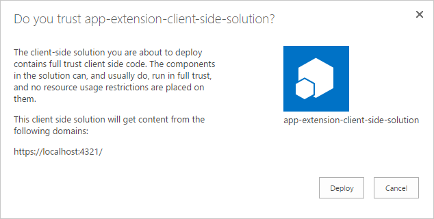
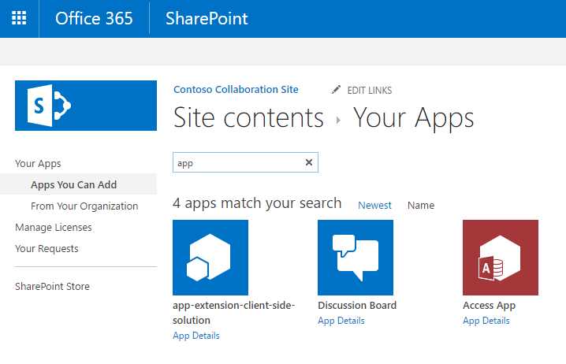
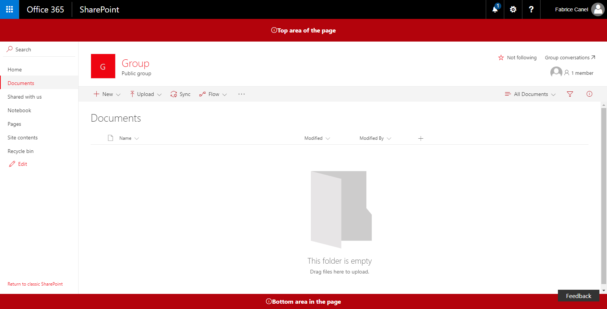

# Deploy your extension to site collection (Hello world part 3)

>**Note:** The SharePoint Framework Extensions are currently in preview and is subject to change. SharePoint Framework Extensions are not currently supported for use in production environments.

In this article you will learn how to deploy your SharePoint Framework Application Customizer to SharePoint and see it working on a modern SharePoint pages. This article continues with the hello world extension built in the previous article [Using page placeholders from Application Customizer (Hello World part 2)](./using-page-placeholder-with-extensions.md).

Be sure you have completed the procedures in the following articles before you start:

* [Build your first SharePoint SharePoint Extension (Hello World part 1)](./build-a-hello-world-extension.md)
* [Using page placeholders from Application Customizer (Hello World part 2)](./using-page-placeholder-with-extensions.md)

## Package the helloWorld Application Customizer
In the console window, go to the extension project directory created in [Build your first SharePoint SharePoint Extension (Hello World part 1)](./build-a-hello-world-extension.md)

```
cd app-extension
```
If gulp serve is still running, stop it from running by choosing `Ctrl+C`.

Unlike in the **Debug** mode, in order to use extension on modern SharePoint server-side pages, you need to deploy and register the extension with SharePoint either in `Site collection`, `Site` or `List` scope. Scope defines where and how the Application Customizer will be active. In this particular scenario, we'll register the Application Customizer using `Site Collection` scope. 

Before we package our solution, we want to include needed code to automate the extension activation in the site, whenever solution will be installed on the site. In this case, we'll use feature framework elements to perform these actions directly in the solution package, but you could also associate the application customizer to SharePoint site using REST or CSOM object model, for example as part of the site provisioning.

1. Install solution package to site where it should be installed, so that extension manifest is being white listed for execution
2. Associate Application Customizer to the planned scope. This can be performed programatically (CSOM/REST) or by using feature framework inside of the SharePoint Framework solution package. You'll need to associate following properties in the `UserCustomAction` object at site collection, site or list level.
    * **ClientSiteComponentId:** This is the identifier (GUID) of the Field Customizer, which has been installed on the app catalog. 
    * **ClientSideComponentProperties:** This is optional parameter, which can be used to provide properties for the Field Customizer instance

> Notice. Currently you'll need to install solution packages explicitly to the sites to ensure that extension is being properly executed. There will be alternative ways to achieve this in the future without site-by-site deployment. 

In the following steps, we'll create new `CustomAction` definition, which will be then automatically deployed with needed configurations when solution package is installed on a site. 

Move back to your solution package in the Visual Studio Code (or to your preferred editor)

We'll first need to create an **assets** folder where we will place all feature framework assets used to provision SharePoint structures when package is installed.

* Create folder called **sharepoint** to the root of the solution
* Create folder called **assets** as a sub folder for the just created **sharepoint** folder

Your solution structure should be looking like in the following picture


### Add element.xml file for SharePoint definitions

Create a new file inside the **sharepoint\assets** folder named as **elements.xml**

Copy the following xml structure into **elements.xml**. Updated the **ClientSideComponentId** property to have the unique Id of your Application Customizer available from the **HelloWorldApplicationCustomizer.manifest.json** file at **src\extensions\helloWorld** folder.

We also set the **ClientSideComponentProperties** using this xml definition and bypass JSON properties for this extension instance. Notice how the JSON is escaped, so that we can set that properly using XML attribute. 

Notice also that we use specific location called `ClientSideExtension.ApplicationCustomizer` to define that this is Application Customizer. Since by default this **element.xml** will be associated to *Web* scoped feature, this CustomAction will be automatically added to `Web.UserCustomAction` collection in the site where the solution is being installed.

```xml
<?xml version="1.0" encoding="utf-8"?>
<Elements xmlns="http://schemas.microsoft.com/sharepoint/">

    <CustomAction 
        Title="SPFxApplicationCustomizer"
        Location="ClientSideExtension.ApplicationCustomizer"
        ClientSideComponentId="46606aa6-5dd8-4792-b017-1555ec0a43a4"
        ClientSideComponentProperties="{&quot;Header&quot;:&quot;Header area of the page&quot;,&quot;Footer&quot;:&quot;Footer area in the page&quot;}">

    </CustomAction>

</Elements>
```

### Ensure that definitions are taken into use in build pipeline

Open **package-solution.json** from the **config** folder. The **package-solution.json** file defines the package metadata as shown in the following code:

```json
{
  "solution": {
    "name": "app-extension-client-side-solution",
    "id": "02d35a3e-5896-4664-874f-9fe9fdfe8408",
    "version": "1.0.0.0"
  },
  "paths": {
    "zippedPackage": "solution/app-extension.sppkg"
  }
}

```

To ensure that our newly added **element.xml** file is taken into account while solution is being packaged, we'll need to include a Feature Framework feature definition for the solution package. Let's include a JSON definition for needed feature inside of the solution structure as demonstrated in below code.

```json
{
  "solution": {
    "name": "app-extension-client-side-solution",
    "id": "02d35a3e-5896-4664-874f-9fe9fdfe8408",
    "version": "1.0.0.0",
    "features": [{
      "title": "Application Extension - Deployment of custom action.",
      "description": "Deploys a custom action with ClientSideComponentId association",
      "id": "456da147-ced2-3036-b564-8dad5c1c2e34",
      "version": "1.0.0.0",
      "assets": {        
        "elementManifests": [
          "elements.xml"
        ]
      }
    }]
  },
  "paths": {
    "zippedPackage": "solution/app-extension.sppkg"
  }
}

```

## Deploy field to SharePoint Online and host JavaScript from local host

Now you are ready to deploy the solution to SharePoint site and to get the CustomAction automatically associated on the site level.

In the console window, enter the following command to package your client-side solution that contains the extension, so that we get the basic structure ready for packaging:

```
gulp bundle
```

Next execute following command, so that the solution package is created:

```
gulp package-solution
```

The command will create the package in the **sharepoint/solution** folder:

```
app-extension.sppkg
```

Next you need to deploy the package that was generated to the App Catalog.

Go to your tenant's **App Catalog**.

Upload or drag and drop the `app-extension.sppkg` located in the **sharepoint/solution** folder to the App Catalog. SharePoint will display a dialog and ask you to trust the client-side solution to deploy.

Notice that we did not update the URLs for hosting the solution for this deployment, so URL is still pointing to `https://localhost:4321`.



Move back to your console and ensure that the solution is running. If it's not running, executed following command in the solution folder.

```
gulp serve --nobrowser
```

Go to the site where you want to test SharePoint asset provisioning. This could be any site collection in the tenant where you deployed this solution package.

Chose the gears icon on the top nav bar on the right and choose **Add an app** to go to your Apps page.

In the **Search** box, enter '**app**' and choose *Enter* to filter your apps.



Choose the **app-extension-client-side-solution** app to install the solution on the site. When installation is completed, refresh the page by pressing **F5**.

When application has been successfully installed, you can see the header and footer being rendered in similar ways as with the debug query parameters.



## Next steps

Congratulations! You have deployed a extension to a modern SharePoint page from app catalog. You can continue building out your Hello World extension in the next topic, [Hosting extension from Office 365 CDN (Hello world part 4)](./hosting-extension-from-office365-cdn.md), where you will learn how to deploy and load the extension assets from a CDN instead of localhost.