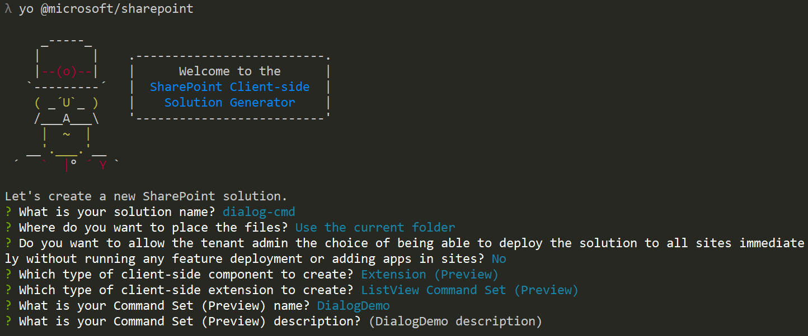
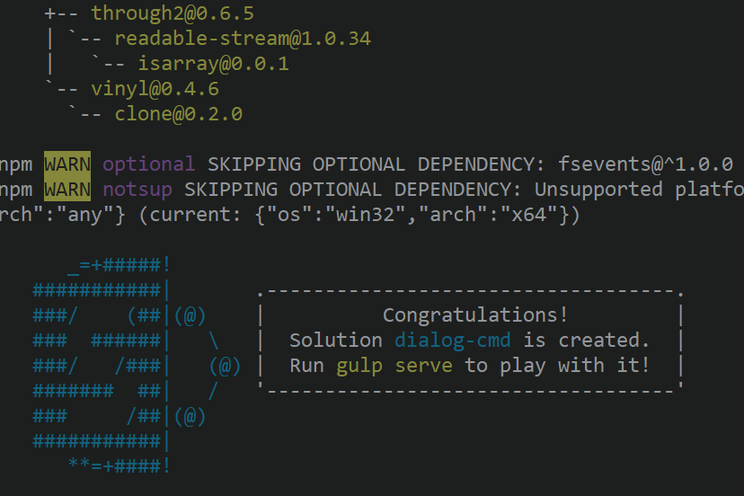
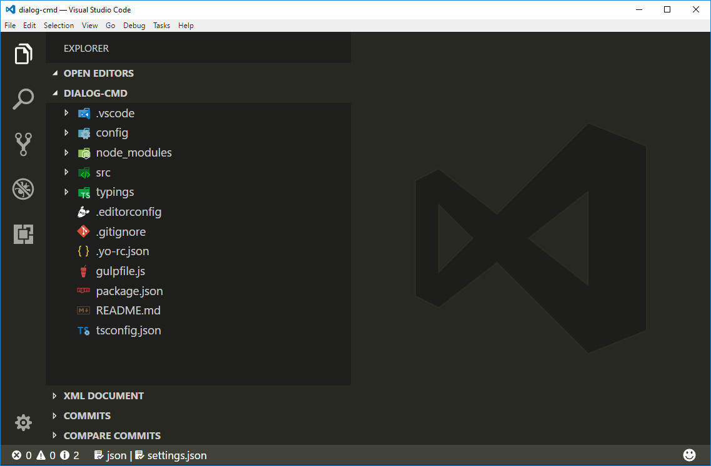
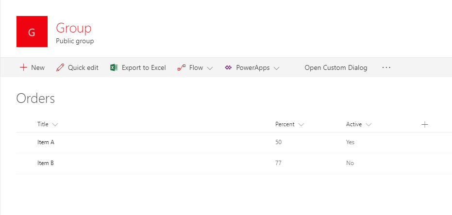
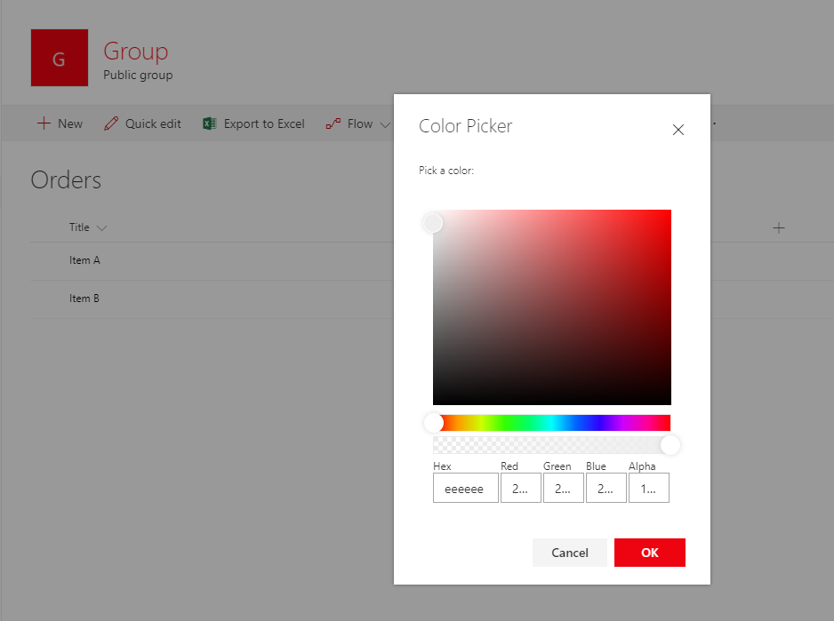
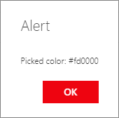

# Using Custom Dialogs with SharePoint Framework Extensions

Custom dialogs are available from `@microsoft/sp-dialog`package and can be used within the context of SharePoint Framework Extensions or client-side web parts. 

This tutorial demonstrates creation of a custom dialog and using that in the context of ListView Command Set extension.

> Notice that the SharePoint Framework dialog is currently in preview status and we are looking to collect feedback before it's officially released. Please provide us feedback by using the [sp-dev-docs repository Issue list](https://github.com/SharePoint/sp-dev-docs/issues).

> Notice that debugging Custom ListView Sets in the SharePoint Online is currently only available from modern list experience in classic team sites hosted on dev tenant. 

> End result of this tutorial is also available as source code at https://github.com/SharePoint/sp-dev-fx-extensions/tree/master/samples/react-command-dialog.  

## Setup your Environment

Before you can complete this guide you will need to ensure you have [setup your environment](https://dev.office.com/sharepoint/docs/spfx/set-up-your-development-environment) for development 
using SharePoint Framework and that you are using latest SharePoint Framework Yeoman templates. 

> You can update your SharePoint Framework Yeoman templates by running following command `npm install -g @microsoft/generator-sharepoint`. 

## Create a New Project

Start by creating a new folder for the project using your console of choice:

```sh
md dialog-cmd
```

And enter that folder

```sh
cd dialog-cmd
```

The run the Yeoman generator for SharePoint Framework

```sh
yo @microsoft/sharepoint
```

When prompted:

* Accept the default value of **dialog-cmd** as your solution name and press **Enter**.
* Choose **Extension (Preview)** as the client-side component type to be created. 
* Choose **ListView Command Set (Preview)** as the extension type to be created.

The next set of prompts will ask for specific information about your extension:

* Accept the default value of **DialogDemo** as your extension name and press **Enter**.
* Accept the default value of **DialogDemo description** as your extension description and press **Enter**.



At this point, Yeoman will install the required dependencies and scaffold the solution files along with the *HelloWorld* extension. This might take a few minutes. 

When the scaffold is complete, you should see the following message indicating a successful scaffold:



For information about troubleshooting any errors, see [Known issues](../basics/known-issues).

Once the scaffolding completes, open your project folder in your code editor. This article uses Visual Studio Code in the steps and screenshots but you can use any editor you prefer.

```
code .
```



## Modify extension manifest based on requirements 

In the extension manifest, configure extension to have only one button. In the code editor, open the **./src/extensions/dialogDemo/DialogDemoCommandSet.manifest.json** file. Replace the commands section with the following JSON:

```json
{
  //...
  "commands": {
    "COMMAND_1": {
      "title": "Open Custom Dialog",
      "iconImageUrl": "icons/request.png"
    }
  }
}

```

## Adding sp-dialog package to solution
Return to the console and execute the following command to include the dialog API in our solution. 

```
npm install @microsoft/sp-dialog --save
```

Since we are using the `--save` option, this dependency will be added to *package.json* file and would be automatically installed when `npm install` command is executed.

Return to Visual Studio Code (or your preferred editor).

## Creating your custom dialog
Create a new file called **ColorPickerDialog.tsx** to **./src/extensions/dialogDemo/** folder.

Add following import statements on the start of the newly created file. We are creating our custom dialog using Office UI Fabric React components, so the implementation will be in React. 

> Notice that currently DialogContent component is coming from `@microsoft/sp-dialog`, but will be included in Office UI Fabric React components soon, like mentioned in the code comments. 

```ts
import * as React from 'react';
import * as ReactDOM from 'react-dom';
import { BaseDialog, IDialogConfiguration } from '@microsoft/sp-dialog';
import {
  autobind,
  ColorPicker,
  PrimaryButton,
  Button,
  DialogFooter
  // DialogContent <- This should be imported here for third parties
} from 'office-ui-fabric-react';
// Note: DialogContent is available in v2.32.0 of office-ui-fabric-react
// As a workaround we're importing it from sp-dialog until the next version bump
import { DialogContent } from '@microsoft/sp-dialog';
```

Add following interface definition just below the import statements. This wil be used to bypass needed information and functions between the ListView Command Set extension and custom dialog.

```ts
interface IColorPickerDialogContentProps {
  message: string;
  close: () => void;
  submit: (color: string) => void;
  defaultColor?: string;
}
```

Add following class just below the interface definition. This React class is responsible for rendering the UI experiences inside of the custom dialog. Notice that we use the Office UI Fabric React components for actual rendering and just bypass the needed properties.  

```ts
class ColorPickerDialogContent extends React.Component<IColorPickerDialogContentProps, {}> {
  private _pickedColor: string;

  constructor(props) {
    super(props);
    // Default Color
    this._pickedColor = props.defaultColor || '#FFFFFF';
  }

  public render(): JSX.Element {
    return <DialogContent
      title='Color Picker'
      subText={this.props.message}
      onDismiss={this.props.close}
      showCloseButton={true}
    >
      <ColorPicker color={this._pickedColor} onColorChanged={this._onColorChange} />
      <DialogFooter>
        <Button text='Cancel' title='Cancel' onClick={this.props.close} />
        <PrimaryButton text='OK' title='OK' onClick={() => { this.props.submit(this._pickedColor); }} />
      </DialogFooter>
    </DialogContent>;
  }

  @autobind
  private _onColorChange(color: string): void {
    this._pickedColor = color;
  }
}
```
Add following class definition for our custom dialog under the just added class code. This one is the actual custom dialog, which will be called from the button click and which is inherited from the **BaseDialog**.

```ts
export default class ColorPickerDialog extends BaseDialog {
  public message: string;
  public colorCode: string;

  public render(): void {
    ReactDOM.render(<ColorPickerDialogContent
      close={ this.close }
      message={ this.message }
      defaultColor={ this.colorCode }
      submit={ this._submit }
    />, this.domElement);
  }

  public getConfig(): IDialogConfiguration {
    return {
      isBlocking: false
    };
  }

  @autobind
  private _submit(color: string): void {
    this.colorCode = color;
    this.close();
  }
}
```

## Associating custom dialog to button click
To associate the custom dialog button to custom ListView Command Set, the code to initiate the dialog has to be added for the button click operation.

In the code editor, open the  **DialogDemoCommandSet.ts** file from **./src/extensions/dialogDemo/** folder.

Add following import statements under the existing **strings** import. These are for using the just created custom dialog in the context of ListView Command Set. 

```ts
import { Dialog } from '@microsoft/sp-dialog';
import ColorPickerDialog from './ColorPickerDialog';
```

Add following **_colorCode** variable definition above **onInit** function in the **DialogDemoCommandSet** class. This is used to store teh color picker dialog result.

```ts
  private _colorCode: string;
```

Update the **onExecute** function as follows. In this code we are doing following steps

* Initiate custom dialog
* Bypass message for the dialog, which will be used as title
* Bypass color code for the dialog with default value, if not yet set
* Show the custom dialog
* Receive and store return value from the dialog
* Show received value in out-of-the-box dialog using `Dialog.alert()` function

```ts
  @override
  public onExecute(event: IListViewCommandSetExecuteEventParameters): void {
    switch (event.commandId) {
      case 'COMMAND_1':
        const dialog: ColorPickerDialog = new ColorPickerDialog();
        dialog.message = 'Pick a color:';
        // Use 'EEEEEE' as the default color for first usage
        dialog.colorCode = this._colorCode || '#EEEEEE';
        dialog.show().then(() => {
          this._colorCode = dialog.colorCode;
          Dialog.alert(`Picked color: ${dialog.colorCode}`);
        });
        break;
      default:
        throw new Error('Unknown command');
    }
  }
```

## Testing custom dialog in your tenant
Move to **DialogDemoCommandSet.manifest.json** file in **./src/extensions/dialogDemo/** folder and copy **id** value, which will be used in the debug query parameter.

Move to console side and execute following command. We use `--nobrowser` option, since local workbench cannot be currently used for debugging, so there's no reason to start that. 

```sh
gulp serve --nobrowser
```

This will start bundling and will serve the resulting manifest from `localhost` address.


To test your extension, navigate to a site in your SharePoint Online tenant.

Move to an existing custom list in the site with some items or create a new list and add few items to it for testing purposes. 

Append the following query string parameters to the URL. Notice that you will need to update the **id** to match your own extension identifier available from the **DialogDemoCommandSet.manifest.json** file:

```
?loadSpfx=true&debugManifestsFile=https://localhost:4321/temp/manifests.js&customActions={"8701f44c-8c81-4e54-999d-62763e8f34d2":{"location":"ClientSideExtension.ListViewCommandSet.CommandBar"}}
```

Accept the loading of Debug Manifests by clicking **Load debug scripts** when prompted:


Notice new button being visible in the toolbar of the list with test *Open Custom Dialog*.



Click *Open Custom Dialog* button to see custom dialog rendered in the list view. 



Choose a color in the *Color Picker* and click **OK** to test how the code is returning selected value back to caller, which is then shown using out-of-the-box alert dialog.


