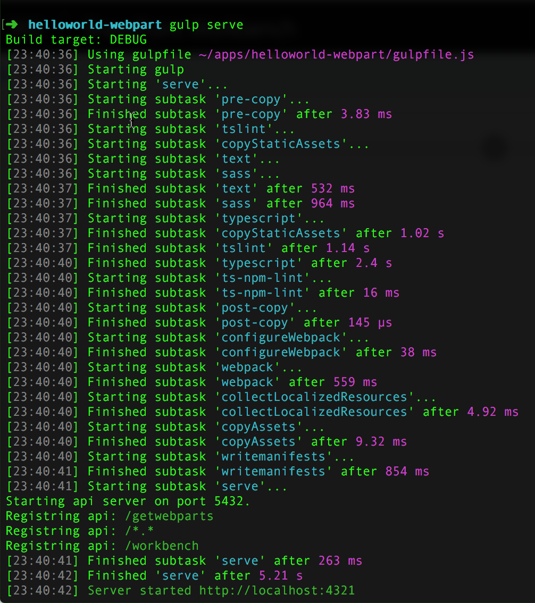

# SharePoint Framework Toolchain

>**Note:** The SharePoint Framework is currently in preview and is subject to change. SharePoint Framework client-side web parts are not currently supported for use in production environments.

## Overview
The SharePoint Framework toolchain is the set of build tools, framework packages, and other items that manage building and deploying your client side projects. The toolchain helps you build client-side components like web parts. It also helps you test them in your local development environment with tools such as the SharePoint Workbench. And you can use the toolchain to package and deploy to SharePoint. The toolchain also provides you with a set of build commands that help you to complete key build tasks such as code compilation, packaging the client-side project into a SharePoint app package and more.

## npm
Before diving into the various toolchain components, it’s important to understand how the SharePoint Framework uses [npm](https://www.npmjs.com/), to manage different modules in the project. npm is one of the preferred open source package managers for JavaScript client-side development. 

### SharePoint Framework packages
SharePoint Framework consists of several npm packages that work together to help developers build client-side experiences in SharePoint. 

### Common build tools packages
The following list of common build tools packages are in the SharePoint Framework:

* [@microsoft/sp-build-core-tasks](https://www.npmjs.com/package/@microsoft/sp-build-core-tasks) - A collection of tasks for the SharePoint Framework build system, which is based on gulp. The `sp-build-core-tasks` package implements operations specific to SharePoint such as packaging solutions and writing manifests.

* [@microsoft/sp-build-web](https://www.npmjs.com/package/@microsoft/sp-build-web) - Imports and configures a set of build tasks that are appropriate for a build target that will run in a web browser (as opposed to a Node.js environment).This package is intended to be imported directly by a gulp file that uses the SharePoint Framework build system. 

* [@microsoft/gulp-core-build](https://www.npmjs.com/package/@microsoft/gulp-core-build) - The core gulp build tasks for building TypeScript, HTML, less, and other build formats. This package depends on several other npm packages that contain the following tasks:

	- [@microsoft/gulp-core-build-sass](https://www.npmjs.com/package/@microsoft/gulp-core-build-sass)
	- [@microsoft/gulp-core-build-typescript](https://www.npmjs.com/package/@microsoft/gulp-core-build-typescript)
	- [@microsoft/gulp-core-build-sass](https://www.npmjs.com/package/@microsoft/gulp-core-build-sass)
	- [@microsoft/gulp-core-build-webpack](https://www.npmjs.com/package/@microsoft/gulp-core-build-webpack)
	- [@microsoft/gulp-core-build-serve](https://www.npmjs.com/package/@microsoft/gulp-core-build-serve)
	- [@microsoft/gulp-core-build-karma](https://www.npmjs.com/package/@microsoft/gulp-core-build-karma)
	- [@microsoft/gulp-core-build-mocha](https://www.npmjs.com/package/@microsoft/gulp-core-build-mocha)

* [@microsoft/loader-load-themed-styles](https://www.npmjs.com/package/@microsoft/loader-load-themed-styles) - A loader that wraps the loading of CSS in script equivalent to <code>require('load-themed-styles').loadStyles( /* css text */ )</code>. It is designed to be a replacement for style-loader.

* [@microsoft/loader-raw-script](https://www.npmjs.com/package/@microsoft/loader-raw-script) - A loader that loads a script file's contents directly in a webpack bundle using an `eval(…)`.

* [@microsoft/loader-set-webpack-public-path](https://www.npmjs.com/package/@microsoft/loader-set-webpack-public-path) -A loader that sets the __webpack_public_path__ variable to a value specified in the arguments, optionally appended to the SystemJs baseURL property.

## Scaffolding a new client-side project

### Packages installation
As the packages are installed locally, npm also installs the dependencies associated with each package. You can find the packages installed under the `node_modules` folder in your project folder. This folder contains the packages along with all of their dependencies. It is ideal that this folder contains dozens to hundreds of folders as npm packages are always broken down to smaller modules and thus resulting in dozens to hundreds of packages being installed. The key SharePoint Framework packages are located under the `node_modules\@microsoft` folder. The `@microsoft` is an npm scope that collectively represents [packages published by Microsoft](https://www.npmjs.com/~microsoft).

Every time you create a new project using the generator, the generator installs the SharePoint Framework packages along with its dependencies for that specific project locally. In this way, npm makes it easier to manage your web part projects without affecting other projects that are in the local dev environment. 

### package.json
Below is the `package.json` of the [helloworld-webpart](web-parts/get-started/build-a-hello-world-web-part):

```json 
{
  "name": "helloword-webpart",
  "version": "0.0.1",
  "private": true,
  "engines": {
    "node": ">=0.10.0"
  },
  "dependencies": {
    "@microsoft/sp-client-base": "~0.1.12",
    "@microsoft/sp-client-preview": "~0.1.12"
  },
  "devDependencies": {
    "@microsoft/sp-build-web": "~0.4.32",
    "@microsoft/sp-module-interfaces": "~0.1.8",
    "@microsoft/sp-webpart-workbench": "~0.1.12",
    "gulp": "~3.9.1"
  },
  "scripts": {
    "build": "gulp bundle",
    "clean": "gulp nuke",
    "test": "gulp test"
  }
}
```

### Working with source control systems
When you check out, or clone, the web part project from your source control system the first time, run the command to initialize and install all the project dependencies locally:

```
npm install
```

SharePoint Framework uses [gulp](http://gulpjs.com/) as its task runner to handle processes like the following:

## Build tasks
- Compile LESS or SASS files to CSS.
- Bundle and minify JavaScript and CSS files.
- Run tools to call the bundling and minification tasks before each build.
- Compile LESS or SASS files to CSS.
- Compile TypeScript files to JavaScript.

- serve
- build
- bundle
- serve
- nuke
- test
- package-solution
- deploy-azure-storage

```
gulp serve
```

### Build targets


### Build targets

```
Build target: DEBUG
```

In SHIP mode, the build tasks copy all of the web part assets, including the web part bundle, into the `temp\deploy` folder.