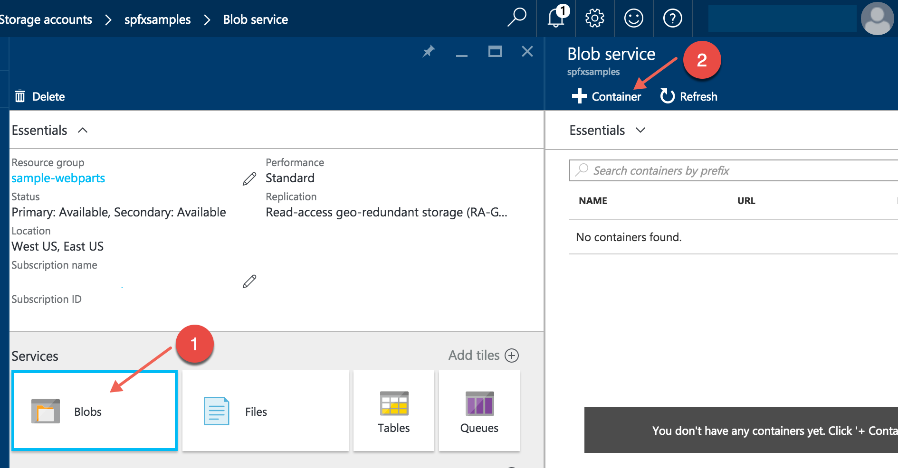
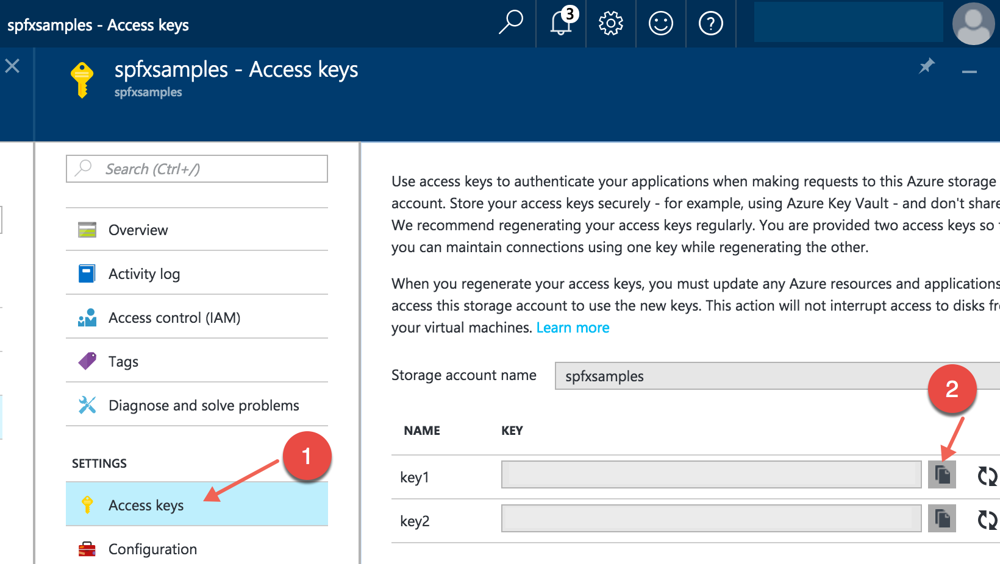

# Deploy your SharePoint client-side web part to a CDN

>**Note:** The SharePoint Framework is currently in preview and is subject to change. SharePoint Framework client-side web parts are not currently supported for use in production environments.

In this article, you will deploy the **HelloWorld** assets to a remote CDN instead of using the local environment. You'll use an Azure Storage account integrated with a CDN to deploy your assets. SharePoint Framework build tools provide out-of-the-box support for deploying to an Azure Storage account; however, you can also manually upload the files to your favorite CDN provider or to SharePoint.

You can also follow these steps by watching the video on the [SharePoint PnP YouTube Channel](https://www.youtube.com/watch?v=xMQMNtsHDhk&list=PLR9nK3mnD-OXvSWvS2zglCzz4iplhVrKq). 

<a href="https://www.youtube.com/watch?v=xMQMNtsHDhk&list=PLR9nK3mnD-OXvSWvS2zglCzz4iplhVrKq">

</a>

## Prerequisites

Make sure that you have completed the following tasks before you begin:

* [Build your first client-side web part](./build-a-hello-world-web-part)
* [Connect your client-side web part to SharePoint](./connect-to-sharepoint)
* [Deploy your client-side web part to a classic SharePoint page](./serve-your-web-part-in-a-sharepoint-page)

## Configure Azure storage account

Configure an Azure storage account and integrate it with the CDN.

You can follow the instructions in the article [Integrate a Storage Account with CDN](https://azure.microsoft.com/en-us/documentation/articles/cdn-create-a-storage-account-with-cdn/) along with the detailed steps in this article to create an Azure storage account and integrate it with the CDN. You will need the following information.

### Storage account name

This is the name you used to create your storage account, as described in [Step 1: Create a storage account](https://azure.microsoft.com/en-us/documentation/articles/cdn-create-a-storage-account-with-cdn/#step-1-create-a-storage-account).

For example, in the following screenshot, **spfxsamples** is the storage account name.


This will create a new storage account endpoint **spfxsamples.blob.core.windows.net**. 

>**Note:** You will need to create a unique storage name for your SharePoint Framework project.


### BLOB container name

Create a new Blob service container. This will be available in your storage account dashboard.

Select the **+ Container** and create a new container with the following:

* Name: **helloworld-webpart**
* Access type: Container



### Storage account access key

In the storage account dashboard, choose **Access Key** in the dashboard and copy one of the access keys.



### CDN profile and endpoint

Create a new CDN profile and associate the CDN endpoint with this BLOB container.

Create a new CDN profile as described in [Step 2: Create a new CDN profile](https://azure.microsoft.com/en-us/documentation/articles/cdn-create-a-storage-account-with-cdn/#step-2-create-a-new-cdn-profile).

For example, in the following screenshot, **spfxwebparts** is the CDN profile name.


Create a CDN endpoint as described in [Step 3: Create a new CDN endpoint](https://azure.microsoft.com/en-us/documentation/articles/cdn-create-a-storage-account-with-cdn/#step-3-create-a-new-cdn-endpoint).

For example, in the following screenshot, **spfxsamples** is the endpoint name, **Storage** is the origin type, and **spfxsamples.blob.core.windows.net** is the storage account.


The CDN endpoint will be created with the following URL: http://spfxsamples.azureedge.net

Because you associated the CDN endpoint with your storage account, you can also access the BLOB container at the following URL:http://spfxsamples.azureedge.net/helloworld-webpart/

Note, however that you have not yet deployed the files.

## Project directory

Switch to console and make sure you are still in the project directory you used to set up your web part project.

End the **gulp serve** task by choosing **Ctrl+C** and go to your project directory:

```
cd helloworld-webpart
```

## Configure Azure Storage account details

Switch to Visual Studio Code and go to your **HelloWorld** web part project.

Open **deploy-azure-storage.json** in the **config** folder.

This is the file that contains your Azure Storage account details.

```json
{
  "workingDir": "./temp/deploy/",
  "account": "<!-- STORAGE ACCOUNT NAME -->",
  "container": "helloworld-webpart",
  "accessKey": "<!-- ACCESS KEY -->"
}
```

Replace the **account**, **container**, **accessKey** with your storage account name, BLOB container and storage account access key respectively.

**workingDir** is the directory where the web part assets will be located.

In this example, with the storage account created earlier, this file will look like:

```json
{
  "workingDir": "./temp/deploy/",
  "account": "spfxsamples",
  "container": "helloworld-webpart",
  "accessKey": "q1UsGWocj+CnlLuv9ZpriOCj46ikgBvDBCaQ0FfE8+qKVbDTVSbRGj41avlG73rynbvKizZpIKK9XpnpA=="
}
```

Save the file.

## Prepare web part assets to deploy

Before uploading the assets to CDN, you need to build them.

Switch to the console and execute the following `gulp` task:

```
gulp --ship
```

This will build the minified assets required to upload to the CDN provider. The `--ship` indicates the build tool to build for distribution. You should also notice the output of the build tools indicate the Build Target is SHIP.

```
Build target: SHIP
[21:23:01] Using gulpfile ~/apps/helloworld-webpart/gulpfile.js
[21:23:01] Starting gulp
[21:23:01] Starting 'default'...
```

The minified assets can be found under the `temp\deploy` directory.

## Deploy assets to Azure Storage

Switch to the console of the **HelloWorld** project directory.

Enter the gulp task to deploy the assets to your storage account:

```
gulp deploy-azure-storage
```

This will deploy the web part bundle along with other assets like JavaScript and CSS files to the CDN.

### Configuring web part to load from CDN

In order for the web part to load from your CDN, you will need to tell it your CDN path.

Switch to Visual Studio Code and open the **write-manifests.json** from the **config** folder.

Enter your CDN base path for the **cdnBasePath** property.

```json
{
  "cdnBasePath": "<!-- PATH TO CDN -->"
}
```

In this example, with the CDN profile created earlier, this file will look like:

```json
{
  "cdnBasePath": "https://spfxsamples.azureedge.net/helloworld-webpart/"
}
```

>**Note:** The CDN base path is the CDN endpoint with the BLOB container.

Save the file.

## Deploy the updated package

### Package the solution

Because you changed the web part bundle, you will need to re-deploy the package to the App Catalog. You used **--ship** to generate minified assets for distribution.

Switch to the console of the **HelloWorld** project directory.

Enter the gulp task to package the client-side solution, this time with the `--ship` flag set. This forces the task to pick up the CDN base path configured in the previous step:

```
gulp bundle --ship
gulp package-solution --ship
```

> **Note:** "gulp bundle --ship" is a temporary fix needed with Developer Preview to ensure that files are rebuilt properly for packaging.

This will create the updated client-side solution package in the **sharepoint\solution** folder.

### Upload to your App Catalog

Upload or drag & drop the client-side solution package to the App Catalog.

Because you already  deployed the package, you will be prompted as to whether to replace the existing package.


Choose **Replace It**.

The App Catalog will now have the latest client-side solution package where the web part bundle is loaded from the CDN.

This will update all the instances of your **HelloWorld** web part in SharePoint to now fetch the resources from CDN.

## Test the HelloWorld web part

### Classic SharePoint Page

Go to the **HelloWorld** web part page you created. Your **HelloWorld** web part will now load the web part bundle and other assets from CDN.

Notice that you are no longer running **gulp serve**, and therefore nothing is served from **localhost**.

## Deploying to other CDNs

In order to deploy the assets to your favorite CDN provider, you can copy the files from **temp\deploy** folder. To generate assets for distribution you will run the following gulp command as we did before with the **--ship** parameter:

```
gulp --ship
```

As long as you are updaging the **cdnBasePath** accordingly, your files are being properly loaded.

## Next steps

You can load jQuery, jQuery UI and build a jQuery Accordion web part. To continue, see [Add jQueryUI Accordion to your client-side web part](./add-jqueryui-accordion-to-web-part).
