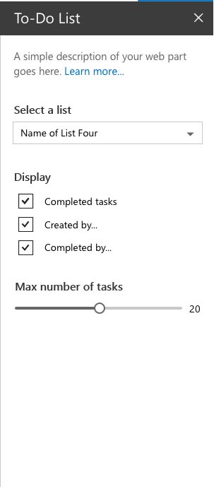

# Integrate your SharePoint client-side web part with the property pane

>**Note:** The SharePoint Framework is currently in Preview, and is subject to change based on customer feedback.  While we’re in preview, SharePoint Framework web parts are not supported for use in production environments.

## Overview

The property pane allows end users to configure the web part with a bunch of properties.  In [Tutorial 1](./build-a-hello-world-web-part), you saw the property pane defined in the `HelloWorldWebPart` class. `propertyPaneSettings` property is where we defined the property pane properties.

Below is an example of a property pane in SharePoint:



Property pane has three key metadata: 
* Pages
* Header
* Groups

Pages provides you the flexibility to separate complex interactions and put them into one or more pages. Pages then contain Header and Groups.

Header allows you to define the title of the property pane and Groups let you define the various sections for the property pane through which you want to group your field sets. 

A property pane should contain a page, an optional header and atleast one group.

Property fields are then defined inside a group. 

## Using property pane

Here is a sample code to initialize and configure property pane in your web part. We create a method of type `IPropertyPaneSettings` and return a collection of property pane page(s).

```ts
protected get propertyPaneSettings(): IPropertyPaneSettings {
  return {
    pages: [
      {
        header: {
          description: strings.PropertyPaneDescription
        },
        groups: [
          {
            groupName: strings.BasicGroupName,
            groupFields: [
              PropertyPaneTextField('description', {
                label: strings.DescriptionFieldLabel
              })
            ]
          }
        ]
      }
    ]
  };
}
``` 
### Property pane fields

The following field types are supported:
* Label
* Textbox
* Multi-line Textbox
* Checkbox
* Dropdown
* Link 
* Slider
* Toggle
* Custom 

The field types are available as modules in `sp-client-platform` and hence requires an import before you can use them in your code:

```ts
import {
  PropertyPaneTextField,
  PropertyPaneCheckbox,
  PropertyPaneLabel,
  PropertyPaneLink,
  PropertyPaneSlider,
  PropertyPaneToggle,
  PropertyPaneDropdown
} from '@microsoft/sp-client-preview';
```

Every field type constructor is defined as follows, taking `PropertyPaneTextField` as an example:

```ts
PropertyPaneTextField('targetProperty',{
  //field properties are defined here
})
```
`targetProperty` defines the associated object for that field type and is also defined in the props interface in your web part.

To assign types to these properties, we define an interface in our web part class that includes one or more target properties.

```ts
export interface IHelloWorldWebPartProps {
    targetProperty: string
}
```

This is then available in your web part using `this.properties.targetProperty`.

```ts
<p class="ms-font-l ms-fontColor-white">${this.properties.description}</p>
```

Once the properties are defined, you can then access them in your web part using the `this.properties.<property-value>`, as we do in the [`render` method of the `HelloWorldWebPart`](./build-a-hello-world-web-part#web-part-render-method):

## Handling field changes

Property Pane has two interaction modes:
* Reactive
* Non-reactive

In reactive mode, on every change, a change event is triggered. Reactive behavior automatically updates the web part with the new values.

While reactive mode suffices many scenarios, at times you will need non-reactive behavior. Non-reactive does not update the web part automatically unless the user confirms the changes.

## Custom field example

Add the following field definiton in a **groupFields** array.

```ts 
{
  type: IPropertyPaneFieldType.Custom,
  targetProperty: 'custom',
  properties: {
    onRender: this._customFieldRender.bind(this),
    value: undefined,
    context: undefined
  }
}
```

Add the following types to the `@microsoft/sp-client-platform` imports

```ts
IPropertyPaneFieldType,
IOnCustomPropertyFieldChanged
```

Add the following private method to render the custom field

```ts
private _customFieldRender(elem: HTMLElement, context: any, onChanged?: IOnCustomPropertyFieldChanged): void {
    elem.innerHTML = '<input id="password" type="password" name="password" class="ms-TextField-field">';
}
```

 


