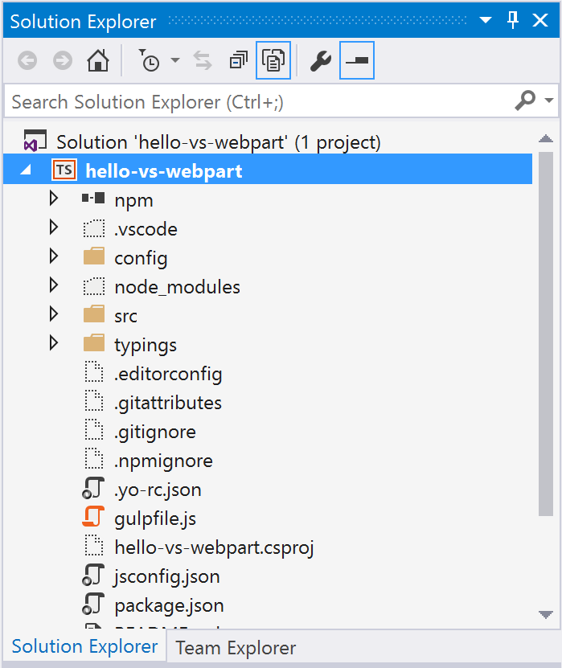
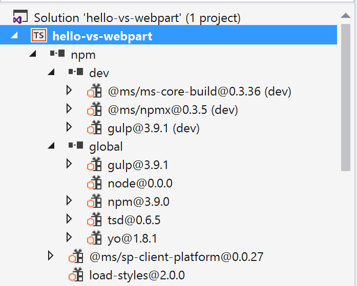
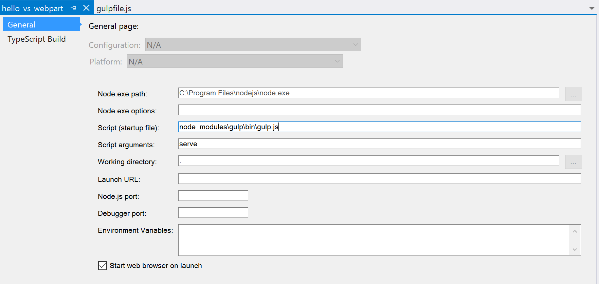
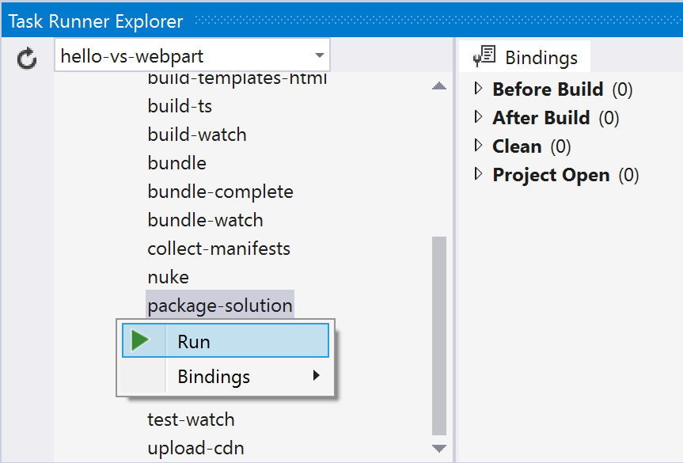

# Use Visual Studio to develop SharePoint client-side web parts

>**Note:** The SharePoint Framework is currently in Preview, and is subject to change based on customer feedback.  While we’re in preview, SharePoint Framework web parts are not supported for use in production environments.

SharePoint Framework is client-side driven and uses a variety of open source tools to enable SharePoint development. It relies heavily on node and npm to provide you with a local/debug runtime environment and a robust package eco-system respectively. Tools like gulp, webpack etc., depend on the availability of node runtime environment. 

## Node.js Tools for Visual Studio 
With the help of [Node.js Tools for Visual Studio](https://www.visualstudio.com/en-us/features/node-js-vs.aspx), you can use Visual Studio as your primary IDE for building client-side web parts and applications. Node.js Tools for Visual Studio is a free, open source plugin that turns Visual Studio into a Node.js IDE. It is designed, developed, and supported by Microsoft and the community, just like the SharePoint Framework.

## Install Required Tools
- [Visual Studio 2015](https://go.microsoft.com/fwlink/?LinkId=691978&clcid=0x409)
- Latest Visual Studio Update
    - [Visual Studio Update 3](https://www.visualstudio.com/en-us/news/releasenotes/vs2015-update3-vs)
- [Node.js Tools for Visual Studio](https://github.com/Microsoft/nodejstools/releases/download/v1.2.Dev-7.20.2016/NTVS.Dev.2016-07-20.VS.2015.msi)

## Load SharePoint Client-side Project in Visual Studio
With little effort, you can load your SharePoint client-side project into Visual Studio. Follow the steps below to use Visual Studio as your development environment for building client-side web parts and applications.

> Please note this applies only to the preview release. It is expected the integration with Visual Studio will be improved as we progress towards the final release.

### Yo SharePoint
The first step is to create the SharePoint client-side project. We will use the Yeoman SharePoint Generator to create the project.

1. Create a new project directory in your favorite location:

   ```
   md hello-vs-webpart
   ```

2. Navigate to the project directory:

   ```
   cd hello-vs-webpart
   ```

3. Create a new client-side web part project by running the Yeoman SharePoint Generator:

   ```
   yo @microsoft/sharepoint
   ```


### Import Project into Visual Studio
There are two ways to open your client-side project in Visual Studio. Ideally, we would only have one. To make sure you get the best experience with Visual Studio, use whichever steps works best for you.

If opening the **.njsproj** doesn't work for you, you can try importing the client-side solution project into Visual Studio. We are working on getting project file properly created directly from scaffolding.

#### Open Visual Studio and Create a New Project

1. In the *New Project* dialog, select the *Templates->Other languages->TypeScript->Node.js* and then *From Existing Node.js code* project template.
Name the project the same name as your SharePoint client-side project, that is, *hello-vs-webpart*, and choose the location of the client-side project as the location, and click *OK*.

    

2. In the project wizard, choose the client-side project folder as the folder containing your Node.js code, and click *Next* to continue.

    

3. choose *Next* to continue.

4. Verify the save location for your project. Visual Studio should show the same client-side project folder as the location to save your Node.js project file.

5. Choose *Finish* to import the client-side project into Visual Studio.

    

## Explore the Project
Now that Visual Studio has imported your client-side project, take a moment to explore the project in Visual Studio.

 

Notice how you got a npm package explorer as well (found by extending npm node in the project):

 

### Modify gulpfile.js
1. Open *gulpfile.js* in the root of the project and change the initial declaration of the variables from *let* to *var*.

```
  var gulp = require('gulp');
  var build = require('@microsoft/sp-build-web');
```

> **Note:** This is a temporary workaround as Visual Studio does not support ES6 yet.

### Setup Project Startup File
1. In the project properties, change the following properties to their corresponding values as shown below:For launching the project from within Visual Studio (F5), 
   - **Script (startup file)**: node_modules\gulp\bin\gulp.js
   - **Script arguments**: serve

 

### Build and Debug Project
Your client-side project is now setup to work with Visual Studio.

Press F5 to build and debug your project in your favorite browser.

#### Notes on Debugging
JavaScript client-side development has relied on browser developer tools which provides a robust environment to debug web applications. While Visual Studio provides the key integration into SharePoint client-side projects, browser developer tools are still used as the primary debugging tool to debug your client-side projects. 

All of the major browsers have their corresponding developer tools. The following links get you started with the developer tools.


- If you are using Chrome, you have [Chrome Developer Tools](https://developer.chrome.com/devtools)
- If you are using IE, you have [IE Developer Tools](https://msdn.microsoft.com/en-us/library/gg589507(v=vs.85).aspx)
- If you are using Edge, you have [Edge Developer Tools](https://developer.microsoft.com/en-us/microsoft-edge/platform/documentation/f12-devtools-guide/)
- If you are using Firefox, you have [Firefox Developer Tools](https://developer.mozilla.org/en-US/docs/Tools)
> **Note:** We will publish debugging guidance as we progress towards the final release. 

#### Task Runner Explorer - Executing Other Tasks
SharePoint Framework comes with a set of gulp tasks to simplify packaging your client-side solution and uploading your assets to CDN. These commands are usually accessed using the following commands:

```
gulp package-solution
gulp deploy-azure-storage
```

You will use Visual Studio's Task Runner to explore and execute the available commands within the client-side project. To open the Task Runner window, either:
- Press *Ctrl+Alt+BkSpace*, or,
- Navigate to the following menu item: *View->Other Windows->Task Runner Explorer*

 

Task Runner Explorer makes is easier to view available gulp commands and run them when needed. Just right click on a gulp command to reveal the context menu to run a specific command. 

