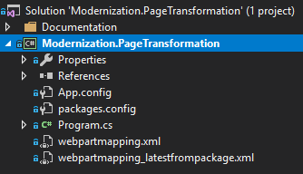

# Transforming to modern site pages using .Net

> [!IMPORTANT]
> The SharePoint PnP Modernization framework is continuously evolving, checkout [the release notes](https://github.com/SharePoint/PnP-Tools/blob/master/Solutions/SharePoint.Modernization/Modernization%20Framework%20release%20notes.md) to stay up to date on the latest changes. If you encounter problems please file an issue in the [PnP Tools GitHub issue list](https://github.com/SharePoint/PnP-Tools/issues).

The page transformation engine is built using .Net and is distributed as a [nuget](https://www.nuget.org/packages/SharePointPnPModernizationOnline) package. Once you've added the nuget package you'll see that 2 additional files are added to your solution:



> [!Note]
> The minimal .Net Framework version for this solution to work is 4.5.1.

The `webpartmapping.xml` and `webpartmapping_latestfrompackage.xml` represent the transformation model that describes how the transformation will happen. You typically will tweak the `webpartmapping.xml` file to your needs by for example adding additional mappings to your own web parts. If you later on install an updated version of the nuget package your `webpartmapping.xml` will not be overwritten by default but the `webpartmapping_latestfrompackage.xml` will be. You can use this latter file to compare the latest out-the-box mapping with your mapping and take over the changes you need.

With the mapping file in place you now can use below snippet (coming from the [Modernization.PageTransformation sample on GitHub](https://github.com/SharePoint/PnP/tree/dev/Samples/Modernization.PageTransformation)) to transform all the pages in a given site:

```csharp
string siteUrl = "https://contoso.sharepoint.com/sites/mytestsite";
string userName = "joe@contoso.onmicrosoft.com";
AuthenticationManager am = new AuthenticationManager();
using (var cc = am.GetSharePointOnlineAuthenticatedContextTenant(siteUrl, userName, GetSecureString("Password")))
{
    var pageTransformator = new PageTransformator(cc);
    var pages = cc.Web.GetPages();
    foreach (var page in pages)
    {
        PageTransformationInformation pti = new PageTransformationInformation(page)
        {
            // If target page exists, then overwrite it
            Overwrite = true,
            // Migrated page gets the name of the original page
            TargetPageTakesSourcePageName = true,
        };

        try
        {
            Console.WriteLine($"Transforming page {page.FieldValues["FileLeafRef"]}");
            pageTransformator.Transform(pti);
        }
        catch(ArgumentException ex)
        {
            Console.WriteLine($"Page {page.FieldValues["FileLeafRef"]} could not be transformed: {ex.Message}");
        }
    }
}
```

## See also

- [Modernize your classic SharePoint sites](modernize-classic-sites.md)
- [Modernization.PageTransformation sample on GitHub](https://github.com/SharePoint/PnP/tree/dev/Samples/Modernization.PageTransformation)
- [YouTube recording from May 3rd SIG call containing a page transformation demo](https://youtu.be/Uf2f8ISBpVg?t=15m31s)
- [Understanding and configuring the page transformation model](modernize-userinterface-site-pages-model.md)
- [Classic and modern web part experiences](https://support.office.com/en-us/article/classic-and-modern-web-part-experiences-3fdae6c3-8fc1-49ab-8708-8c104b882e64)
